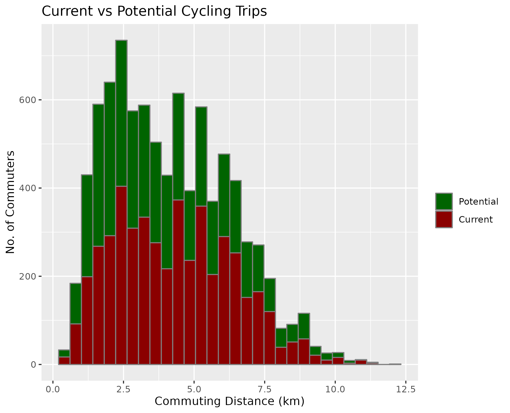
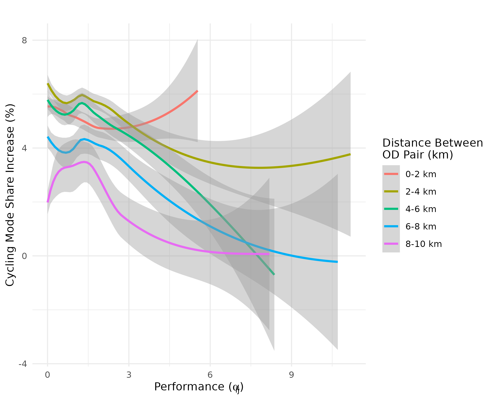
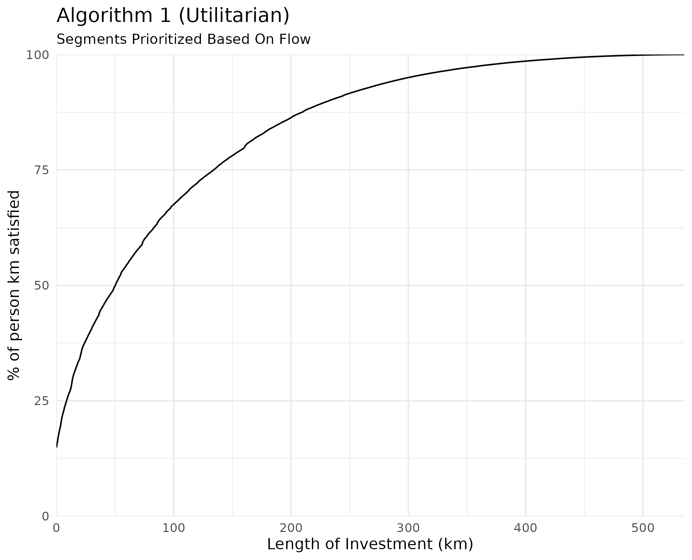
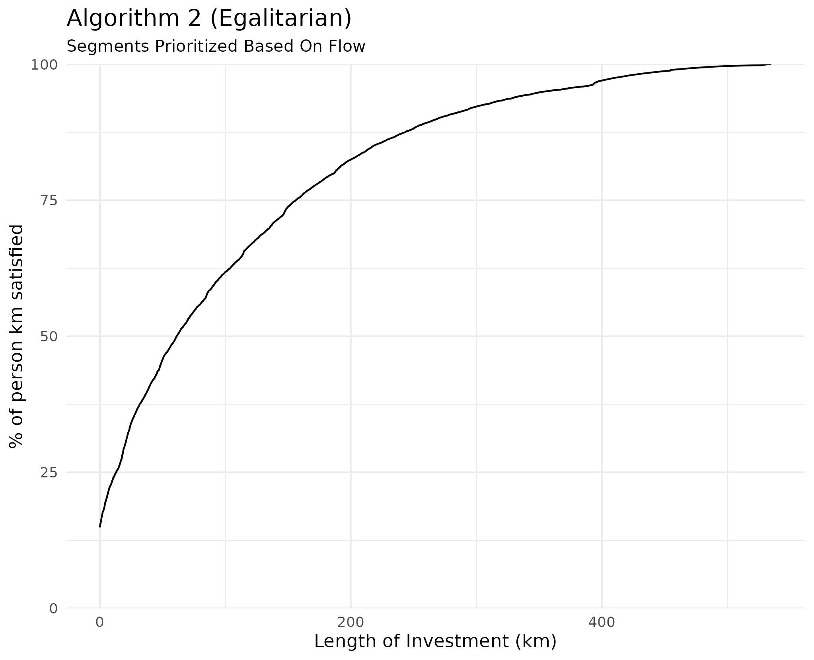
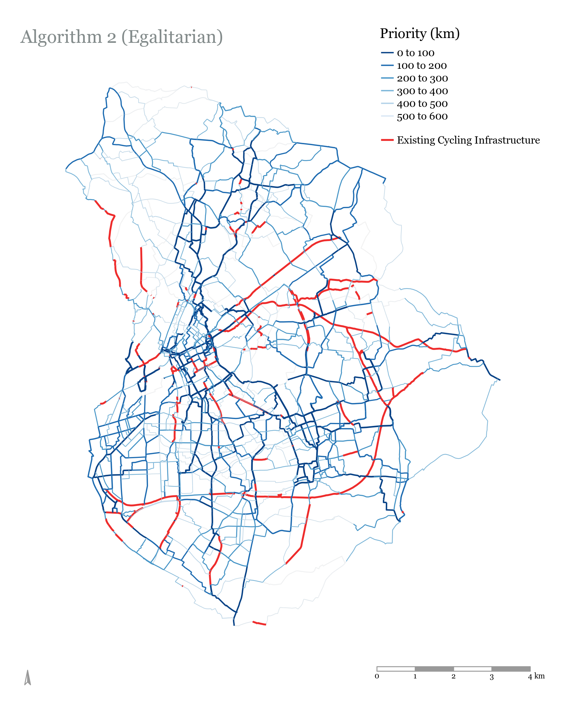
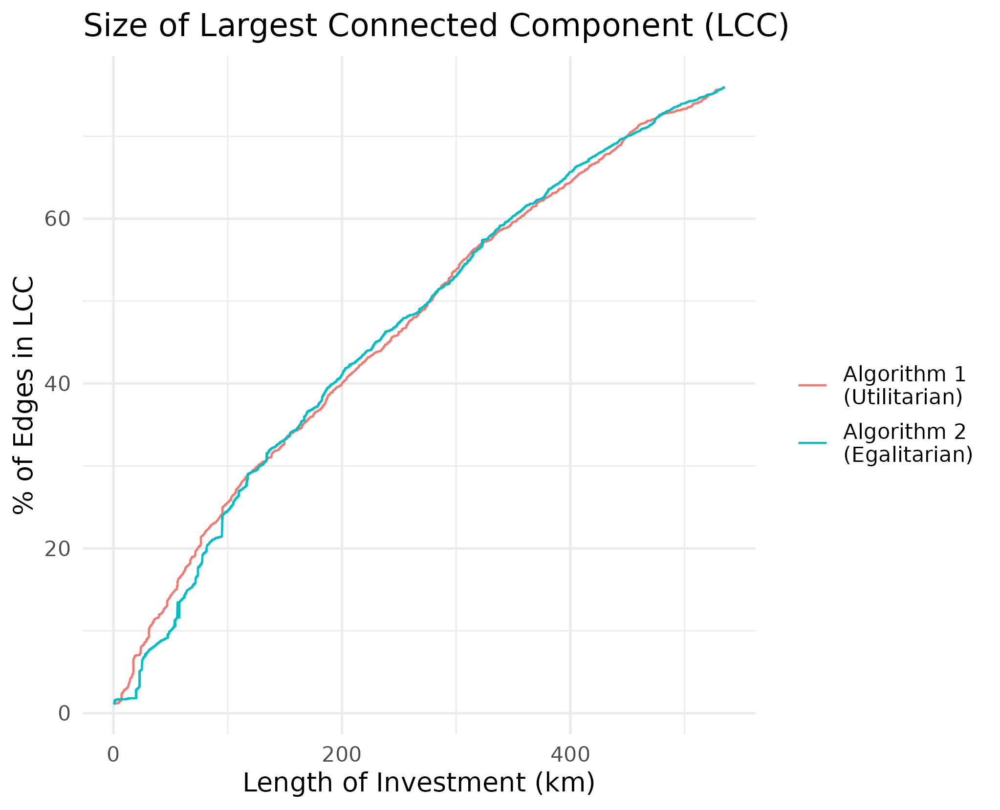
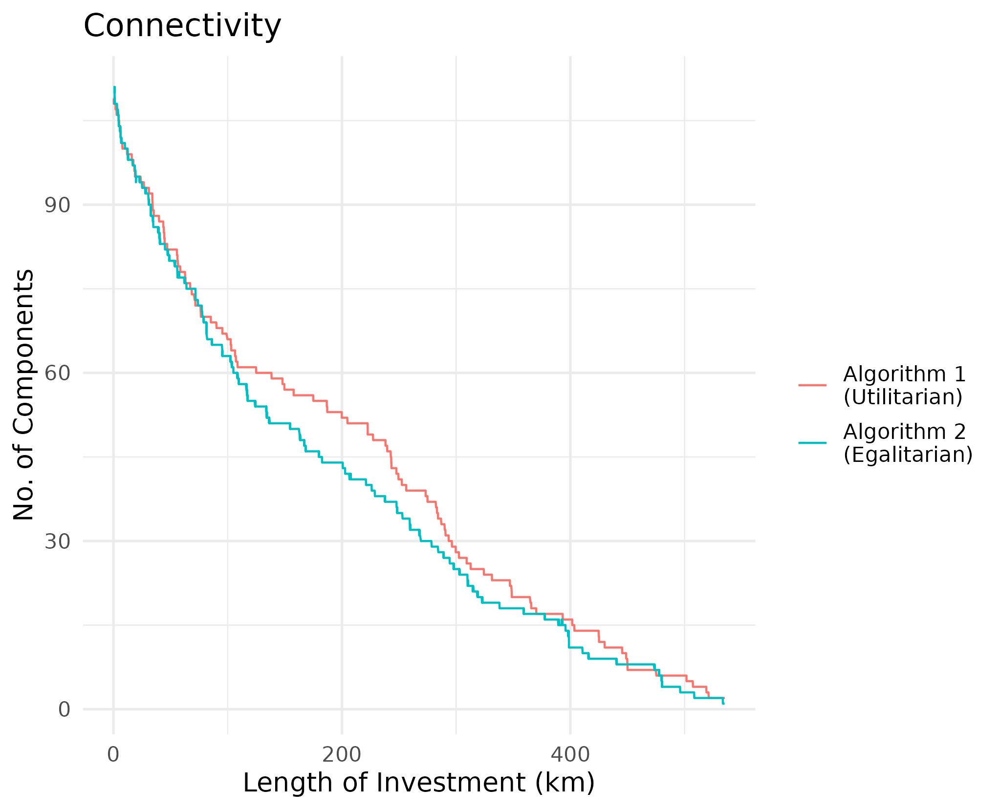

Reproducibility Instructions
================
18/8/2020

This repository contains the code used for the paper. Below is an
explanation of the scripts used, and how the analysis can be reproduced.

## Paper

The paper can be found in the repo,\[**ADD LINK TO PDF**\]

-----

## Missing Data

There is one file that cannot be synced to github due to its size. This
file is neseccary for the scripts to run:

Middle Layer Super Output Areas (December 2011) Boundaries:

  - Source:
    <http://geoportal.statistics.gov.uk/datasets/826dc85fb600440889480f4d9dbb1a24_0>
  - Location in Repo: data-raw/MSOA\_2011\_Boundaries/\[Add files here\]

-----

## Scripts

The scripts should be run in the order they are numbered in (and listed
in here). The only exception is \_x\_dodgr\_weighting\_profiles.R.

#### \_\_*1.0\_get\_flow\_data.R*

This script matches MSOA to major towns and cities using data from
[here](http://geoportal.statistics.gov.uk/datasets/78ff27e752e44c3194617017f3f15929).
It then matches the results to the Census flow data so that all OD pairs
have an Origin City and Destination City (MSOAs in rural areas are not
matched to a city)

In this script, you choose which city you wish to run the analysis from
this list of available towns and cities:

    ##   [1] "Barnsley"             "Basildon"             "Basingstoke"         
    ##   [4] "Bath"                 "Bedford"              "Birkenhead"          
    ##   [7] "Birmingham"           "Blackburn"            "Blackpool"           
    ##  [10] "Bolton"               "Bournemouth"          "Bracknell"           
    ##  [13] "Bradford"             "Brighton and Hove"    "Bristol"             
    ##  [16] "Burnley"              "Burton upon Trent"    "Bury"                
    ##  [19] "Cambridge"            "Cardiff"              "Carlisle"            
    ##  [22] "Chatham"              "Chelmsford"           "Cheltenham"          
    ##  [25] "Chester"              "Chesterfield"         "Colchester"          
    ##  [28] "Coventry"             "Crawley"              "Darlington"          
    ##  [31] "Derby"                "Doncaster"            "Dudley"              
    ##  [34] "Eastbourne"           "Exeter"               "Gateshead"           
    ##  [37] "Gillingham"           "Gloucester"           "Grimsby"             
    ##  [40] "Guildford"            "Halifax"              "Harlow"              
    ##  [43] "Harrogate"            "Hartlepool"           "Hastings"            
    ##  [46] "Hemel Hempstead"      "High Wycombe"         "Huddersfield"        
    ##  [49] "Ipswich"              "Kingston upon Hull"   "Leeds"               
    ##  [52] "Leicester"            "Lincoln"              "Liverpool"           
    ##  [55] "London"               "Luton"                "Maidstone"           
    ##  [58] "Manchester"           "Mansfield"            "Middlesbrough"       
    ##  [61] "Milton Keynes"        "Newcastle upon Tyne"  "Newcastle-under-Lyme"
    ##  [64] "Newport"              "Northampton"          "Norwich"             
    ##  [67] "Nottingham"           "Nuneaton"             "Oldham"              
    ##  [70] "Oxford"               "Peterborough"         "Plymouth"            
    ##  [73] "Poole"                "Portsmouth"           "Preston"             
    ##  [76] "Reading"              "Redditch"             "Rochdale"            
    ##  [79] "Rotherham"            "Salford"              "Scunthorpe"          
    ##  [82] "Sheffield"            "Shrewsbury"           "Slough"              
    ##  [85] "Solihull"             "South Shields"        "Southampton"         
    ##  [88] "Southend-on-Sea"      "Southport"            "St Albans"           
    ##  [91] "St Helens"            "Stevenage"            "Stockport"           
    ##  [94] "Stockton-on-Tees"     "Stoke-on-Trent"       "Sunderland"          
    ##  [97] "Sutton Coldfield"     "Swansea"              "Swindon"             
    ## [100] "Telford"              "Wakefield"            "Walsall"             
    ## [103] "Warrington"           "Watford"              "West Bromwich"       
    ## [106] "Weston-Super-Mare"    "Wigan"                "Woking"              
    ## [109] "Wolverhampton"        "Worcester"            "Worthing"            
    ## [112] "York"

This is done in line 17. For example:

``` r
chosen_city <- "Manchester"
```

The script then filters all flow data where both the Origin MSOA **AND**
the destination MSOA are in the chosen city. If you wish to run the
analysis on London, then make sure you have a computer that is up to the
task.

#### \_\_*2.0\_distance\_and\_elevation.R*

This script is used to get the distance and slope between each OD pair

  - Distance: The routed distance using the
    [dodgr](https://atfutures.github.io/dodgr/) package.
  - Slope: The average slope along the route seperating the OD pair,
    using the [slopes](https://itsleeds.github.io/slopes/) package

#### \_\_*3.0\_potential\_demand.R*

**EDIT THIS\!\!**

This script is used to estimate where additional cycling demand will
come from. It uses an uptake function from the Propensity to Cycle Tool
([pct](https://itsleeds.github.io/pct/)).

#### \_\_*3.1\_plot\_mode\_shares.R* , \_\_3.2\_plot\_od\_comparison.R\_ , \_\_3.3\_plot\_desire\_lines\_current\_vs\_potential.R\_

These three scripts plot the results of \_\_*3.0\_potential\_demand.R* .

<!-- * Compare the distance distribution of existing cycling mode share and potential cycling mode share: -->

<!-- <p float="left"> -->

<!--    -->

<!--     -->

<!--    -->

<!-- </p> -->

<!-- * Vizualize Existing and Potential Cycling Flow as Desire Lines -->

<!--  -->

<!-- * Examine where potential cycling demand is assigned.  -->

<!-- In the figure below, the x axis is a ratio of the cycling mode share of the OD pair to its expected cycling mode share. Looking at the resulting cycling mode share, we see that OD pairs between 2-8km have the highest mode share (consistent with bell-shaped distribution of cycling vs distance), and that mode share increase is highest for OD pairs that have lower than expected cycling mode shares. -->

<!-- <p float="center"> -->

<!--    -->

<!-- </p> -->

#### \_\_*x\_dodgr\_weighting\_profiles.R*

The [dodgr](https://atfutures.github.io/dodgr/) package is used to route
the cycling demand (flow) onto the road network. This is done using
different weighting profiles, as explained in the
[documentation](https://atfutures.github.io/dodgr/reference/weighting_profiles.html)
of the package. This script is used to download a json file of the
weight profile and edit the ‘bicycle’ entries. Weights are assigned to
all OSM road types (for example, we assign a weight of 0 to make sure
that no cycling routes utilize them). The weighting profiles used are
explained in the methodology.

The weighting profiles used in the analysis are in the data file of the
repo. These are: \* weight\_profile\_unweighted.json: unweighted
shortest paths \* weight\_profile\_weighted.json: weighted shortest
paths (weighting profile explained in methodology) \*
weight\_profile\_no\_primary\_trunk.json: weighted shortest paths with
cycling banned on primary and trunk roads

These weighting profiles are used in script
***2.0\_distance\_and\_elevation.R* AND **\_4.0\_aggregating\_flows.R\_

#### \_\_*4.0\_aggregating\_flows.R*

This script uses the The [dodgr](https://atfutures.github.io/dodgr/)
package is used to route potential cycling demand onto the road network.
This is done for the different weighting profiles used in the analysis

#### \_\_*5.0\_identifying\_cycle\_infastructure\_from\_osm\_tags.R*

This script is used to identify all road segments that have segregated
cycling lanes. This includes all roads that match any of the 3 following
tags:

  - highway = cycleway  
  - cycleway = track
  - bicycle = designated

#### \_\_*6.0\_comparing\_weighting\_profiles.R*

Here we analyze the street network configuration of the city by
comparing the unweighted shortest paths to the weighted shortest paths
(check methodology for explanation of weighted shortest paths).
<!-- The aggregated flow shows us which road types are used, and it is clear that cycleways are not utilized unless the road network is weighted to create a hierarchy of road type preference.  -->

<!--  -->

<!--  -->

#### \_\_*7.0\_community\_detection.R*

Using the potential cycling demand between OD pairs, we are able to
define communities in the network. The nodes are the population-weighted
MSOA centroids (location obtained from the
[pct](https://itsleeds.github.io/pct/) package) and the links between
them are weighted by the potential cycling demand between them. The
Louvian algorithm is used to assign each MSOA centroid to a community,
and then each road segment on the network is assigned to the same
community as the MSOA centroid closest to it.

<!-- The results for Manchester are shown below  -->

<!--  -->

#### \_\_*8.0\_growing\_a\_network.R*

This script contains all the functions for prioritizing road segments
for dedicated infrastructure. It is necessary to run this script before
8.1 and 8.2. The speed of the functions is inversely proportional to the
size of the city being analyzed (Script 8.2 takes almost 2 hours for
Birmingham on a 2.7 GHz Intel Core i5 laptop with 8GB of RAM)

#### \_\_*8.1\_plot\_network\_growth.R*

Here we obtain results for the utilitarian growth function (Algorithms 1
and 2 in the paper)

##### Algorithm 1 (Utilitarian Growth)

Logic:

1.  Identify all links **that have dedicated cycling infrastructure**
    and add them to the initialsolution
2.  Identify all links that neighbor links in the current solution
3.  Select neighboring link with highest flow and add it to the solution
4.  Repeat steps 2 & 3 until all flow is satisfied or investment
    threshold is met

<!-- Results:  -->

<!-- <p float="left"> -->

<!--    -->

<!--     -->

<!-- </p> -->

<!-- The results show the priority of each road segment (Roads are grouped into 100km groups for vizualization purposes) -->

<!-- <p float="center"> -->

<!--    -->

<!-- </p> -->

#### \_\_*8.2\_plot\_network\_growth\_community.R*

Here we obtain results for the egalitarian growth function (Algorithms 2
in the paper). We also compare the connectivity of the network proposed
by both algorithms

##### Algorithm 2 (Egalitarian Growth)

Logic:

1.  Identify all links that have dedicated cycling infrastructure and
    add them to the initial solution
2.  Identify all links that neighbor links in the current solution
3.  Select **from each community** one neighboring link with highest
    flow and add it to thesolution
4.  If there are no more neighboring links in a community, select the
    link with the highest flow in the community, regardless of
    connectivity, and add it to the solution
5.  Repeat steps 2, 3 & 4 until all flow is satisfied or investment
    threshold is met

<!-- Results:  -->

<!-- <p float="left"> -->

<!--    -->

<!--     -->

<!-- </p> -->

<!-- Priority of each road segment, and utilization of different OSM road types: -->

<!-- <p float="left"> -->

<!--    -->

<!--     -->

<!-- </p> -->

<!-- ##### Comparing Connectivity of Algorithm 2 and 3 -->

<!-- We check the number of connected components and the size of the Largest Connected Component as road segments are added to the solution (the components are the road segments). The initial number of components depends on the existing bicycle network of the city. For Manchester, we can see that the existing bicycle network has over 120 disconnected components (Remember we are only looking at segregated bicycle infrastructure, not painted bicycle lanes). -->

<!-- <p float="left"> -->

<!--    -->

<!--     -->

<!-- </p> -->

<!-- The algorithms seem to provide comparable connectivity gains.  -->
