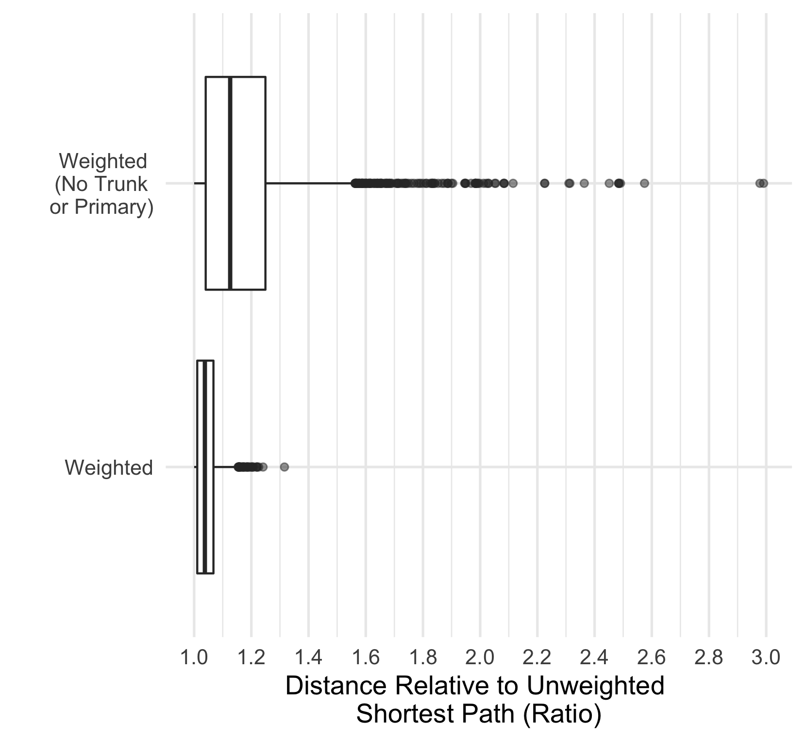
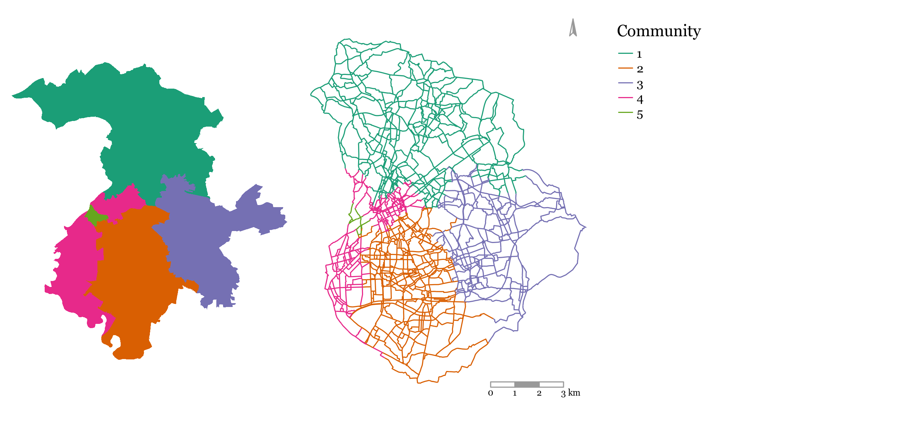

```{r, echo=FALSE, eval=FALSE}
# aim: add citations efficiently to the paper (can tidy up after)
citr::tidy_bib_file(rmd_file = "README.Rmd", messy_bibliography = "~/uaf/allrefs.bib", file = "rlbibfile.bib")
```

```{r, echo=FALSE, eval=FALSE}
file.rename("README.pdf", "cycle-network-paper.pdf")
```

```{r, include=FALSE}
library(tidyverse)
library(tmap)
knitr::opts_chunk$set(warning = FALSE)
```

<!-- Highlights -->

<!-- ======== -->

# Introduction

The 2015 Paris agreement [@agreement2015paris] acknowledged that fundamental changes to societies and economies are necessary to mitigate climate change.
Like other sectors, transport is under substantial pressure to decarbonise, resulting in a number of technical innovations including electric vehicles.
But new vehicle technologies can only go so far and fail to tackle parallel problems such as congestion, road traffic casualties and physical inactivity [@brand_climate_2020].

In this context, interest and investment in active modes has grown substantially, especially with the growing realisation that the benefits extend beyond congestion and the environment, as active travel can also help alleviate what is referred to as the pandemic of global inactivity; physical inactivity is on the rise and has become the 4th highest cause of death globally [@kohl2012pandemic].
Various studies have documented the association between active transport and lower risk of disease, including cancer and cardiovascular disease [@celis2017association; @jarrett2012effect; @patterson2020associations].
In the wake of the Covid-19 pandemic, and the resulting reduced capacity of public transport, the UK government has pledged to invest billions of pounds to improve walking and cycling infrastructure across the country.
While this unprecedented sum is an opportunity to reshape cities in a way that improves the well-being of citizens, it does come with a warning:

> "Inadequate cycling infrastructure discourages cycling and wastes public money. Much cycling infrastructure in this country is inadequate. It reflects a belief, conscious or otherwise, that hardly anyone cycles, that cycling is unimportant and that cycles must take no meaningful space from more important road users, such as motor vehicles and pedestrians" [@departmentgearchange2020].

Funding alone is therefore no guarantee of a change in commuting across the country; it must be used to design adequate cycling infrastructure that is based on motivators and deterrents to cycling.
In this paper we propose an approach for planning connected cycling networks that can be generalised to any city with appropriate input data (as shown in the Appendix).
We used the city of Manchester as a case study due to its ambitions to become the first UK region with a carbon neutral transport network, supported by ambitious plans for a 1800 mile walking and cycling network (the 'Bee Network') that will be delivered over 10 years [@manchestercyclingbee2020].
While schemes have already been put in place for around a quarter of this network, the majority is yet to be built.

# Literature Review

## Motivators and Deterrents to Cycling

Much research has explored the question of what gets people cycling.
Segregated cycling infrastructure --- road space that is allocated to cyclists only with physical separation to protect cyclists --- is associated with cycling uptake [@aldred2019impacts; @goodman2014new; @marques2015infrastructure].
Separation from motorized vehicles has been found to be key [@winters2011motivators].
Revealed preference of cyclists shows that they are willing to deviate from the most efficient routes in order to commute on safer roads [@crane2017longitudinal].
However, such deviations are only considered if they do not considerably increase route circuitry; behavior studies have found that the probability of choosing a route decreases in proportion to its length relative to the shortest route [@broach2011bicycle; @winters2010far].
Another defining feature for cycling infrastructure is how well connected it is.
Cyclists prefer cohesive infrastructure, particularly when cycling on arterial roads with high levels of motorized traffic [@stinson2003commuter].
The lack of well-connected cycling infrastructure is one of the main obstacles to increasing cycling uptake [@caulfield2012determining].
While direct and cohesive cycling networks have been shown to positively impact cycling rates, density[^1] of the cycling network is also vital [@schoner2014missing].

[^1]: making an area's bicycle network denser means adding more cycling routes in the area and thereby giving cyclists more route options.

## Network-Level Approaches to Bicycle Infrastructure Planning

The studies outlined above lay out the fundamentals for designing cycling networks that generate significant cycling uptake, but they do not propose network-level interventions.
In this section we outline methods used in past studies, namely optimization and network analysis methods, such as connected components and community detection, and examine how they are leveraged to suggest cycling network designs.
We compare the effectiveness of these network-level studies in incorporating the fundamentals outlined above.
Our proposed approach is inspired by these methods, but it attempts to add to them by ensuring that all of the outlined fundamentals are accounted for.
It also goes further by attempting to factor in ethical considerations related to the distribution of investment.

*Optimization* methods have been used to propose improvements to cycling networks.
@mesbah2012bilevel propose a bi-level formulation to optimize allocation of cycling lanes to the network without exceeding a set budget.
They account for the effect of cycling lanes on car traffic, and attempt to maximize utilization of said lanes with minimal impact on car travel times.
Safeguarding against increased car traffic may be counter-productive if the goal is to create a mode-shift, as research has shown that reducing road space for cars leads to less cars on the road, a phenomenon referred to as "traffic evaporation" [@nello2020environmental].

@mauttone2017bicycle developed an optimization framework aiming at minimizing the total user cost of cycling on the network without considering car usage.
The aggregate flow[^2] on road segments (links) is obtained by using shortest paths to route existing cycling demand onto the road network.
The solution is a proposed set of links where cycling infrastructure should be added in order to minimize the overall travel cost of cyclists across the network.
The cost of traversing a link is given as a function of its length and whether or not it has cycling infrastructure.
The problem has also been solved by attempting to find the minimum cost of improving roadway links to meet a desired level of service (LOS) [@duthie2014optimization].
In this formulation, all origin-destination (OD) pairs need to be connected by roads that meet the desired LOS.
A limitation of these approaches is that they do not explicitly solve for continuity.
Continuity is addressed using either a constraint specifying that each link with a bike lane should be connected to at least one destination [@mesbah2012bilevel], a constraint on maximum deviation from shortest paths [@duthie2014optimization], or a discontinuity penalty to prioritize connected road segments [@mauttone2017bicycle].
In this paper, continuity is analysed by looking at the connectivity of the network through the graph-theoretic concept of *connected components*.

[^2]: *flow* is used throughout this research to refer to the cycling demand when it is routed onto the road network.
    The flow on any road segment is the cumulative demand on it, resulting from cyclists commuting between various Origin-Destination (OD) pairs.

@orozco2020data study the existing cycling network in terms of its disconnected components.
They propose two different algorithms to connect disconnected components; one connects the two largest components, and the other connects the largest component to its nearest neighbor.
By measuring the growth of the largest connected component as a function of the kilometers of network added, they determine that these approaches are more effective at improving cycling network connectivity than random allocation of cycling infrastructure.
The concept of connected components is also at the core of the methodology proposed by @olmos2020data.
After routing the cycling demand onto the network links, they use percolation theory to filter out the links based on the aggregate flow passing through them, varying the flow threshold for filtering to identify the minimum flow at which the whole city is connected by a single component.
While these approaches deal with continuity better, they look at the network as a whole when attempting to improve it, and in doing so fail to account for equitable distribution of infrastructure.

Other approaches have focused on characteristics of route segments as the basis of analysis to help prioritize investment in cycle infrastructure where it is most needed.
@grise2018if developed a multi-criteria approach, combined with estimated levels of usage, to highlight routes most in need of investment in Quebec City.
@wysling2022improve present a method that used open data from Paris to generate cycling suitability ratings, based on 'bicycle suitability multipliers' associated with different types of road across the city, to support more effective interventions.

With the exception of @grise2018if, the aforementioned studies do not explore the equity impacts of different network prioritization approaches.
The following section highlights the importance of considering (often unstated) ethical assumptions underlying network optimization and prioritization approaches of the type outlined above.

## Ethical Underpinnings and Proposed Approach

All of these network-level methodologies are underpinned by ethical principles, even though these principles are not explicitly acknowledged by the authors.
This is important since different ethical principles constitute different problem formulations and targets.
Broadly speaking, transport appraisal can be based on either utilitarian or egalitarian principles.
The former seeks to maximize the overall benefit, while the latter is concerned with a fair distribution of benefits [@jafino2020transport].
<!-- @nahmias2017integrating criticize the --> <!-- utilitarian approach that has been historically popular in the --> <!-- evaluation of transport investments, explaining how the maximization of --> <!-- overall benefit fails to account for the distribution of that benefit --> <!-- among communities or individuals. @lucas2016method explain how --> <!-- transport studies have traditionally looked at the bigger picture --> <!-- without studying the distribution of investments on the different parts --> <!-- of the study area, and go on to propose an egalitarian approach that --> <!-- ensures the disaggregation of transport policy benefits across the study --> <!-- area.  --> The utilitarian approach, historically popular in transport planning, has been criticised for focusing on the bigger picture and failing to account for the distribution of investments on the different communities of the study area [@lucas2016method; @nahmias2017integrating].
@pereira2017distributive emphasize the need for a more egalitarian approach to transport planning.
They highlight accessibility as a cornerstone of distributive justice, and contend that policies should aim to distribute investments in a way that minimizes spatial variations in accessibility.

# Method and Application

## Method overview

This research attempts to propose an egalitarian framework for cycling network design.
This is done by identifying the different sub-networks that exist within the larger network, and ensuring that each gets a fair share of investment.
Trip patterns in a city are not uniformly distributed geographically, and *community finding* methods have been used to partition study areas into localized areas that experience a disproportionate number of trips within them.
@akbarzadeh2018designing use a modularity maximization approach [@blondel2008fast] on taxi trip data to identify seven different communities in the city of Isfahan, Iran.
An optimization problem is then formulated to connect nodes within each community with cycling infrastructure, with the emphasis being on connectivity within the communities, not between them.
@bao2017planning adopt a similar methodology, first identifying communities and then using a greedy network expansion algorithm to simultaneously add links to each community.
The link with the highest benefit-cost ratio in each community is selected, and the network is grown by adding neighboring links to the solution until a budget limit is met.
The benefit is the flow on the link, and each link is assigned a cost based on current road conditions.

Our work builds on these community finding approaches by proposing a similar greedy network expansion algorithm for cycle network expansion *within communities*.
We incorporate community finding methods for study area partitioning with weighted routing to avoid links that are stressful to cycle on.
In doing so, we propose an approach that ensures a better distribution investments across the study area while also accounting for motivators and deterrents to cycling.
We propose three sub-methods that address some of the limitations of previous studies.
These limitations include (a) an inherent bias when basing network design solely on existing cycling demand, (b) the proposal of routes that may not correspond to studies on cyclist preference and government policies, and (c) an insufficient consideration of the ethical principles underlying the analysis.
The current work addresses these limitations through the following organisation.
Section \@ref(calculating-potential-cycling-demand) focuses on calculating potential cycling demand.
Section \@ref(routing) focuses on routing the demand onto the road network while accounting for cyclist preferences and government priorities.
Section \@ref(road-segment-prioritization) outlines a method for partitioning the study area based on a community finding algorithm and routed cycling demand.
It then introduces the network expansion algorithms, and compares an approach grounded in 'egalitarianism' to one grounded in 'utilitarianism'. 
An overview of the steps involved is shown in Figure \@ref(fig:methodflowchart).

```{r methodflowchart, fig.cap="Flowchart of proposed methodology", out.width="80%", fig.show='hold', fig.align = "center", echo=FALSE}

```

## Case study area

Manchester is a city in the North West of England.
"Manchester" can be used to refer to multiple things:

- Manchester City Council, which is a local government district that includes the city centre and surrounding areas.
- The Greater Manchester region, which is a metropolitan county that includes the city of Manchester and 9 other local government districts.
- The city of Manchester, which is used by visitors to refer to the city centre and surrounding areas. This definition if formalised in the Major Towns and Cities (TCITY) dataset provided by the Office for National Statistics.

We use the TCITY definition of Manchester, which was "developed specifically for the production and analysis of statistics" and which is shown in Figure \@ref(fig:manchestermap).
Manchester is a cosmopolitan city with a large university population.
As shown in Figure \@ref(fig:manchestermap) (right), the high density of the central area allows high levels of cycling, although the surrounding areas have low levels of cycling.
Manchester and its surrounding have many deprived areas.


```{r manchestermap, echo=FALSE, fig.cap="Maps of Greater Manchester (top) and the case study area (City of Manchester)"}
greater_manchester = pct::get_pct_zones(region = "greater-manchester", geography = "msoa")
greater_manchester = greater_manchester |>
  mutate(pcycle = bicycle / all * 100)
# names(greater_manchester)
msoas = sf::read_sf("./data/Manchester/msoas_geometry.shp")
msoas_union = sf::st_union(msoas)
greater_manchester_lads = greater_manchester |>
  group_by(lad_name) |>
  summarise()
?tm_scale_bar
m1 = tm_shape(greater_manchester_lads) +
  tm_polygons(col = "lad_name", palette = "Set1", alpha = 0.2, title = "") +
  tm_layout(legend.position = c("left", "bottom")) +
  tm_shape(msoas_union) +
  tm_borders(col = "black", lwd = 2) +
  tm_scale_bar(breaks = (0:3)*5)
msoas_centroids = sf::st_centroid(msoas)
pct_zones_in_manchester = greater_manchester[msoas_centroids, ] 
m2 = tm_shape(greater_manchester, bb = msoas) +
  tm_fill("pcycle", palette = "Blues", title = "% cycling to work\n(2011 Census)") +
  tm_layout(legend.position = c("left", "bottom"), legend.bg.color = "white", legend.bg.alpha = 0.5) +
  tm_shape(msoas_union) +
  tm_borders(col = "black", lwd = 2) +
  tm_scale_bar(breaks = 0:5)
tmap_arrange(m1, m2, nrow = 1)
```


## Calculating Potential Cycling Demand

```{r echo=FALSE, results='hide', message=FALSE, warning=FALSE}
# scripts for potential demand

# source("R/_1.0_get_flow_data.R")
# source("R/_2.0_distance_and_elevation.R")
# source("R/_3.0_potential_demand.R")
# source("R/_3.1_plot_mode_shares.R")
# source("R/_3.2_plot_od_comparison.R")
# source("R/_3.3_plot_desire_lines_current_vs_potential.R")
```

Many of the cycling network studies mentioned above use demand data for cycling as a starting point.
Some use existing cycling demand, some calculate potential cycling demand, and others ignore demand completely.
@duthie2014optimization note that relying only on existing cycling activity to prioritize cycling infrastructure can reinforce existing cycling patterns and ignore potential cycling demand that could be satisfied by a connected network.
To avoid this issue they choose to ignore existing demand completely, and focus on creating a network that connects the entire study area.
@olmos2020data opt to calculate potential demand instead; they obtain the distance distribution of cyclists using a smartphone-based bicycle GPS data, and then use a rejection-sampling algorithm on the OD data of the study area to match the potential demand distribution to the distribution obtained from GPS data.

*OD* data can be obtained from a range of sources, including GPS data, household travels surveys and census data on work locations.
In areas where observed OD data is unavailable, modelling techniques such as spatial interaction models can be used to estimate travel volumes between zones [@black1995spatial; @martinez2013new; @wilson1971family].
In this paper we use open access data from the UK census [@ONS2011flowdata], which contains aggregate statistics on number of commuters between administrative zones --- Middle layer Super Output Areas (MSOA) --- by mode of travel (this is similar to the approach used by @grise2018if).
MSOAs have an average population of just over 8000 [@ofn2018population].[^3]
Figures \@ref(fig:potdemhistograms) and \@ref(fig:desirefacetcycling) illustrate the proportion of trips cycled by distance and the geographic extent of the input OD dataset used in this paper.

[^3]: See <https://wicid.ukdataservice.ac.uk/> for open access to the OD data.

For our purposes, we use a logistic regression model to calculate potential cycling demand.
The model was adapted from the Propensity to Cycle Tool (PCT), which estimates the proportion of trips ($\boldsymbol{C_{p}}$) for each OD pair that would cycle under different scenarios of change as a function of distance and hilliness [@lovelace2017propensity].
We used the Government Target scenario, indicating a nationwide target of doubling cycling by 2025.
The logistic regression model used to calculate $\boldsymbol{C_{p}}$ has the following parameters:

```{=tex}
\begin{align}\label{eq:pcteqn}
     logit(C_{p}) = & \alpha + \beta_1 d + \beta_2 \sqrt{d} + \beta_3 d^2 + \beta_4 s + \beta_5 ds + \beta_6 \sqrt{d}s 
\end{align}
```
\noindent where $d$ and $s$ are the distance and slope associated with each OD pair, and $\alpha$ and all $\beta$s are parameters calculated by a regression model on the training data.
The square and square-root distance terms "capture the non-linear impact of distance on the likelihood of cycling", and interaction terms capture the combined effect of slope and distance [@lovelace2017propensity].
Alternative cycling uptake models could be 'plugged in' to our approach for different contexts or scenarios of change.

The potential demand calculations show that the current and potential number of cyclists both follow a bell-shaped distribution, with the number of trips peaking around the 3-4km commuting distance and then going back down for longer distances (see Figures \@ref(fig:potdemhistograms) and \@ref(fig:desirefacetcycling)).

<!-- note: could be a joint table/map showing sample - if reviewers request -->

<!-- ```{r potdemhistograms, fig.cap="Distribution of potential cycling demand", out.width="30%", fig.show='hold', echo=FALSE} -->

<!-- knitr::include_graphics(c( -->

<!--   "data/Manchester/Plots/histogram_distance_all_vs_cycling.png", -->

<!--   "data/Manchester/Plots/histogram_distance_all_vs_cycling_potential.png", -->

<!--   "data/Manchester/Plots/histogram_distance_cycling_potential_vs_current.png" -->

<!-- )) -->

<!-- ``` -->

```{r potdemhistograms, fig.cap="Distribution of potential cycling demand", out.width="90%", fig.show='hold', fig.align="center", echo=FALSE}
knitr::include_graphics("data/Manchester/Plots/histogram_distance_cycling_potential_current_all.png")
```

```{r desirefacetcycling, fig.cap="Current and potential cycling demand", out.width="65%", fig.pos="H", fig.align="center", echo=FALSE}
knitr::include_graphics("data/Manchester/Plots/desire_facet_cycling.png")
```

The uptake model used in this paper assumes uptake of traditional bicycles, which are affected by topography and distance due to physical effort.
As discussed in Section \@ref(discussion-and-conclusions), using adapted uptake models could enable the approach to help plan for solutions such as e-bikes that enable trips covering longer distances and hillier roads.

## Routing

```{r echo=FALSE, results='hide', message=FALSE, warning=FALSE}
# scripts for routing

# source("R/_4.0_aggregating_flows.R")
# source("R/_5.0_identifying_cycle_infastructure_from_osm_tags.R")
# source("R/_6.0_comparing_weighting_profiles.R")
```

The next step in our approach is to route the potential cycling demand ($\boldsymbol{C_{p}}$) between all OD pairs onto the road network.
We choose not to use the PCT approach for routing as it is reliant on external and therefore inflexible routing services.
<!-- This expands on the work of @mauttone2017bicycle, by going beyond simply favoring roads with existing cycling infrastructure to creating a hierarchy of road preference. -->

```{=tex}
\begin{longtable}{lll}
\caption{OSM road types}
\label{table:osmroadtypes}\\
\textbf{OSM Road Type } & \textbf{Description}                                                                                                                                            & \textbf{UK Equivalent}                                                                                                   \endfirsthead 
\hline
Motorway                & \begin{tabular}[c]{@{}l@{}}Road open to high-speed \\vehicles only\end{tabular}                                                                                 & Motorway                                                                                                                 \\* 
\hline
Trunk                   & \multirow{5}{*}{\begin{tabular}[c]{@{}l@{}}Roads that don't \\meet motorway criteria, \\in descending order \\of importance and \\through-traffic\end{tabular}} & A-Roads with Primary Status                                                                                              \\* 
\cline{3-3}
Primary                 &                                                                                                                                                                 & A-Roads with Non-Primary Status                                                                                          \\* 
\cline{3-3}
Secondary               &                                                                                                                                                                 & B-roads                                                                                                                  \\* 
\cline{3-3}
Tertiary                &                                                                                                                                                                 & \begin{tabular}[c]{@{}l@{}}Classified unnumbered roads \\OR unclassified busy through roads\end{tabular}                 \\* 
\cline{3-3}
Unclassified            &                                                                                                                                                                 & \multirow{2}{*}{\begin{tabular}[c]{@{}l@{}}Unclassified (Intended for \\local traffic - 60\% of UK roads)\end{tabular}}  \\* 
\cline{1-2}
Residential             & Function is purely residential                                                                                                                                  &                                                                                                                          \\ 
\hline
Service                 & \begin{tabular}[c]{@{}l@{}}Road that provides \\access to a facility\end{tabular}                                                                               &                                                                                                                          \\ 
\hline
Track                   & \begin{tabular}[c]{@{}l@{}}Unpaved - suitable for \\two track vehicles (mostly rural)\end{tabular}                                                              &                                                                                                                          \\ 
\hline
Cycleway                & \begin{tabular}[c]{@{}l@{}}Designated cycleway - \\open to cyclists only\end{tabular}                                                                           &                                                                                                                          \\ 
\hline
Path                    & \begin{tabular}[c]{@{}l@{}}Unpaved - open to \\non-motorized traffic only\end{tabular}                                                                          &                                                                                                                          \\
\hline
\end{longtable}
```
To conduct routing, the following is considered:

1.  **Cyclist Preference**: Work done by @dill2013four on examining cyclist typologies determined that around 60% of Portland residents fit under the *interested but concerned* category. These were people that enjoyed cycling but avoided it due safety concerns. The key to encouraging this group was to create a low-stress cycling network, not only though segregated infrastructure but also by planning routes that passed through residential streets.
2.  **Low-Traffic Neighbourhoods (LTNs)**: The UK Department for Transport is allocating funding to local authorities to invest in Active Transport, partially through the creation of LTNs [@departmentgearchange2020]. This includes closing off residential streets to motorized traffic.
3.  **Existing Cycling Infrastructure**: Utilizing existing cycling infrastructure makes economic sense, as small investments may lead to large connectivity gains as the disconnected cycling infrastructure gets joined together.

The above points are accounted for by using a weighted road network for routing.
This has been previously done by multiplying all road segments without cycling infrastructure by a fixed impedance factor [@mauttone2017bicycle], or by assigning different weights to the road segments that are (a) proportional to the investment cost of bringing them to an acceptable level of stress for cycling [@duthie2014optimization], or (b) inversely proportional to perceived level of stress experienced by cyclists [@wysling2022improve].
Perceived stress for cyclists has been found to be a function of vehicular traffic volume and speed [@sorton1994bicycle], both of which vary predictably with road type.
@gehrke2020cycling build on this information to use routing impedance factors for road segments that are based on road type and the existence of cycling infrastructure.

For the purposes of this paper we created a similar weighting profile that is adjusted to favor less stressful roads (based on the definition by @sorton1994bicycle and information from Table \@ref(table:osmroadtypes)) and roads with existing cycling infrastructure.
We believe this to be more appropriate than the simplistic approach adopted by @mauttone2017bicycle as it makes use of a hierarchy of road preference based on perceived stress levels, going beyond simply favouring roads with existing cycling infrastructure.
It is also different to the weighting profile used by @wysling2022improve as it adds a larger weight on trunk and primary roads then other roads without cycling infrastructure.

<!-- The approach is also in line with the creation of LTNs, as residential streets are those where motorized traffic is most likely to be banned in the creation of LTNs.  -->

<!-- **ADD TABLE - THIS IS BASIC** -->

<!-- ```{r, echo=FALSE, message = FALSE} -->

<!-- weight_profiles <- readxl::read_excel("Paper/paper_tables.xlsx", sheet = "Weighting Profile") -->

<!-- knitr::kable(weight_profiles, -->

<!--              caption = "Weighting Profiles") -->

<!-- ``` -->

```{=tex}
\begin{longtable}{lrrr}
\caption{Weighting profiles}
\label{table:weightprofiles}\\
\multirow{2}{*}{\textbf{OSM Road Type}} & \multicolumn{3}{c}{\textbf{Weighting Profile}}                                                 \\*
                                        & \multicolumn{1}{l}{\textit{Unweighted}} & \multicolumn{1}{l}{\textit{Weighted}} & \multicolumn{1}{l}{\textit{Weighted\_2}}  \endfirsthead
Cycleway                                & 1          & 1                                     & 1                                         \\
Path                                    & 1          & 0.9                                   & 0.9                                       \\
Residential                             & 1          & 0.9                                   & 0.9                                       \\
Service                                 & 1          & 0.9                                   & 0.9                                       \\
Tertiary                                & 1          & 0.9                                   & 0.9                                       \\
Track                                   & 1          & 0.9                                   & 0.9                                       \\
Unclassified                            & 1          & 0.9                                   & 0.9                                       \\
Secondary                               & 1          & 0.8                                   & 0.8                                       \\
Primary                                 & 1          & 0.7                                   & \textcolor{red}{0}                        \\
Trunk                                   & 1          & 0.6                                   & \textcolor{red}{0}                        \\
Motorway                                & 1          & \textcolor{red}{0}                    & \textcolor{red}{0}                       
\end{longtable}
```
\noindent A weighted distance $d_{w}$ for each road segment is calculated as follows [^4]:

[^4]: The **dodgr** r package [@padgham2019dodgr] is used to route cycling demand onto the road network.
    The package uses the OpenStreetMaps (OSM) road network and allows the user to assign weights to roads based on their type.
    The routing is done based on weighted shortest paths, with the distance along each road segment being divided by a factor to obtain the weighted distance for routing.
    It is more intuitive to multiply when weighting a network, but the dodgr package divides by numbers between 0 and 1, which achieves the same result (road types with a weight of 0 are not routed on).
    For the sake of reproducibility, we stick to the convention used in the package.

```{=tex}
\begin{equation}\label{eq:weight_distance}
    d_{w} = \frac{d_{unw}}{W}
\end{equation}
```
\noindent where $d_{unw}$ is the unweighted distance and $W$ is the weight from Table \ref{table:weightprofiles}.

All weights are between 0 and 1, and the values in the \textit{Weighted} profile are chosen to be inversely proportional to the stress level experienced by cyclists on them.
The \textit{Unweighted} weighting profile is used to compare increases in route length resulting from two different approaches:

1.  **Weighted**: Relatively high impedance on Primary and Trunk roads (to minimize cycling on them).
2.  **Weighted_2**: Avoiding Primary and Trunk Roads completely.

Comparing the cycling demand routed on the weighted and unweighted road network allows us to get a better understanding of the importance of different road types.
In the case of Manchester, trunk roads bisect the city and are a major part of unweighted shortest paths (Figure \@ref(fig:flowsfacetunweighted)).
On the other hand, cycleways are not part of unweighted shortest paths, and so very little of the cycling demand is routed through them.
In the weighted network, cycleways are much better utilized, and the majority of the cycling demand passes through tertiary roads, as expected.

```{r flowsfacetunweighted, fig.cap="Flow results based on unweighted shortest paths (Manchester)", out.width="90%", fig.show='hold', echo=FALSE}
knitr::include_graphics("data/Manchester/Plots/flows_facet_unweighted_Manchester.png")
```

```{r flowsfacetweighted, fig.cap="Flow results based on weighted shortest paths (Manchester)", out.width="90%", fig.show='hold', echo=FALSE}
knitr::include_graphics("data/Manchester/Plots/flows_facet_weighted_Manchester.png")
```

<!-- The difference between aggregate flow on weighted and unweighted networks is dependant on the road network of the city. Comparing Manchester to Nottingham, we see that trunk roads are much more important in the former, as over 25\% of flow on the unweighted road network passes through them. For Nottingham, less than 10\% of the flow on the unweighted network passes through trunk roads, but almost 25\% of the flow passes through tertiary roads (Figure \ref{fig:perc_person-km}).  -->

The results of routing potential cycling demand on the weighted and unweighted networks are understandably quite different.
From Figure \@ref(fig:flowsfacetunweighted) we can see that trunk and primary roads are the most efficient means of traversing the road network of Manchester.
Both of these road types are classified as Primary A roads according to the UK Department for Transport's road classification (Table \@ref(table:osmroadtypes)), and are therefore part of the Primary Route Network (PRN) [@department2012guidance].
The PRN has the widest, most direct roads on the network, and carries most of the through traffic.
This includes freight, with all roads in the PRN being required by law to provide unrestricted access to trucks up to 40 tonnes [@department2012guidance].

We choose to avoid routing the potential cycling demand on Primary A Roads for the following 2 reasons:

1.  **Logistical Difficulty**: Changes on these roads need to be agreed upon by all affected authorities [@department2012guidance], which may prove to be difficult.
2.  **Low Traffic Neighborhoods (LTNs)**: The UK government is aiming to restrict access to motorized vehicles on residential roads to create LTNs [@departmentgearchange2020]. This is part of a policy to prevent automobile rat-running and make streets more accessible to cyclists and pedestrians. Under such a policy, Primary A roads would become even more essential for motorized traffic and it would be more difficult to reallocate road space on these roads to cyclists.

Figure \@ref(fig:flowsfacetweighted) shows that routing on the weighted network significantly reduces flow on the trunk and primary roads, but does not eliminate it completely.
This is intentional, as the impedance on these roads is only slightly higher than the remaining road types (See Table \@ref(table:weightprofiles)).
Potential cycling demand is only routed on these roads if there are no routes through other roads that offer comparable directness.

Banning cycling flow completely on trunk and primary roads may result in excessively circuitous paths, as seen in Figure \@ref(fig:boxplotcircuity).
When routing using the *weighted* weighting profile in Table \@ref(table:weightprofiles), we see that shortest paths increase by less than 5% on average from unweighted shortest paths, with the largest increases still below 30%.
When routing on primary and trunk roads is banned (*weighted_2* profile in Table \@ref(table:weightprofiles)), the average increase relative to unweighted shortest paths rises to 10%, with certain locations experiencing more significant negative effects on accessibility.
Given that cyclists will only deviate from shortest paths by a certain amount to access better cycling infrastructure (as explained in Section \@ref(introduction)), allowing flow on some stretches of trunk and primary roads is necessary to insure cycling uptake and equitable access to cycling infrastructure.
In its new vision for walking and cycling, the Department for Transport acknowledges that minimal segregated stretches of bicycle lanes on main roads will be necessary to avoid circuitous cycling networks [@departmentgearchange2020].

```{r boxplotcircuity, fig.cap="Effect of banning cyclists from trunk and primary roads for all OD pairs (Manchester)", out.width="50%", fig.show='hold', fig.align="center", echo=FALSE}

```

Weighting the road network also allows us to better utilize existing cycling infrastructure, as can be seen by the higher flow on cycleways in Figure \@ref(fig:flowsfacetweighted).
Again, the small differences in impedance between cycleways and other road types mean that cycleways that require significant deviation are not routed on.

It should be reiterated that the weighting profile used for routing has been developed for the purposes of this study.
It creates a hierarchy of road preference that is grounded in cyclist preferences and government plans to create LTNs.
A wide range of weighting profiles could be used to represent different types of cyclists and road environments, as described in @gehrke2020cycling and @furth2016network.
A sensitivity analysis could be done to determine an optimal weighting profile, but given the variation in city road networks<!-- (Figure \ref{fig:perc_person-km}) -->, this would probably require calibration to the specific city.
More accurate routing could be carried out given the availability of road-level data.
In such cases we would add additional impedance to specific roads, giving more useful routing results than the current approach which considers all roads of the same type to be equivalent.

One use-case of such granular data would be to identify roads that serve schools.
The Department of Transport notes that the number of school children being driven to school has trebled over the past 40 years [@departmentgearchange2020], and so having cycling infrastructure serving schools is key to achieving the government target of getting more children to cycle.
This would not be difficult, as over 75% of children in the UK live within a 15 minute cycle from their school [@departmentcycleinfradesign2020].
@goodman2019scenarios show that if dutch levels of cycling were achieved in the UK, the % of children cycling to school could increase from 1.8% to 41%.
In their typology of cyclists, @dill2013four found that a majority of people who say they would never cycle had never cycled to school, whereas confident cyclists were those most likely to have cycled to school.
Getting people to cycle from a young age is therefore key to achieving societal change in commuting habits.

## Road Segment Prioritization

```{r echo=FALSE, results='hide', message=FALSE, warning=FALSE}
# scripts for cycle network algorithms

# source("R/_7.0_community_detection.R")
# source("R/_8.0_growing_a_network.R")
# source("R/_8.1_growth_utilitarian.R")
# source("R/_8.2_growth_egalitarian.R")
```

After routing the potential cycling demand onto the road network using weighted shortest paths, we have estimates for the cumulative potential cycling demand passing through all road segments.
This cumulative demand (referred to as *flow*) is then used as a basis for identifying segments that are in most need of investment in segregated cycling infrastructure.
In doing so, we must account for the motivations and deterrents for cycling identified in Section \@ref(introduction), namely direct and well-connected routes.

A range of algorithms could be used for prioritization.
Because policy priorities vary, we present two algorithms.
Both utilize existing infrastructure from the beginning and allow us to compare a solution that focuses on utilitarianism to one that focuses on egalitarianism.
In both algorithms, links are selected iteratively and the iteration at which each link is added to the solution is recorded.
Investments in cycling infrastructure can be limited by budget constraints, so it can be useful to see where best to allocate a defined length of segregated infrastructure.
In order to incorporate egalitarian principles in our approach, we use community detection to partition the study area and distribute investment over the different subdivisions.

### Community Detection

As explained in Section \@ref(ethical-underpinnings-and-proposed-approach), a major challenge facing 'top-down' planning approaches is how to incorporate egalitarian principles by fairly distributing investments in cycling infrastructure.
One way of quantifying this is to split up the city into smaller geospatial areas and target equal investment in each of those areas.
This approach could also help ensure that on-the-ground surveys are made by local stakeholders, an important component of the planning process [@parkin2018designing].
Community detection offers us a way to delineate such a split; cyclists are limited in their commuting distance (see Figure \@ref(fig:cyclinghistmanc)), and so trip attractors are more likely to have a local catchment area of cyclists.

```{r cyclinghistmanc, fig.cap="Cycling commuting distance - Manchester (2011 census data)", out.width="40%", fig.show='hold', fig.align = "center", echo=FALSE}
knitr::include_graphics("data/Manchester/Plots/histogram_distance_cycling.png")
```

In our case, the network is the city; the nodes are the population-weighted MSOA centroids and the links connecting each MSOA pair are weighted by the potential cycling demand between them.
The Louvain method [@blondel2008fast] is used to separate MSOAs into communities.
Potential cycling demand is used since we assume that this is what the cycling demand will be once the cycling infrastructure is added.
To assign road links to communities, the following steps are carried out:

```{=html}
<!-- 1. Create links between MSOA centroids and weigh these links by potential cycling demand between them.
2. Use Louvian method to determine optimal number of communities and assign each MSOA centroid to a community.
3. Assign each road link to the same community as the closest MSOA centroid to it. -->
```
```{r, eval = FALSE}
1. Create links between MSOA centroids and weigh these links by potential cycling demand 
   between them.
2. Use the Louvain method to determine the optimal number of communities and assign each MSOA 
   centroid to a community.
3. Assign each road link to the same community as the closest MSOA centroid to it.
```

The results show that Manchester can be split into four large communities and one small one (Figure \@ref(fig:communitiesmanchester)).

```{r communitiesmanchester, fig.cap="Communities based on potential cycling demand between MSOAs (Manchester)", out.width="80%", fig.show='hold', fig.align = "center", echo=FALSE}

```

  <!-- this prevents text from floating above figure -->

### Algorithm 1: Utilitarian Expansion

The algorithm logic is as follows:

```{=html}
<!-- 1. Identify all links that have segregated cycling infrastructure and add them to the initial solution
2. Identify all links that neighbor links in the current solution
3. Select neighboring link with highest flow and add it to the solution
4. Repeat steps 2 \& 3 until all flow is satisfied or investment threshold is met -->
```
```{r, eval = FALSE, results='asis'}
1. Identify all links that have segregated cycling infrastructure and add them to the 
   initial solution
2. Identify all links that neighbor links in the current solution
3. Select neighboring link with highest flow and add it to the solution
4. Repeat steps 2 and 3 until all flow is satisfied or investment threshold is met
```

This algorithm ensures that the resulting network is connected.
It also satisfies the directness criteria, since links on the weighted shortest paths are those that have the highest flow passing through them (this is a result of the routing in Section \@ref(routing).

### Algorithm 2: Egalitarian Expansion 

The first algorithm focuses on connectivity and directness, but not on fairly distributing investment.
The latter is not a requirement for increasing cycling uptake, but it is fundamental for spatial equity, as explained in Section \@ref(ethical-underpinnings-and-proposed-approach).
This algorithm incorporates the ideal of fair distribution by ensuring that investment is distributed between the defined communities.
This is done using the following logic:

<!-- 1. Identify all links that have segregated cycling infrastructure and add them to the initial solution -->

<!-- 2. Identify all links that neighbor links in the current solution -->

<!-- 3. Select *from each community* one neighboring link with highest flow and add it to the solution -->

<!-- 4. If there are no more neighboring links in a community, select the link with the highest flow in that community, regardless of connectivity, and add it to the solution -->

<!-- 5. Repeat steps 2, 3 \& 4 until all flow is satisfied or investment threshold is met  -->

```{r, eval = FALSE}
1. Identify all links that have segregated cycling infrastructure and add them to the initial
   solution
2. Identify all links that neighbor links in the current solution
3. Select from each community one neighboring link with highest flow and add it to the
   solution
4. If there are no more neighboring links in a community, select the link with the highest
   flow in that community, regardless of connectivity, and add it to the solution
5. Repeat steps 2, 3 and 4 until all flow is satisfied or investment threshold is met

```

Even though we may end up with a more disconnected network, we will have separate connected networks in each community.
Given that communities are defined by having more internal flow than external flow, this is a satisfactory solution.

The results of the community detection are used to evaluate the algorithms.
This is done by looking at the *person-km satisfied* as cycling infrastructure is added.
Person-km is a measure of the total km cycled on a road segment, so it is the product of the number of potential commuters cycling on that road segment ($flow$) and the length of the segment in km ($l$).
For each road segment, the person-km is equal to $flow * l$.
In the case of Manchester, Table \@ref(tab:personkmtable) shows that almost half of the person-km is in community 1, while only 0.5% of total person-km on the network is in community 5.

```{r personkmtable, echo=FALSE, message = FALSE, warning=FALSE}

library(tidyverse)
library(sf)
library(kableExtra)

table <- readRDS("data/Manchester/graph_with_flows_weighted_communities.Rds")
# we weigh the flow on each edge by its distance. We can then get how much of the commuter km are satisfied
table$person_km <- table$flow * table$d
# get % of total person km on each link
table$person_km_perc <- (table$person_km / sum(table$person_km)) * 100

table <- table %>% sf::st_drop_geometry() %>% 
  dplyr::group_by(Community) %>%
  summarize(`Person-Km (Total)` = format(round(sum(person_km),0), big.mark=","),
            `Person-Km (%)` = round(sum(person_km_perc),1))

knitr::kable(table,
             caption = "Total person-km in different communities (Manchester)") %>%
  kable_styling(latex_options = "hold_position")
       
```

Looking at the person-km satisfied (Figure \@ref(fig:growthtotal)), we see that the incremental addition of cycling infrastructure is better distributed between communities using Algorithm 2; equal distribution of investment results in the gain in % of person km satisfied in each community being inversely correlated with the size of the community.
In addition, we find that the restrictions imposed by Algorithm 2 on the network expansion do not seem to have a noticeable effect on the city-wide % of person-km satisfied.
Comparing both algorithms, we can see that Algorithm 1 provides only marginally quicker city-wide gains than Algorithm 2.

```{r growthtotal, fig.cap="Comparing overall (dashed) and community level person-km satisfied (Manchester)", out.width="48%", fig.show='hold', fig.align = "center", echo=FALSE}
knitr::include_graphics(c(
  "data/Manchester/Plots/Growth_Results/growth_utilitarian_satisfied_km_both_flow_column.png",
  "data/Manchester/Plots/Growth_Results/growth_egalitarian_satisfied_km_both_flow_column.png"
))
```

Figure \@ref(fig:growth3MapandBar) gives us a geographic representation of the results from Algorithm 2; it shows when each link was added to the solution (first 100km, second 100km, etc).
We can see that, generally, road segments around cycling infrastructure are prioritized, except for those neighboring cycling infrastructure on the very periphery.
The first 100km is also spatially distributed across the city, with no apparent bias towards a particular area.

It is also important to understand how the different highway types contribute to the proposed network.
Figure \@ref(fig:growth3MapandBar) shows that most of the flow will be on residential and tertiary roads, as expected from the weighting profile defined in Table \@ref(table:weightprofiles).

```{r growth3MapandBar, fig.cap="Road segment priority (left), disaggregated by road type (right) - egalitarian growth", out.width="45%", fig.show='hold', fig.align="center", echo=FALSE}
knitr::include_graphics(c(
  "data/Manchester/Plots/Growth_Results/growth_egalitarian_priority_all_FLOW.png",
  "data/Manchester/Plots/Growth_Results/growth_egalitarian_investment_highways_flow.png"
))

```

### Connectivity

Existing cycling infrastructure is made up of many disconnected components.
Both Algorithm 1 and 2 start with all existing segregated cycling infrastructure and aim to create an efficient, connected network.
Figure \@ref(fig:componentsandGCC) shows that both algorithms gradually reduce the number of components as more infrastructure is added, but Algorithm 2 is able to provide better connectivity with less investment.

Consistent growth can also be seen for the size of the Largest Connected Component in the proposed bicycle network (Figure \@ref(fig:componentsandGCC)).
Here, however, we find that there is little difference between both algorithms.

```{r componentsandGCC, fig.cap="Network characteristics", out.width="85%", fig.show='hold', fig.pos="H", fig.align = "center", echo=FALSE}
# knitr::include_graphics(c(
#   "data/Manchester/Plots/Growth_Results/growth_util_egal_components_number_comparisonManchester.png",
#   "data/Manchester/Plots/Growth_Results/growth_util_egal_components_gcc_comparisonManchester.png"
# ))
knitr::include_graphics("data/Manchester/Plots/Growth_Results/growth_util_egal_components_gcc_components_together_Manchester.png")

```

Overall, the improved distribution of investment shown by Algorithm 2 does not seem to come at the cost of poorer connectivity or less city-wide gains when compared to Algorithm 1.
The results therefore advocate for the incorporation of egalitarian principles in bicycle network planning.

# Discussion and conclusions

This paper demonstrates an approach for prioritizing investments in city-wide cycleway networks.
The approach aims to respect both the needs of the users and the ambitions of stakeholders working at local or regional levels.
The results, including detailed route network maps based on current travel behaviour derived from OD data, can provide an evidence-base for designing direct, connected, and low-stress networks.
A core contribution of this approach is that it insures that investments in cycling infrastructure are distributed fairly between different communities in a city.

Given that the "most essential activity entailed in the design of cycle-friendly infrastructure is developing a cycle network" [@parkin2018designing], we believe that the approach has great potential to inform investment in cities such as Manchester where there is political will to invest in cycling long-term.
A benefit of the approach is that it has relatively modest data requirements: only the road network (from OSM), its topography (from satellite imagery), and OD data (from the national census in this case) are needed, opening up the possibility of deploying the approach in other cities[^5].

[^5]: The results are easily reproducible for all UK cities, and can also be reproduced for cities elsewhere given the availability of commuter data.
    Instructions for reproducing the results are detailed in the **README** file in the R folder of the .zip file that accompanies this paper (Link to public github repo to be added when paper is published)

<!-- ^[The results are easily reproducible for all UK cities, and can also be reproduced for cities elsewhere given the availability of commuter data. Instructions for reproducing the results are detailed in the **README** file in the R folder of this [Github repository](https://github.com/Hussein-Mahfouz/cycle-networks)]. -->

<!-- [The results are easily reproducible for all UK cities, and can -->

<!-- also be reproduced for cities elsewhere given the availability of -->

<!-- commuter data. The appendix shows the results for 3 other UK cities: Birmingham, Leeds and Nottingham.  -->

<!-- For instructions on reproducing the results shown in this -->

<!-- paper, see the **README** file in the R folder of the .zip file that -->

<!-- accompanies this paper (to be released as open source software when the -->

<!-- paper is published).]. -->

```{=html}
<!-- For after publishing 

^[The results are easily reproducible for all UK cities, and can also be reproduced for cities elsewhere given the availability of commuter data. Instructions for reproducing the results are detailed in this [Github repository](https://github.com/Hussein-Mahfouz/cycle-networks)]. -->
```
The approach can identify not only where there is high potential for cycling but also trade-offs between stress levels (related to motor traffic) and directness.
The results can therefore be used as a basis for recommendations on road space reallocation *and* new infrastructure to unlock potential cycling demand.
The approach encourages consideration of a wider range of preferences and needs than previous approaches that focus only on absolute potential.
Moreover, the inclusion of egalitarian principles in scenarios of change encourages investment in cycling infrastructure that addresses geographical and social inequalities.
This is done by explicitly ensuring that infrastructure improvements are pursued in different parts of the city simultaneously.
This approach compares well with one that focuses exclusively on maximizing the number of potential cycling trips that benefit from investment, showing that a fair distribution can be achieved without compromising on overall benefit.
This ability to address inequalities in network prioritization is particularly important given research showing substantial *inequalities* around transport provision in general and cycling uptake and investment in particular [@lucas2016method; @vidaltortosa_infrastructure_2020].

The approach is not without limitations.
The level of detail is only as good as the granularity of the available data (in this case relatively coarse zones).
@iacono2010measuring note that such large travel zones are not ideal for understanding route choice behaviour of cyclists and pedestrians.
They also give rise to an \`ecological fallacy' whereby average characteristics are assumed to apply to all residents of the aggregated geographical area, suggesting a need for applying the methods to more granular OD data (and for governments and other data-collecting organisations to make OD data more readily available).
The potential demand calculation is also based on cycling in the traditional sense, and does not consider the effect of micro-mobility on reducing topology-related impedance to cycling.
Given that we are proposing an approach which can accommodate any cycling uptake functions, this is an acceptable limitation.
The network prioritization is based strongly on potential cycling demand calculations. While this provides a solid supplementary tool for network planning, it would be more useful as part of a multi-criteria approach that considers on-the ground information from existing cyclists, road geometries, and traffic analysis. @grise2018if propose a multi-criteria approach that includes the first of these points.

The approach is also focused solely on the allocation of cycling infrastructure, and does not consider the larger political and regulatory environment that needs to exist to promote cycling; while segregated, connected, and direct cycling infrastructure is key to achieving high levels of cycling, research has shown that it cannot exist in a vacuum.
@wardman2007factors developed a mode choice model for the UK and their results showed that improved cycling infrastructure on its own only had modest impacts on mode shift, and even the unlikely scenario of all urban routes being serviced by segregated bike lanes was forecast to increase cycling mode share by only 3%.
International research shows that cities that invest in more comprehensive cycling projects have a more significant increase in the number of cyclists as well as the cycling mode share [@parkin2018designing; @pucher2010infrastructure].
These cities do not just focus on infrastructure, but on general policies as well as restricting car use.
Evaluation of policies in Denmark and Germany and the Netherlands has shown that their high cycling mode share is down to a broader set of soft and hard policies.
Hard policies include traffic calming, filtered permeability interventions, cycling rights of way, bike parking, integration with the public transport network, and making driving cars both expensive and inconvenient, while soft policies include marketing and awareness campaigns [@gossling2013urban; @pucher2008making].
While these policies are outside the scope of this research, it is important to recognize their key role in bringing about an increase in levels of cycling.

Consideration of these limitations suggest future directions of research.
New datasets and continuously evolving computational (hardware and software) capabilities should enable the data related issues to be overcome as open datasets, and our ability to process them, improve.
Plugging-in alternative uptake models could help address the relatively narrow definition of 'potential' used in this paper, to consider broader social factors.
A promising area of future research in this direction could be to integrate a wider range of modes, including e-bikes and e-scooters, into the analysis.
Currently scope for progress in this direction is partially restricted by the lack of data on the proliferation of these modes, raising the point that surveys could replace the broad category of \`Bicycle' with a range of small modes such as 'pedal cycles' (including tricycles and recumbent cycles), e-bikes and other forms of micro-mobility.

Despite the rapid growth of these alternative modes, there is little doubt that the humble bicycle is a key ingredient in the ongoing shift towards active transport.
Recognition of the importance of this shift for improved health and well-being of citizens, and the wider challenge to decarbonise the global economy, has grown with pressures on health and public transport systems during the pandemic.
The success of policies to accelerate cycling uptake depends on a range of factors including, vitally, the design of the cycling network for potential cyclists.
The approach presented in this paper provides a strong evidence base, that considers both cycling potential and social equity, for designing joined-up and cost-effective strategic cycle networks.
<!-- In tandem with policies to reduce excessive reliance on private cars, evidence-based investment in strategic cycle networks is key to. -->

<!-- I think it would be good to say how others could reproduce the methods in other cities (RL) -->

<!-- (HM) Answer: Done. I added a footnote to the first paragraph in the conclusion linking to the github repo -->

<!-- There should also be links to the literature. -->

<!-- (HM) Answer: There are links to the literature at the end of each thematic section (Calculating Potential Cycling Demand / Routing / Road Segment Prioritization). There is a discussion paragraph in each of them. What additional links are necessary here? -->

# References {#references .unnumbered}

<!-- to fix indentation: https://github.com/crsh/papaja/issues/37#issuecomment-104185288 -->

```{=tex}
\setlength{\parindent}{-0.5in}
\setlength{\leftskip}{0.5in}
\setlength{\parskip}{8pt}
```
