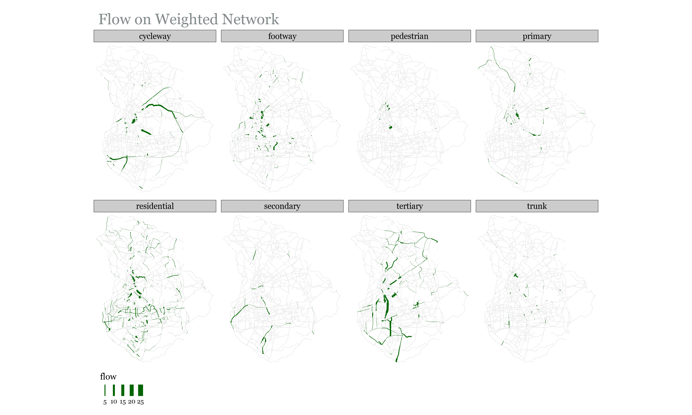

```{r, echo=FALSE, eval=FALSE}
file.rename("README.pdf", "cycle-network-paper.pdf")
```


# Ideas and discussion

- Intro: possible trim down substantially then add some literature in (a) Calculating Potential Demand / (b) Routing / (c) Road Segment Prioritization
- Community Detection: Where in the document should this section be? It is now before Road Segment Prioritization, but I can merge them
- Should we use other cities for the sake of comparison (compare communities, road types etc)
- How to add tables properly (they are now added using latex code which only shows up when outputting to pdf)
- Footnotes are sometimes split between pages. How do I keep them on the same page?
- What is the best way to write pseudocode (Steps for Algorithm 1 and 2)

<!-- ## Missing Data -->

<!-- There are a couple of files that cannot be synced to github due to their -->
<!-- size. These files are neseccary for the scripts to run. Below are links -->
<!-- to where you can download them, and instructions on where to place them -->
<!-- in the repo file structure -->

<!-- Flow Data (2011 Census Origin-Destination Data): -->

<!--   - Source: <https://www.nomisweb.co.uk/census/2011/bulk/rOD1> —\> -->
<!--     Choose File **“WU03EW”** -->
<!--   - Location in Repo: data-raw/flow\_data.csv -->

<!-- Middle Layer Super Output Areas (December 2011) Boundaries: -->

<!--   - Source: -->
<!--     <http://geoportal.statistics.gov.uk/datasets/826dc85fb600440889480f4d9dbb1a24_0> -->
<!--   - Location in Repo: data-raw/MSOA\_2011\_Boundaries/\[Add files here\] -->

<!-- ----- -->

<!-- ## Scripts -->

<!-- The scripts should be run in the order they are numbered in (and listed -->
<!-- in here). The only exception is \_x\_dodgr\_weighting\_profiles.R. -->

<!-- Check the readme -->
<!-- [here](https://github.com/Hussein-Mahfouz/Bicycle-Network-Optimization) -->
<!-- for detailed info on each script -->

<!-- Keywords -->

<!-- ======== -->

<!-- Highlights -->

<!-- ======== -->

# Introduction


The 2015 Paris agreement [@agreement2015paris] was an acknowledgment that fundamental changes to our lives and economies are necessary to reduce the impacts of climate change. The transport sector is one of many sectors facing transformation, with innovation and policy measures leading to the introduction of ‘greener’ private vehicles. But as demand for transport rises, resulting in increased congestion, public and active modes of transport are also gaining more recognition. The benefits of the latter extend beyond congestion and the environment, as it promises to help alleviate what is referred to as the pandemic of global inactivity; physical inactivity is on the rise and has become the 4th highest cause of death globally [@kohl2012pandemic]. Various studies have documented the association between active transport and lower risk of disease, including cancer and cardiovascular disease [@celis2017association; @jarrett2012effect; @patterson2020associations].
In the wake of the Covid-19 pandemic, and the resulting reduced capacity of public transport, the UK government has pledged to invest billions of pounds to improve walking and cycling infrastructure across the country. While this unprecedented sum is an opportunity to reshape cities in a way that improves the well-being of citizens, it does come with a warning:

> "Inadequate cycling infrastructure discourages cycling and wastes public money. Much cycling infrastructure in this country is inadequate. It reflects a belief, con- scious or otherwise, that hardly anyone cycles, that cycling is unimportant and that cycles must take no meaningful space from more important road users, such as motor vehicles and pedestrians - [@departmentgearchange2020]"

The funding on its own is therefore no guarantee of a change in commuting across the country; it must be used to design adequate cycling infrastructure that is based on motivators and deterrents to cycling. 


A considerable amount of research has been done towards that end. Segregated cycling infrastructure^[Segregated cycling infrastructure refers to road space that is allocated to cyclists only, with physical separation to protect cyclists from other modes of transport.] has been shown to increase cycling uptake [@aldred2019impacts; @goodman2014new; @marques2015infrastructure], with the separation from motorized vehicles being key [@winters2011motivators]. Revealed preference of cyclists shows that they are willing to deviate from the most efficient routes in order to commute on safer roads [@crane2017longitudinal]. However, such deviations are only considered if they do not considerably increase route circuitry; behaviour studies have found that the probability of choosing a route decreases in proportion to its length relative to the shortest route [@broach2011bicycle; @winters2010far]. Another defining feature for cycling infrastructure is how well connected it is. Cyclists prefer cohesive infrastructure, particularly when cycling on arterial roads with high levels of motorized traffic [@stinson2003commuter], and the lack of well-connected cycling infrastructure is one of the main obstacles to increasing cycling uptake [@caulfield2012determining]. While direct and cohesive cycling networks have been shown to positively impact cycling rates, density^[making an area's bicycle network denser means adding more cycling routes in the area and thereby giving cyclists more route options] of the cycling network is also vital [@schoner2014missing]. 


As noted by @buehler2016bikeway, it is only recently that research has pivoted from focusing on localized, street or intersection level impact towards studying the cycling network as a whole. They emphasize the promise of this shift in capturing the network-wide effect of street-level interventions. *Optimization* techniques have been used to propose improvements to cycling networks. @mesbah2012bilevel propose a bi-level formulation to optimize allocation of cycling lanes to the network without exceeding a set budget. The upper level is the proposed interventions and the lower level is the route choices made by users in reaction to changes in the network. The problem accounts for the effect of cycling lanes on car traffic, and attempts to maximize utilization of said lanes with minimal impact on car travel times. To improve cohesion of the suggested network, a constraint is added so that each link^[*link* refers to a road segment throughout this research] with a bike lane should be connected to at least one destination. Car usage is not considered by @mauttone2017bicycle, who develop an optimization framework that aims to minimize the total user cost of cycling on the network. The aggregate flow on links is obtained by using shortest paths to route existing cycling demand onto the road network, and the solution is a proposed set of links where cycling infrastructure should be added in order to minimize the overall travel cost of cyclists across the network. The cost of traversing a link is given as a function of its length and whether or not it has cycling infrastructure, and a discontinuity penalty is also added to prioritize connected road segments. The problem has also been solved by attempting to find the minimum cost of improving roadway links to meet a desired level of service (LOS) [@duthie2014optimization]. In this formulation, all OD pairs need to be connected by roads that meet the desired LOS, and a directness constraint is added so that paths between OD pairs do not exceed a certain multiple of the shortest path.


These problem formulations do not explicitly solve for continuity, which is dealt with using a either (a) a constraint specifying that each link with a bike lane should be connected to at least one destination [@mesbah2012bilevel], (b) a constraint on deviation from shortest paths [@duthie2014optimization], or (c) a discontinuity penalty [@mauttone2017bicycle]. To solve for continuity, the graph-theoretic concept of *connected components*, has been used. @natera2019data study the existing cycling network in terms of its disconnected components and introduce two different algorithms to connect these components by their most critical links and, in doing so, measure the size of the growth of the largest connected component as a function of the kilometers of network added. They observe that small investments at strategic points have a large impact on connectivity in most cases. The concept of connected components is also at the core of the methodology proposed by @olmos2020data. After routing the cycling demand onto the network links, they use percolation theory to filter out the links based on the aggregate flow^[*flow* is used throughout this research to refer to the cycling demand when it is routed onto the road network. The flow on any road segment is the cumulative demand on it, resulting from cyclists commuting between various OD pairs] passing through them, varying the flow threshold for filtering to identify the minimum flow at which the whole city is connected by a giant component. The results show a cycling network that connects the entire city, and subtracting links intersecting with current cycling infrastructure identifies links proposed for intervention.


The problem formulations outlined above look at the network as a whole when attempting to improve it. An alternative approach is to identify the different sub-networks that exist within the larger network, and work on improving each separately. Trip patterns in a city are not uniformly distributed geographically, and *community finding* methods have been used to partition study areas into localized areas that experience a disproportionate number of trips within them. @akbarzadeh2018designing use a modularity maximization approach [@blondel2008fast] on taxi trip data to identify 7 different communities in the city of Isfahan, Iran. An optimization problem is then formulated to connect nodes within each community with cycling infrastructure. The emphasis is on connectivity within the communities, not between them. @bao2017planning adopt a similar methodology, but use hierarchical clustering to specify the desired number of clusters. They use a greedy network expansion algorithm, where the link with the highest benefit-cost ratio in each cluster is selected, and the network is grown by adding neighboring links to the solution until a budget limit is met. The benefit is the flow on the link, and each link is assigned a cost based on current road conditions.


All of these network-level methodologies are underpinned by different ethical principles, even though these principles are not explicitly acknowledged by the authors. This is important since different ethical principles constitute different problem formulations and targets. Broadly speaking, transport appraisal can be based on either utilitarian or egalitarian principles. The former seeks to maximize the overall benefit, while the latter is concerned with a fair distribution of benefits [@jafino2020transport]. @nahmias2017integrating criticize the utilitarian approach that has been historically popular in the evaluation of transport investments, explaining how the maximization of overall benefit fails to account for the distribution of that benefit among communities or individuals. @lucas2016method explain how transport studies have traditionally looked at the bigger picture without studying the distribution of investments on the different parts of the study area, and go on to propose an egalitarian approach that ensures the dis-aggregation of transport policy benefits across the study area. @pereira2017distributive also emphasize the need for a more egalitarian approach to transport planning. They highlight accessibility as a cornerstone of distributive justice, and contend that policies should aim to distribute investments in a way that minimizes spatial variations in accessibility. This research attempts to compare the two principles, and in doing so determine whether a methodology formulated based on an egalitarian approach can be feasible in designing a cycling network that aligns with motivators and deterrents to cycling. **Write some more here**

# Data and Geographical Scale of Analysis

The analysis is heavily dependent on commuter data^[*commuter data* refers to publicly available Origin-Destination (OD) data, normally obtained from a census. This study uses data from the UK census [@ONS2011flowdata], which contains aggregate statistics on number of commuters between MSOA pairs, by mode of travel.]. Commuter data in the UK is publicly available at the Middle layer Super Output Area (MSOA) level; the average MSOA has a population of 8209 [@ofn2018population]. @iacono2010measuring note that such large travel zones are not ideal for understanding route choice behaviour of cyclists and pedestrians. They also give rise to an \`ecological fallacy' whereby average characteristics are assumed to apply to all residents of the aggregated geographical area. Given that more granular data is not publicly available, the study uses MSOA-level commuter data. The methodology is however applicable to more granular commuter data should it become available.

# Calculating Potential Cycling Demand

Using existing cycling demand to inform decisions on where cycling infrastructure should be added reinforces existing cycling patterns and ignores potential cycling demand that could be satisfied by a connected network. To avoid this issue, @duthie2014optimization choose to ignore demand completely, and focus on creating a network that connects the entire study area. @olmos2020data obtain the distance distribution of cyclists using a smartphone-based bicycle GPS data, and then use a rejection-sampling algorithm on the OD data of the study area to match the potential demand distribution to the distribution obtained from GPS data. 

For our purposes, we use a logistic regression model to calculate potential cycling demand. The model is adopted directly from the Propensity to Cycle Tool (PCT) [@lovelace2017propensity]. The PCT estimates  the proportion of cyclists ($\boldsymbol{C_{p}}$) for each MSOA pair should the government achieve its target of doubling cycling by 2025. The logistic regression model used to calculate $\boldsymbol{C_{p}}$ has the following parameters:

```{=tex}
\begin{align}\label{eq:pcteqn}
     logit(C_{p}) = & -4.018 - 0.6369d +  1.988\sqrt{d} + 0.008775d^2\\ & - 0.2555s + 0.00206ds -0.1234\sqrt{d}s\nonumber 
\end{align}
```

\noindent where **d** and **s** are the distance and slope respectively for the OD pair. The authors use square and square-root distance terms "to capture the non-linear impact of distance on the likelihood of cycling", and interaction terms to capture the combined effect of slope and distance [@lovelace2017propensity].

The potential demand calculations show that the current and potential number of cyclists both follow a bell-shaped distribution, with the number of trips peaking around the 3-5km commuting distance and then going back down for longer distances (see Figure \@ref(fig:potdemhistograms)).

```{r potdemhistograms, fig.cap="Distribution of Potential Cycling Demand", out.width="32%", fig.show='hold', echo=FALSE}
knitr::include_graphics(c(
  "data/Manchester/Plots/histogram_distance_all_vs_cycling.png",
  "data/Manchester/Plots/histogram_distance_all_vs_cycling_potential.png",
  "data/Manchester/Plots/histogram_distance_cycling_potential_vs_current.png"
))
```


```{r desirefacetcycling, fig.cap="Current and Potential Cycling Demand", out.width="75%", fig.show='hold', echo=FALSE}
knitr::include_graphics("data/Manchester/Plots/desire_facet_cycling.png")
```

It should be noted that the calculations assume a future that is constrained by physical geography; i.e. we consider cycling in the traditional sense. Recently there have been various micro-mobility solutions, including e-bikes, that allow commuters to traverse longer distances and hillier roads with less effort than traditional bicycles. While these modes would probably be associated with less geographical impedance, it is beyond the scope of this work to integrate that into the analysis. Doing so is partially restricted by the lack of data on the proliferation of these modes, which raises the point that perhaps the census data category of `Bicycle' is too vague, and should be further dis-aggregated to distinguish between traditional bicycles and other forms of micro-mobility.


# Routing

The next step is to route the potential cycling demand ($\boldsymbol{C_{p}}$) between all OD pairs onto the road network. **TALK ABOUT WEIGHTED ROUTING IN OTHER STUDIES **
<!-- This expands on the work of @mauttone2017bicycle, by going beyond simply favoring roads with existing cycling infrastructure to creating a hierarchy of road preference. -->

\begin{longtable}{lll}
\caption{OSM Road Types}
\label{table:osmroadtypes}\\
\textbf{OSM Road Type } & \textbf{Description}                                                                                                                                            & \textbf{UK Equivalent}                                                                                                   \endfirsthead 
\hline
Motorway                & \begin{tabular}[c]{@{}l@{}}Road open to high-speed \\vehicles only\end{tabular}                                                                                 & Motorway                                                                                                                 \\* 
\hline
Trunk                   & \multirow{5}{*}{\begin{tabular}[c]{@{}l@{}}Roads that don't \\meet motorway criteria, \\in descending order \\of importance and \\through-traffic\end{tabular}} & A-Roads with Primary Status                                                                                              \\* 
\cline{3-3}
Primary                 &                                                                                                                                                                 & A-Roads with Non-Primary Status                                                                                          \\* 
\cline{3-3}
Secondary               &                                                                                                                                                                 & B-roads                                                                                                                  \\* 
\cline{3-3}
Tertiary                &                                                                                                                                                                 & \begin{tabular}[c]{@{}l@{}}Classified unnumbered roads \\OR unclassified busy through roads\end{tabular}                 \\* 
\cline{3-3}
Unclassified            &                                                                                                                                                                 & \multirow{2}{*}{\begin{tabular}[c]{@{}l@{}}Unclassified (Intended for \\local traffic - 60\% of UK roads)\end{tabular}}  \\* 
\cline{1-2}
Residential             & Function is purely residential                                                                                                                                  &                                                                                                                          \\ 
\hline
Service                 & \begin{tabular}[c]{@{}l@{}}Road that provides \\access to a facility\end{tabular}                                                                               &                                                                                                                          \\ 
\hline
Track                   & \begin{tabular}[c]{@{}l@{}}Unpaved - suitable for \\two track vehicles (mostly rural)\end{tabular}                                                              &                                                                                                                          \\ 
\hline
Cycleway                & \begin{tabular}[c]{@{}l@{}}Designated cycleway - \\open to cyclists only\end{tabular}                                                                           &                                                                                                                          \\ 
\hline
Path                    & \begin{tabular}[c]{@{}l@{}}Unpaved - open to \\non-motorized traffic only\end{tabular}                                                                          &                                                                                                                          \\
\hline
\end{longtable}


To conduct routing, the following is considered:

1.  **Cyclist Preference**: Work done by @dill2013four on examining cyclist typologies determined that around 60% of Portland residents fit under the *interested but concerned* category. These were people that enjoyed cycling but avoided it due safety concerns. The key to encouraging this group was to create a low-stress cycling network, not only though segregated infrastructure but also by planning routes that passed through residential streets.
2.  **Low-Traffic Neighborhoods**: The UK Department for Transport is allocating funding to local authorities to invest in Active Transport, partially through the creation of LTNs [@departmentgearchange2020]. This includes closing off residential streets to motorized traffic.
3.  **Existing Cycling Infrastructure**: Utilizing existing cycling infrastructure makes economic sense, as small investments may lead to large connectivity gains as the disconnected cycling infrastructure gets joined together.

The weighting profiles are therefore adjusted to favor less stressful streets (based on information from Table  \@ref(table:osmroadtypes)), and roads with existing cycling infrastructure. This is also in line with the creation of LTNs, as residential streets are those where motorized traffic is most likely to be banned in the creation of LTNs. 

<!-- **ADD TABLE - THIS IS BASIC** -->
<!-- ```{r, echo=FALSE, message = FALSE} -->
<!-- weight_profiles <- readxl::read_excel("Paper/paper_tables.xlsx", sheet = "Weighting Profile") -->

<!-- knitr::kable(weight_profiles, -->
<!--              caption = "Weighting Profiles") -->
<!-- ``` -->
\begin{longtable}{lrrr}
\caption{Weighting Profiles}
\label{table:weightprofiles}\\
\multirow{2}{*}{\textbf{OSM Road Type}} & \multicolumn{3}{c}{\textbf{Weighting Profile}}                                                 \\*
                                        & \multicolumn{1}{l}{\textit{Unweighted}} & \multicolumn{1}{l}{\textit{Weighted}} & \multicolumn{1}{l}{\textit{Weighted\_2}}  \endfirsthead
Cycleway                                & 1          & 1                                     & 1                                         \\
Path                                    & 1          & 0.9                                   & 0.9                                       \\
Residential                             & 1          & 0.9                                   & 0.9                                       \\
Service                                 & 1          & 0.9                                   & 0.9                                       \\
Tertiary                                & 1          & 0.9                                   & 0.9                                       \\
Track                                   & 1          & 0.9                                   & 0.9                                       \\
Unclassified                            & 1          & 0.9                                   & 0.9                                       \\
Secondary                               & 1          & 0.8                                   & 0.8                                       \\
Primary                                 & 1          & 0.7                                   & \textcolor{red}{0}                        \\
Trunk                                   & 1          & 0.6                                   & \textcolor{red}{0}                        \\
Motorway                                & 1          & \textcolor{red}{0}                    & \textcolor{red}{0}                       
\end{longtable}

\noindent A weighted distance $\boldsymbol{d_{w}}$ for each road segment is calculated as following ^[The **dodgr** r package [@padgham2019dodgr] is used to route cycling demand onto the road network. The package uses the OpenStreetMaps (OSM) road network and allows the user to assign weights to roads based on their type. The routing is done based on weighted shortest paths, with the distance along each road segment being divided by a factor to obtain the weighted distance for routing. It is more intuitive to multiply when weighting a network, but the dodgr package divides by numbers between 0 and 1, which achieves the same result. For the sake of reproducibility, we stick to the convention used in the package.]: 

\begin{equation}\label{eq:weight_distance}
    d_{w} = d_{unw}  \:/\:  W
\end{equation}

\noindent where $\boldsymbol{d_{unw}}$ is the unweighted distance and $\boldsymbol{W}$ is the weight from Table \ref{table:weightprofiles}. 

All weights are between 0 and 1, and the values in the \textit{Weighted} profile are chosen so as to be inversely proportional to the stress level experienced by cyclists on them. The \textit{Unweighted} weighting profile is used to compare increases in route length resulting from two different approaches: 


1. **Weighted**: Relatively high impedance on Primary and Trunk roads (to minimize cycling on them).
2. **Weighted\_2**: Avoiding Primary and Trunk Roads completely.


Comparing the cycling demand routed on the weighted and unweighted road network allows us to get a better understanding of the importance of different road types. In the case of Manchester, trunk roads bisect the city and are a major part of unweighted shortest paths (Figure \@ref(fig:flowsfacetunweighted)). On the other hand, cycleways are not part of unweighted shortest paths, and so very little of the cycling demand is routed through them. In the weighted network, cycleways are much better utilized, and the majority of the cycling demand passes through tertiary roads, as expected. 

```{r flowsfacetunweighted, fig.cap="Flow Results Based on **Unweighted** Shortest Paths (Manchester)", out.width="90%", fig.show='hold', echo=FALSE}
knitr::include_graphics("data/Manchester/Plots/flows_facet_unweighted_Manchester.png")
```

```{r flowsfacetweighted, fig.cap="Flow Results Based on **Weighted** Shortest Paths (Manchester)", out.width="90%", fig.show='hold', echo=FALSE}

```

<!-- The difference between aggregate flow on weighted and unweighted networks is dependant on the road network of the city. Comparing Manchester to Nottingham, we see that trunk roads are much more important in the former, as over 25\% of flow on the unweighted road network passes through them. For Nottingham, less than 10\% of the flow on the unweighted network passes through trunk roads, but almost 25\% of the flow passes through tertiary roads (Figure \ref{fig:perc_person-km}).  -->

The results of routing potential cycling demand on the weighted and unweighted networks are understandably quite different. From Figure \@ref(fig:flowsfacetunweighted) we can see that trunk and primary roads are the most efficient means of traversing the road network of Manchester. Both of these road types are classified as Primary A roads according to the UK Department for Transport's road classification (Table \@ref(table:osmroadtypes)), and are therefore part of the Primary Route Network (PRN) [@department2012guidance]. The PRN has the widest, most direct roads on the network, and carries most of the through traffic. This includes freight, with all roads in the PRN being required by law to provide unrestricted access to trucks up to 40 tonnes [@department2012guidance]. 

We choose to avoid routing the potential cycling demand on Primary A Roads for the following 2 reasons:


1. **Logistical Difficulty**: Changes on these roads need to be agreed upon by all affected authorities [@department2012guidance], which may prove to be difficult. 
2. **Low Traffic Neighborhoods (LTNs)**: The UK government is aiming to restrict access to motorized vehicles on residential roads to create LTNs [@departmentgearchange2020]. This is part of a policy to prevent automobile rat-running and make streets more accessible to cyclists and pedestrians. Under such a policy, Primary A roads would become even more essential for motorized traffic and it would be more difficult to reallocate road space on these roads to cyclists. 

Routing potential cycling demand on a weighted network is more in line with government policy to create LTNs. Figure \@ref(fig:flowsfacetweighted) shows that routing on the weighted network significantly reduces flow on the trunk and primary roads, but does not eliminate it completely. This is intentional, as the impedance on these roads is only slightly higher than remaining road types (See Table \@ref(table:weightprofiles)). Potential cycling demand is only routed on these roads if there are no routes through other roads that offer comparable directness. 

Banning cycling flow completely on trunk and primary roads may result in excessively circuitous paths, as seen in Figure \@ref(fig:boxplotcircuity). When routing using the weighting profile in Table \@ref(table:weightprofiles), we see that shortest paths increase by less than 5\% on average from unweighted shortest paths, with the largest increases still below 30\%. When routing on primary and trunk roads is banned (weighted_2 profile in Table \@ref(table:weightprofiles)), the average increase relative to unweighted shortest paths rises to 10\%, with certain locations experiencing more significant negative effects on accessibility. 

```{r boxplotcircuity, fig.cap="Effect of Banning Cyclists from Trunk and Primary Roads for all OD Pairs (Manchester)", out.width="35%", fig.show='hold', echo=FALSE}
knitr::include_graphics("data/Manchester/Plots/boxplot_weighted_unweighted_distances.png")
```

Given that cyclists will only deviate from shortest paths by a certain amount to access better cycling infrastructure (as explained in Section \@ref(introduction), allowing flow on some stretches of trunk and primary roads is necessary to insure cycling uptake and equitable access to cycling infrastructure. In its new vision for walking and cycling, the Department for Transport acknowledges that minimal segregated stretches of bicycle lanes on main roads will be necessary to avoid circuitous cycling networks [@departmentgearchange2020].

Weighting the road network also allows us to better utilize existing cycling infrastructure, as can be seen by the higher flow on cycleways in Figure \@ref(fig:flowsfacetweighted). Again, the small differences in impedance between cycleways and other road types mean that cycleways that require significant deviation are not routed on. 

It should be reiterated that the weighting profile used for routing has been developed for the purposes of this study. It creates a hierarchy of road preference that is grounded in cyclist preference and government plans to create LTNs. Sensitivity analysis should be done to determine an optimal weighting profile, but given the variation in city road networks<!-- (Figure \ref{fig:perc_person-km}) -->, these would probably require calibration to the specific city. More accurate routing could be carried out given the availability of road-level data. In such cases we would add additional impedance to specific roads, giving more useful routing results than the current methodology which considers all roads of the same type to be equivalent.

One use-case of such granular data would be to identify roads that serve schools. The Department of Transport notes that the number of school children being driven to school has trebled over the past 40 years [@departmentgearchange2020], and so having cycling infrastructure serving schools is key to achieving the government target of getting more children to cycle. This would not be difficult, as over 75\% of children in the UK live within a 15 minute cycle from their school [@departmentcycleinfradesign2020]. @goodman2019scenarios show that if dutch levels of cycling were achieved in the UK, the \% of children cycling to school could increase from 1.8\% to 41\%.

In their typology of cyclists, @dill2013four found that a majority of people who say they would never cycle had never cycled to school, whereas confident cyclists were those most likely to have cycled to school. Getting people to cycle from a young age is therefore key to achieving societal change in commuting habits.   

# Community Detection 

One of the main aims of this research is to incorporate egalitarian principles by fairly distributing investments in cycling infrastructure. One way of quantifying this is to split up the city into smaller geospatial areas and target equal investment in each of those areas. Community detection offers us a way to delineate such a split; cyclists are limited in their commuting distance (see Figure \@ref(fig:cyclinghistmanc)), and so trip attractors are more likely to have a local catchment area of cyclists.

```{r cyclinghistmanc, fig.cap="Cycling Commuting Distance - Manchester (2011 Census Data)", out.width="30%", fig.show='hold', echo=FALSE}
knitr::include_graphics("data/Manchester/Plots/histogram_distance_cycling.png")
```

In our case, the network is the city; the nodes are the population-weighted MSOA centroids and the links connecting each MSOA pair are weighted by the potential cycling demand between them. The Louvian method  [@blondel2008fast] is used to separate MSOAs into communities. Potential cycling demand is used since we assume that this is what the cycling demand will be once the cycling infrastructure is added. To assign road links to communities, the following steps are carried out: 

1. Create links between MSOA centroids and weigh these links by potential cycling demand between them.
2. Use Louvian method to determine optimal number of communities and assign each MSOA centroid to a community.
3. Assign each road link to the same community as the closest MSOA centroid to it.

The results show that Manchester can be split into four large communities and one small one (Figure \@ref(fig:communitiesmanchester)).

```{r communitiesmanchester, fig.cap="Communities Based on Potential Cycling Demand (Manchester)", out.width="75%", fig.show='hold', echo=FALSE}
knitr::include_graphics("data/Manchester/Plots/communities_alternative_Manchester.png")
```


# Road Segment Prioritization

After routing the potential cycling demand onto the road network using weighted shortest paths, we have estimates for the cumulative potential cycling demand passing through all road segments. This cumulative demand (referred to as *flow* is then used as a basis for determining where best to invest in segregated cycling infrastructure. In doing so, we must account for the motivations and deterrents for cycling identified in Section \@ref(introduction), namely direct and well connected routes.

For this purpose, two algorithms are proposed. Both utilize existing infrastructure from the beginning and allow us to compare a solution that focuses on utilitarianism to one that focuses on egalitarianism. In both algorithms, links are selected iteratively and the iteration at which each link is added to the solution is recorded. Investments in cycling infrastructure can be limited by budget constraints, so it can be useful to see where best to allocate a defined length of segregated infrastructure. 

## Algorithm 1: Utilitarian Expansion

1. Identify all links that have segregated cycling infrastructure and add them to the initial solution
2. Identify all links that neighbor links in the current solution
3. Select neighboring link with highest flow and add it to the solution
4. Repeat steps 2 \& 3 until all flow is satisfied or investment threshold is met


This algorithm ensures that the resulting network is connected. It also satisfies the directness criteria, since links on the weighted shortest paths are those that have the highest flow passing through them (this is a result of the routing in Section \@ref(introduction).

## Algorithm 2: Egalitarian Expansion (Focus on Fair Distribution of Resources)

The first algorithm focuses on connectivity and directness, but not on fairly distributing investment. The latter is not a requirement for increasing cycling uptake, but it is fundamental for spatial equity, as explained in Section \@ref(introduction). This algorithm incorporates the ideal of fair distribution by using community detection to partition the road network. 

The algorithm uses the following logic to ensure fair distribution between communities:


1. Identify all links that have segregated cycling infrastructure and add them to the initial solution
2. Identify all links that neighbor links in the current solution
3. Select *from each community* one neighboring link with highest flow and add it to the solution
4. If there are no more neighboring links in a community, select the link with the highest flow in that community, regardless of connectivity, and add it to the solution
5. Repeat steps 2, 3 \& 4 until all flow is satisfied or investment threshold is met

Even though we may end up with a more disconnected network, we will have separate connected networks in each community. Given that communities are defined by having more internal flow than external flow, this is a satisfactory solution.

The results of the community detection are used to evaluate the algorithms. This is done by looking at the *person-km satisfied* as cycling infrastructure is added. Person-km is a measure of the total km cycled on a road segment, so it is the product of the number of potential commuters cycling on that road segment ($flow$) and the length of the segment in km ($l$). For each road segment, the person-km is equal to $flow * l$. In the case of Manchester, Table (**Reference the table**) shows that almost half of the person-km is in community 1 , while only 0.5\% of total person-km on the network is in community 5.


```{r personkmtable, echo=FALSE, message = FALSE}

library(tidyverse)
library(sf)

table <- readRDS("data/Manchester/graph_with_flows_weighted_communities.RDS")
# we weigh the flow on each edge by its distance. We can then get how much of the commuter km are satisfied
table$person_km <- table$flow * table$d
# get % of total person km on each link
table$person_km_perc <- (table$person_km / sum(table$person_km)) * 100

table <- table %>% sf::st_drop_geometry() %>% 
  dplyr::group_by(Community) %>%
  summarize(`Person-Km (Total)` = round(sum(person_km),0),
            `Person-Km (%)` = round(sum(person_km_perc),1))

knitr::kable(table,
             caption = "Total Person-Km in Different Communities (Manchester)")
       
```

Looking at the person-km satisfied (Figure \@ref(fig:growthtotal)), we see that the incremental addition of cycling infrastructure is better distributed between communities using Algorithm 2; equal distribution of investment results in the gain in % of person km satisfied in each community being inversely correlated with the size of the community. In addition, we find that the restrictions imposed by Algorithm 2 on the network expansion do not seem to have a noticeable effect on the city-wide \% of person-km satisfied. Comparing both algorithms, we can see that Algorithm 1 provides only marginally quicker city-wide gains than Algorithm 2. 


```{r growthtotal, fig.cap="Comparing Overall (Dashed) and Community Level Person-Km Satisfied (Manchester)", out.width="45%", fig.show='hold', echo=FALSE}
knitr::include_graphics(c(
  "data/Manchester/Plots/Growth_Results/growth_utilitarian_satisfied_km_both_flow_column.png",
  "data/Manchester/Plots/Growth_Results/growth_egalitarian_satisfied_km_both_flow_column.png"
))
```

Figure \@ref(fig:growth3MapandBar) gives us a geographic representation of the results from Algorithm 2; it shows when each link was added to the solution (first 100km, second 100km, etc). We can see that, generally, road segments around cycling infrastructure are prioritized, except for those neighboring cycling infrastructure on the very periphery. The first 100km is also spatially distributed across the city, with no apparent bias towards a particular area.

It is also important to understand how the different highway types contribute to the proposed network. Figure \@ref(fig:growth3MapandBar) shows that most of the flow will be on residential and tertiary roads, as expected from the weighting profile defined in Table \@ref(table:weightprofiles). 


```{r growth3MapandBar, fig.cap="Results of Alg. 2 (Manchester)", out.width="45%", fig.show='hold', echo=FALSE}
knitr::include_graphics(c(
  "data/Manchester/Plots/Growth_Results/growth_egalitarian_priority_all_FLOW.png",
  "data/Manchester/Plots/Growth_Results/growth_egalitarian_investment_highways_flow.png"
))
```

## Connectivity

Existing cycling infrastructure is made up of many disconnected components. Both Algorithm 1 and 2 start with all existing segregated cycling infrastructure and aim to create an efficient, connected network. Figure \@ref(fig:componentsandGCC) shows that both algorithms gradually reduce the number of components as more infrastructure is added, but Algorithm 2 is able to provide better connectivity with less investment. 

Consistent growth can also be seen for the size of the Largest Connected Component in the proposed bicycle network (Figure \@ref(fig:componentsandGCC)). Here however, we find that there is little difference between both Algorithms. 

```{r componentsandGCC, fig.cap="Network Characteristics", out.width="45%", fig.show='hold', echo=FALSE}
knitr::include_graphics(c(
  "data/Manchester/Plots/Growth_Results/growth_util_egal_components_number_comparisonManchester.png",
  "data/Manchester/Plots/Growth_Results/growth_util_egal_components_gcc_comparisonManchester.png"
))
```


# Overarching Policies

While segregated, connected, and direct cycling infrastructure is key to achieving high levels of cycling, research has shown that it cannot exist in a vacuum. @wardman2007factors developed a mode choice model for the UK and their results showed that improved cycling infrastructure on its own only had modest impacts on mode shift, and even the unlikely scenario of all urban routes being serviced by segregated bike lanes was forecast to increase cycling mode share by only 3%. However, cities that invest in more comprehensive cycling projects show a more significant increase in the number of cyclists as well as the cycling mode share [@pucher2010infrastructure]. These cities do not just focus on infrastructure, but on general policies as well as restricting car use. Evaluation of policies in Denmark and Germany and the Netherlands has shown that their high cycling mode share is down to a broader set of policies that also include traffic calming, cycling rights of way, bike parking, integration with the public transport network, and making driving cars both expensive and inconvenient [@pucher2008making]. While these policies are outside the scope of this research, it is important to recognize their key role in bringing about an increase in levels of cycling.

# Conclusions

The research provides a methodology for designing a cycling network that respects both the needs of the users and the ambitions of the government. The methodology can be used as a starting point for introducing a direct, connected, and low-stress network for any city by leveraging available open data. The only data necessary for reproducing it is the road network (from OSM), its topography (from satellite imagery), and commuter data (from the national census). It should be noted that the recommendations are only as good as the granularity of the available data.  
A core part of the methodology is determining where there is high potential for cycling, and using this as a basis for recommendations on road space reallocation in order to unlock potential cycling demand. A routing engine was used to study the effects of limiting access on different road types, and it was found that reducing cyclist flow on roads with high through-traffic resulted in acceptable increases in commuting distances. As a result, a hierarchy of road preference was used to route potential cycling demand. Algorithms were developed to determine where investments in cycling infrastructure should be prioritized. These algorithms, based on connectivity and egalitarian principles of resource distribution, ensured that whatever the level of investment, the resulting cycling network would improve connectivity of existing cycling infrastructure.

The research hopes to aid in the current shift towards active transport that is being promoted by the UK government. The success of such a shift is contingent on the appeal of the cycling network for prospective cyclists, a fact that was used as the basis for the methodology outlined here. 


# References {#references .unnumbered}

<!-- to fix indentation: https://github.com/crsh/papaja/issues/37#issuecomment-104185288 -->

```{=tex}
\setlength{\parindent}{-0.5in}
\setlength{\leftskip}{0.5in}
\setlength{\parskip}{8pt}
```
