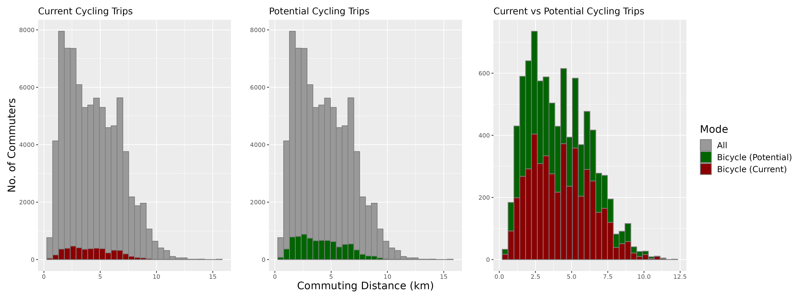
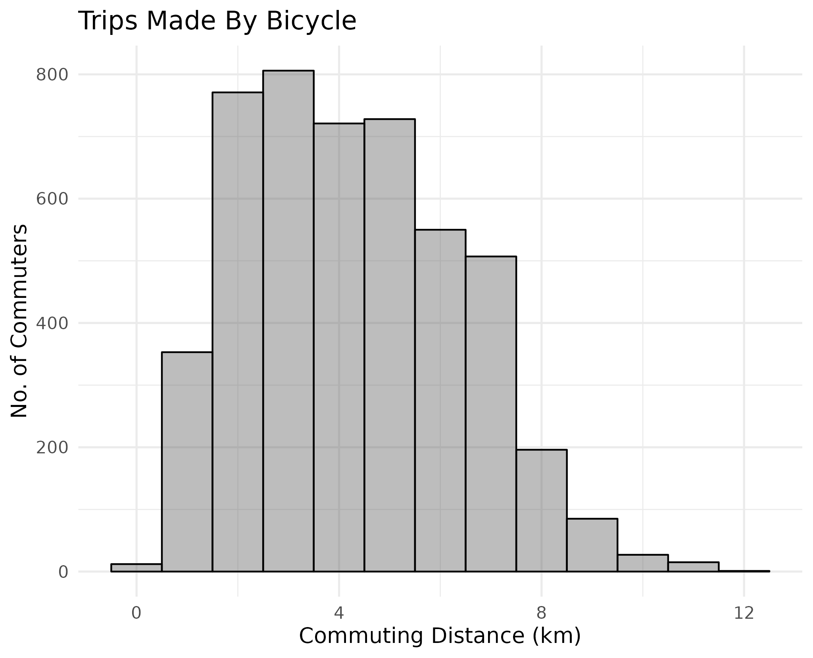
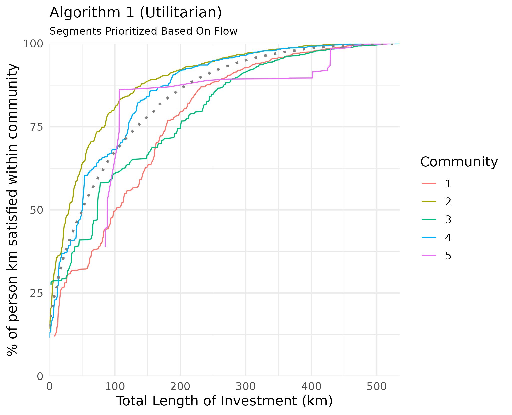
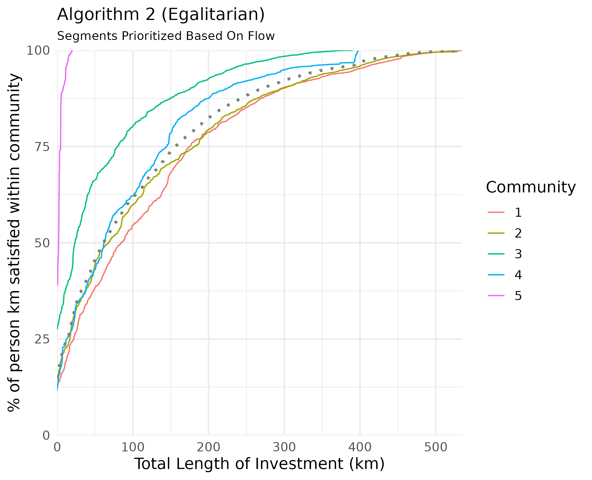
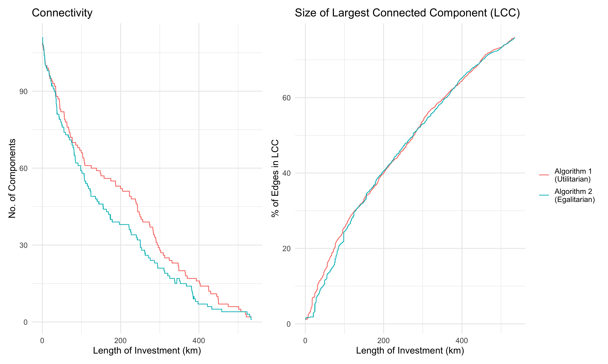

A Road Segment Prioritization Approach for Cycling Infrastructure
================

<!-- Highlights -->
<!-- ======== -->

# Introduction

The 2015 Paris agreement (UN, 2015) acknowledged that fundamental
changes to societies and economies are necessary to mitigate climate
change. Like other sectors, transport is under substantial pressure to
decarbonise, resulting in a number of technical innovations including
electric vehicles. But new vehicle technologies can only go so far and
do not tackle parallel problems such as congestion, road traffic
casualties and physical inactivity (Brand et al., 2020).

In this context, interest and investment in active modes are growing.
The benefits extend beyond congestion and the environment, as active
travel can also help alleviate what is referred to as the pandemic of
global inactivity; physical inactivity is on the rise and has become the
4th highest cause of death globally (Kohl 3rd et al., 2012). Various
studies have documented the association between active transport and
lower risk of disease, including cancer and cardiovascular disease
(Celis-Morales et al., 2017; Jarrett et al., 2012; Patterson et al.,
2020). In the wake of the Covid-19 pandemic, and the resulting reduced
capacity of public transport, the UK government has pledged to invest
billions of pounds to improve walking and cycling infrastructure across
the country. While this unprecedented sum is an opportunity to reshape
cities in a way that improves the well-being of citizens, it does come
with a warning:

> “Inadequate cycling infrastructure discourages cycling and wastes
> public money. Much cycling infrastructure in this country is
> inadequate. It reflects a belief, conscious or otherwise, that hardly
> anyone cycles, that cycling is unimportant and that cycles must take
> no meaningful space from more important road users, such as motor
> vehicles and pedestrians” (DfT, 2020a).

The funding on its own is therefore no guarantee of a change in
commuting across the country; it must be used to design adequate cycling
infrastructure that is based on motivators and deterrents to cycling.

## Motivators and Deterrents to Cycling

Much research has been done to understand what gets people to cycle.
Segregated cycling infrastructure[1] has been shown to increase cycling
uptake (Aldred et al., 2019; Goodman et al., 2014; Marqués et al.,
2015), with the separation from motorized vehicles being key (Winters et
al., 2011). Revealed preference of cyclists shows that they are willing
to deviate from the most efficient routes in order to commute on safer
roads (Crane et al., 2017). However, such deviations are only considered
if they do not considerably increase route circuitry; behaviour studies
have found that the probability of choosing a route decreases in
proportion to its length relative to the shortest route (Broach et al.,
2011; Winters et al., 2010). Another defining feature for cycling
infrastructure is how well connected it is. Cyclists prefer cohesive
infrastructure, particularly when cycling on arterial roads with high
levels of motorized traffic (Stinson and Bhat, 2003). The lack of
well-connected cycling infrastructure is one of the main obstacles to
increasing cycling uptake (Caulfield et al., 2012). While direct and
cohesive cycling networks have been shown to positively impact cycling
rates, density[2] of the cycling network is also vital (Schoner and
Levinson, 2014).

## Network-Level Approaches

The studies outlined above lay out the fundamentals for designing
cycling networks that generate significant cycling uptake, but they do
not propose network-level interventions. In this section we outline
methods used in past studies, namely optimization and network analysis
methods, such as connected components and community detection, and
examine how they are leveraged to suggest cycling network designs. We
compare the effectiveness of these network-level studies in
incorporating the fundamentals outlined above. Our proposed approach is
inspired by these methods, but it attempts to add to them by ensuring
that all of the outlined fundamentals are accounted for. It also goes
further by attempting to factor in ethical considerations related to the
distribution of investment.

*Optimization* methods have been used to propose improvements to cycling
networks. Mesbah et al. (2012) propose a bi-level formulation to
optimize allocation of cycling lanes to the network without exceeding a
set budget. They account for the effect of cycling lanes on car traffic,
and attempt to maximize utilization of said lanes with minimal impact on
car travel times. Safeguarding against increased car traffic may be
counter-productive if the goal is to create a mode-shift, as research
has shown that reducing road space for cars leads to less cars on the
road, a phenomenon referred to as “traffic evaporation” (Nello-Deakin,
2020). On the other hand, Mauttone et al. (2017) developed an
optimization framework aiming at minimizing the total user cost of
cycling on the network without considering car usage. The aggregate
flow[3] on road segments (links) is obtained by using shortest paths to
route existing cycling demand onto the road network. The solution is a
proposed set of links where cycling infrastructure should be added in
order to minimize the overall travel cost of cyclists across the
network. The cost of traversing a link is given as a function of its
length and whether or not it has cycling infrastructure. The problem has
also been solved by attempting to find the minimum cost of improving
roadway links to meet a desired level of service (LOS) (Duthie and
Unnikrishnan, 2014). In this formulation, all origin-destination (OD)
pairs need to be connected by roads that meet the desired LOS. A
limitation of these approaches is that they do not explicitly solve for
continuity. The latter is addressed using either a constraint specifying
that each link with a bike lane should be connected to at least one
destination (Mesbah et al., 2012), a constraint on maximum deviation
from shortest paths (Duthie and Unnikrishnan, 2014), or a discontinuity
penalty to prioritize connected road segments (Mauttone et al., 2017).

In this paper, continuity is analysed by looking at the connectivity of
the network through the graph-theoretic concept of *connected
components*. Natera et al. (2019) for example, study the existing
cycling network in terms of its disconnected components. They propose
two different algorithms to connect disconnected components; one
connects the two largest components, and the other connects the largest
component to its nearest neighbor. By measuring the growth of the
largest connected component as a function of the kilometers of network
added, they determine that these approaches are more effective at
improving cycling network connectivity than random allocation of cycling
infrastructure. The concept of connected components is also at the core
of the methodology proposed by Olmos et al. (2020). After routing the
cycling demand onto the network links, they use percolation theory to
filter out the links based on the aggregate flow passing through them,
varying the flow threshold for filtering to identify the minimum flow at
which the whole city is connected by a giant component. While these
approaches deal with continuity better, they look at the network as a
whole when attempting to improve it, and in doing so fail to account for
equitable distribution of infrastructure.

## Ethical Underpinnings and Proposed Approach

All of these network-level methodologies are underpinned by ethical
principles, even though these principles are not explicitly acknowledged
by the authors. This is important since different ethical principles
constitute different problem formulations and targets. Broadly speaking,
transport appraisal can be based on either utilitarian or egalitarian
principles. The former seeks to maximize the overall benefit, while the
latter is concerned with a fair distribution of benefits (Jafino et al.,
2020). <!-- @nahmias2017integrating criticize the -->
<!-- utilitarian approach that has been historically popular in the -->
<!-- evaluation of transport investments, explaining how the maximization of -->
<!-- overall benefit fails to account for the distribution of that benefit -->
<!-- among communities or individuals. @lucas2016method explain how -->
<!-- transport studies have traditionally looked at the bigger picture -->
<!-- without studying the distribution of investments on the different parts -->
<!-- of the study area, and go on to propose an egalitarian approach that -->
<!-- ensures the disaggregation of transport policy benefits across the study -->
<!-- area.  --> The utilitarian approach, historically popular in
transport planning, has been criticised for focusing on the bigger
picture and failing to account for the distribution of investments on
the different communities of the study area (Lucas et al., 2016;
Nahmias-Biran et al., 2017). Pereira et al. (2017) emphasize the need
for a more egalitarian approach to transport planning. They highlight
accessibility as a cornerstone of distributive justice, and contend that
policies should aim to distribute investments in a way that minimizes
spatial variations in accessibility.

This research attempts to propose an egalitarian framework for cycling
network design. This is done by identifying the different sub-networks
that exist within the larger network, and ensuring that each gets a fair
share of investment. Trip patterns in a city are not uniformly
distributed geographically, and *community finding* methods have been
used to partition study areas into localized areas that experience a
disproportionate number of trips within them. Akbarzadeh et al. (2018)
use a modularity maximization approach (Blondel et al., 2008) on taxi
trip data to identify 7 different communities in the city of Isfahan,
Iran. An optimization problem is then formulated to connect nodes within
each community with cycling infrastructure, with the emphasis being on
connectivity within the communities, not between them. Bao et al. (2017)
adopt a similar methodology, first identifying communities and then
using a greedy network expansion algorithm to simultaneously add links
to each community. The link with the highest benefit-cost ratio in each
community is selected, and the network is grown by adding neighboring
links to the solution until a budget limit is met. The benefit is the
flow on the link, and each link is assigned a cost based on current road
conditions.

<!-- EDIT! Add more to limitations -->

Our work builds on these *community finding* approaches by proposing a
similar greedy network expansion algorithm for cycle network expansion
within communities. We incorporate community finding methods for study
area partitioning with weighted routing to avoid links that are
stressful to cycle on. In doing so, we propose an approach that accounts
for motivators and deterrents to cycling. We propose three sub-methods
that address some of the limitations of previous studies. These
limitations include (a) an inherent bias of basing network design solely
on existing cycling demand, (b) the proposal of routes that may not
correspond to studies on cyclist preference and government policies, and
(c) an insufficient consideration of the ethical principles underlying
the analysis. The current work addresses these limitations through the
following organisation. Section
<a href="#calculating-potential-cycling-demand">2</a> focuses on
calculating potential cycling demand. Section <a href="#routing">3</a>
focuses on routing the demand onto the road network while accounting for
cyclist preferences and government priorities. Section
<a href="#road-segment-prioritisation"><strong>??</strong></a> outlines
a method for partitioning the study area based on a community finding
algorithm and routed cycling demand. It then introduces the network
expansion algorithms, and compares an approach grounded in
‘egalitarianism’ to one grounded in ‘utilitarianism.’

# Calculating Potential Cycling Demand

Many of the cycling network studies mentioned above use demand data for
cycling as a starting point. Some use existing cycling demand, some
calculate potential cycling demand, and others ignore demand completely.
Duthie and Unnikrishnan (2014) note that relying only on existing
cycling activity to prioritize cycling infrastructure can reinforce
existing cycling patterns and ignore potential cycling demand that could
be satisfied by a connected network. To avoid this issue they choose to
ignore existing demand completely, and focus on creating a network that
connects the entire study area. Olmos et al. (2020) opt to calculate
potential demand instead; they obtain the distance distribution of
cyclists using a smartphone-based bicycle GPS data, and then use a
rejection-sampling algorithm on the OD data of the study area to match
the potential demand distribution to the distribution obtained from GPS
data.

*OD* data can be obtained from a range of sources, including GPS data,
household travels surveys and Census data on work locations. In areas
where observed OD data is unavailable, modelling techniques such as
spatial interaction models can be used to estimate travel volumes
between zones (Black, 1995; Martínez and Viegas, 2013; Wilson, 1971). In
this paper we use open access data from the UK census (ONS, 2011), which
contains aggregate statistics on number of commuters between
administrative zones — Middle layer Super Output Areas (MSOA) — by mode
of travel. MSOAs have an average population of just over 8000 (ONS,
2018).[4] Figures <a href="#fig:potdemhistograms">1</a> and
<a href="#fig:desirefacetcycling">2</a> illustrate the proportion of
trips cycled by distance and the geographic extent of the input OD
dataset used in this paper.

For our purposes, we use a logistic regression model to calculate
potential cycling demand. The model was adapted from the Propensity to
Cycle Tool (PCT), which estimates the proportion of trips
(**C**<sub>**p**</sub>) for each OD pair that would cycle under
different scenarios of change as a function of distance and hilliness
(Lovelace et al., 2017). We used the Government Target scenario,
indicating a nationwide target of doubling cycling by 2025. The logistic
regression model used to calculate **C**<sub>**p**</sub> has the
following parameters:

where *d* and *s* are the distance and slope associated with each OD
pair, and *α* and all *β*s, are parameters calculated by a regression
model on the training data. The square and square-root distance terms
“capture the non-linear impact of distance on the likelihood of
cycling,” and interaction terms to capture the combined effect of slope
and distance (Lovelace et al., 2017). Alternative cycling uptake models
could be ‘plugged in’ to our approach for different contexts or
scenarios of change.

The potential demand calculations show that the current and potential
number of cyclists both follow a bell-shaped distribution, with the
number of trips peaking around the 3-4km commuting distance and then
going back down for longer distances (see Figures
<a href="#fig:potdemhistograms">1</a> and
<a href="#fig:desirefacetcycling">2</a>).

<!-- note: could be a joint table/map showing sample - if reviewers request -->
<!-- ```{r potdemhistograms, fig.cap="Distribution of potential cycling demand", out.width="30%", fig.show='hold', echo=FALSE} -->
<!-- knitr::include_graphics(c( -->
<!--   "data/Manchester/Plots/histogram_distance_all_vs_cycling.png", -->
<!--   "data/Manchester/Plots/histogram_distance_all_vs_cycling_potential.png", -->
<!--   "data/Manchester/Plots/histogram_distance_cycling_potential_vs_current.png" -->
<!-- )) -->
<!-- ``` -->

<div class="figure" style="text-align: center">


<p class="caption">
Figure 1: Distribution of potential cycling demand
</p>

</div>

<div class="figure" style="text-align: center">


<p class="caption">
Figure 2: Current and potential cycling demand
</p>

</div>

The uptake model used in this paper assumes uptake of traditional
bicycles, which are affected by topography and distance due to physical
effort. As discussed in Section
<a href="#discussion-and-conclusions">5</a>, using adapted uptake models
could enable the approach to help plan for solutions such as e-bikes
that enable trips covering longer distances and hillier roads.

# Routing

The next step in our approach is to route the potential cycling demand
(**C**<sub>**p**</sub>) between all OD pairs onto the road network. We
choose not to use the PCT approach for routing as it is reliant on
external and therefore inflexible routing services.
<!-- This expands on the work of @mauttone2017bicycle, by going beyond simply favoring roads with existing cycling infrastructure to creating a hierarchy of road preference. -->

To conduct routing, the following is considered:

1.  **Cyclist Preference**: Work done by Dill and McNeil (2013) on
    examining cyclist typologies determined that around 60% of Portland
    residents fit under the *interested but concerned* category. These
    were people that enjoyed cycling but avoided it due safety concerns.
    The key to encouraging this group was to create a low-stress cycling
    network, not only though segregated infrastructure but also by
    planning routes that passed through residential streets.
2.  **Low-Traffic Neighbourhoods (LTNs)**: The UK Department for
    Transport is allocating funding to local authorities to invest in
    Active Transport, partially through the creation of LTNs (DfT,
    2020a). This includes closing off residential streets to motorized
    traffic.
3.  **Existing Cycling Infrastructure**: Utilizing existing cycling
    infrastructure makes economic sense, as small investments may lead
    to large connectivity gains as the disconnected cycling
    infrastructure gets joined together.

The above points are accounted for by using a weighted road network for
routing. This has been previously done by multiplying all road segments
without cycling infrastructure by a fixed impedance factor (Mauttone et
al., 2017), or by assigning different weights to the road segments
proportional to the investment cost of bringing them to an acceptable
level of stress for cycling (Duthie and Unnikrishnan, 2014). Perceived
stress for cyclists has been found to be a function of vehicular traffic
volume and speed (Sorton and Walsh, 1994), both of which vary
predictably with road type. Gehrke et al. (2020) build on this
information to use routing impedance factors for road segments that are
based on road type and the existence of cycling infrastructure.

For the purposes of this paper, we created a similar weighting profile
that is adjusted to favor less stressful roads (based on the definition
by Sorton and Walsh (1994) and information from Table
<a href="#table:osmroadtypes"><strong>??</strong></a>), and roads with
existing cycling infrastructure. We believe this to be more appropriate
than the simplistic approach adopted by Mauttone et al. (2017), as it
makes use of a hierarchy of road preference based on perceived stress
levels, going beyond simply favoring roads with existing cycling
infrastructure.

<!-- The approach is also in line with the creation of LTNs, as residential streets are those where motorized traffic is most likely to be banned in the creation of LTNs.  -->
<!-- **ADD TABLE - THIS IS BASIC** -->
<!-- ```{r, echo=FALSE, message = FALSE} -->
<!-- weight_profiles <- readxl::read_excel("Paper/paper_tables.xlsx", sheet = "Weighting Profile") -->
<!-- knitr::kable(weight_profiles, -->
<!--              caption = "Weighting Profiles") -->
<!-- ``` -->
A weighted distance *d*<sub>*w*</sub> for each road segment is
calculated as follows:[5]

$$

where *d*<sub>*u**n**w*</sub> is the unweighted distance and *W* is the
weight from Table .

All weights are between 0 and 1, and the values in the profile are
chosen to be inversely proportional to the stress level experienced by
cyclists on them. The weighting profile is used to compare increases in
route length resulting from two different approaches:

1.  **Weighted**: Relatively high impedance on Primary and Trunk roads
    (to minimize cycling on them).
2.  **Weighted\_2**: Avoiding Primary and Trunk Roads completely.

Comparing the cycling demand routed on the weighted and unweighted road
network allows us to get a better understanding of the importance of
different road types. In the case of Manchester, trunk roads bisect the
city and are a major part of unweighted shortest paths (Figure
<a href="#fig:flowsfacetunweighted">3</a>). On the other hand, cycleways
are not part of unweighted shortest paths, and so very little of the
cycling demand is routed through them. In the weighted network,
cycleways are much better utilized, and the majority of the cycling
demand passes through tertiary roads, as expected.

<div class="figure">


<p class="caption">
Figure 3: Flow results based on unweighted shortest paths (Manchester)
</p>

</div>

<div class="figure">


<p class="caption">
Figure 4: Flow results based on weighted shortest paths (Manchester)
</p>

</div>

<!-- The difference between aggregate flow on weighted and unweighted networks is dependant on the road network of the city. Comparing Manchester to Nottingham, we see that trunk roads are much more important in the former, as over 25\% of flow on the unweighted road network passes through them. For Nottingham, less than 10\% of the flow on the unweighted network passes through trunk roads, but almost 25\% of the flow passes through tertiary roads (Figure \ref{fig:perc_person-km}).  -->

The results of routing potential cycling demand on the weighted and
unweighted networks are understandably quite different. From Figure
<a href="#fig:flowsfacetunweighted">3</a> we can see that trunk and
primary roads are the most efficient means of traversing the road
network of Manchester. Both of these road types are classified as
Primary A roads according to the UK Department for Transport’s road
classification (Table
<a href="#table:osmroadtypes"><strong>??</strong></a>), and are
therefore part of the Primary Route Network (PRN) (DfT, 2012). The PRN
has the widest, most direct roads on the network, and carries most of
the through traffic. This includes freight, with all roads in the PRN
being required by law to provide unrestricted access to trucks up to 40
tonnes (DfT, 2012).

We choose to avoid routing the potential cycling demand on Primary A
Roads for the following 2 reasons:

1.  **Logistical Difficulty**: Changes on these roads need to be agreed
    upon by all affected authorities (DfT, 2012), which may prove to be
    difficult.
2.  **Low Traffic Neighborhoods (LTNs)**: The UK government is aiming to
    restrict access to motorized vehicles on residential roads to create
    LTNs (DfT, 2020a). This is part of a policy to prevent automobile
    rat-running and make streets more accessible to cyclists and
    pedestrians. Under such a policy, Primary A roads would become even
    more essential for motorized traffic and it would be more difficult
    to reallocate road space on these roads to cyclists.

Figure <a href="#fig:flowsfacetweighted">4</a> shows that routing on the
weighted network significantly reduces flow on the trunk and primary
roads, but does not eliminate it completely. This is intentional, as the
impedance on these roads is only slightly higher than the remaining road
types (See Table
<a href="#table:weightprofiles"><strong>??</strong></a>). Potential
cycling demand is only routed on these roads if there are no routes
through other roads that offer comparable directness.

Banning cycling flow completely on trunk and primary roads may result in
excessively circuitous paths, as seen in Figure
<a href="#fig:boxplotcircuity">5</a>. When routing using the *weighted*
weighting profile in Table
<a href="#table:weightprofiles"><strong>??</strong></a>, we see that
shortest paths increase by less than 5% on average from unweighted
shortest paths, with the largest increases still below 30%. When routing
on primary and trunk roads is banned (*weighted\_2* profile in Table
<a href="#table:weightprofiles"><strong>??</strong></a>), the average
increase relative to unweighted shortest paths rises to 10%, with
certain locations experiencing more significant negative effects on
accessibility. Given that cyclists will only deviate from shortest paths
by a certain amount to access better cycling infrastructure (as
explained in Section <a href="#introduction">1</a>), allowing flow on
some stretches of trunk and primary roads is necessary to insure cycling
uptake and equitable access to cycling infrastructure. In its new vision
for walking and cycling, the Department for Transport acknowledges that
minimal segregated stretches of bicycle lanes on main roads will be
necessary to avoid circuitous cycling networks (DfT, 2020a).

<div class="figure" style="text-align: center">


<p class="caption">
Figure 5: Effect of banning cyclists from trunk and primary roads for
all OD pairs (Manchester)
</p>

</div>

Weighting the road network also allows us to better utilize existing
cycling infrastructure, as can be seen by the higher flow on cycleways
in Figure <a href="#fig:flowsfacetweighted">4</a>. Again, the small
differences in impedance between cycleways and other road types mean
that cycleways that require significant deviation are not routed on.

It should be reiterated that the weighting profile used for routing has
been developed for the purposes of this study. It creates a hierarchy of
road preference that is grounded in cyclist preferences and government
plans to create LTNs. A wide range of weighting profiles could be used
to represent different types of cyclists and road environments, as
described in Gehrke et al. (2020) and Furth et al. (2016). A sensitivity
analysis could be done to determine an optimal weighting profile, but
given the variation in city road
networks<!-- (Figure \ref{fig:perc_person-km}) -->, this would probably
require calibration to the specific city. More accurate routing could be
carried out given the availability of road-level data. In such cases we
would add additional impedance to specific roads, giving more useful
routing results than the current approach which considers all roads of
the same type to be equivalent.

One use-case of such granular data would be to identify roads that serve
schools. The Department of Transport notes that the number of school
children being driven to school has trebled over the past 40 years (DfT,
2020a), and so having cycling infrastructure serving schools is key to
achieving the government target of getting more children to cycle. This
would not be difficult, as over 75% of children in the UK live within a
15 minute cycle from their school (DfT, 2020b). Goodman et al. (2019)
show that if dutch levels of cycling were achieved in the UK, the % of
children cycling to school could increase from 1.8% to 41%. In their
typology of cyclists, Dill and McNeil (2013) found that a majority of
people who say they would never cycle had never cycled to school,
whereas confident cyclists were those most likely to have cycled to
school. Getting people to cycle from a young age is therefore key to
achieving societal change in commuting habits.

# Road Segment Prioritization

After routing the potential cycling demand onto the road network using
weighted shortest paths, we have estimates for the cumulative potential
cycling demand passing through all road segments. This cumulative demand
(referred to as *flow*) is then used as a basis for identifying segments
that are in most need of investment in segregated cycling
infrastructure. In doing so, we must account for the motivations and
deterrents for cycling identified in Section
<a href="#introduction">1</a>, namely direct and well-connected routes.

A range of algorithms could be used for prioritization. Because policy
priorities vary, we present two algorithms. Both utilize existing
infrastructure from the beginning and allow us to compare a solution
that focuses on utilitarianism to one that focuses on egalitarianism. In
both algorithms, links are selected iteratively and the iteration at
which each link is added to the solution is recorded. Investments in
cycling infrastructure can be limited by budget constraints, so it can
be useful to see where best to allocate a defined length of segregated
infrastructure. In order to incorporate egalitarian principles in our
approach, we use community detection to partition the study area and
evaluate the distribution of investment over the different subdivisions.

## Community Detection

As explained in Section
<a href="#ethical-underpinnings-and-proposed-approach">1.3</a>, a major
challenge facing ‘top-down’ planning approaches is how to incorporate
egalitarian principles by fairly distributing investments in cycling
infrastructure. One way of quantifying this is to split up the city into
smaller geospatial areas and target equal investment in each of those
areas. This approach could also help ensure that on-the-ground surveys
are made by local stakeholders, an important component of the planning
process (Parkin, 2018). Community detection offers us a way to delineate
such a split; cyclists are limited in their commuting distance (see
Figure <a href="#fig:cyclinghistmanc">6</a>), and so trip attractors are
more likely to have a local catchment area of cyclists.

<div class="figure" style="text-align: center">


<p class="caption">
Figure 6: Cycling commuting distance - Manchester (2011 census data)
</p>

</div>

In our case, the network is the city; the nodes are the
population-weighted MSOA centroids and the links connecting each MSOA
pair are weighted by the potential cycling demand between them. The
Louvain method (Blondel et al., 2008) is used to separate MSOAs into
communities. Potential cycling demand is used since we assume that this
is what the cycling demand will be once the cycling infrastructure is
added. To assign road links to communities, the following steps are
carried out:

<!-- 1. Create links between MSOA centroids and weigh these links by potential cycling demand between them.
2. Use Louvian method to determine optimal number of communities and assign each MSOA centroid to a community.
3. Assign each road link to the same community as the closest MSOA centroid to it. -->

``` r
1. Create links between MSOA centroids and weigh these links by potential cycling demand 
   between them.
2. Use the Louvain method to determine the optimal number of communities and assign each MSOA 
   centroid to a community.
3. Assign each road link to the same community as the closest MSOA centroid to it.
```

The results show that Manchester can be split into four large
communities and one small one (Figure
<a href="#fig:communitiesmanchester">7</a>).

<div class="figure" style="text-align: center">


<p class="caption">
Figure 7: Communities based on potential cycling demand between MSOAs
(Manchester)
</p>

</div>

  <!-- this prevents text from floating above figure -->

## Algorithm 1: Utilitarian Expansion

The algorithm logic is as follows:

<!-- 1. Identify all links that have segregated cycling infrastructure and add them to the initial solution
2. Identify all links that neighbor links in the current solution
3. Select neighboring link with highest flow and add it to the solution
4. Repeat steps 2 \& 3 until all flow is satisfied or investment threshold is met -->

``` r
1. Identify all links that have segregated cycling infrastructure and add them to the 
   initial solution
2. Identify all links that neighbor links in the current solution
3. Select neighboring link with highest flow and add it to the solution
4. Repeat steps 2 and 3 until all flow is satisfied or investment threshold is met
```

This algorithm ensures that the resulting network is connected. It also
satisfies the directness criteria, since links on the weighted shortest
paths are those that have the highest flow passing through them (this is
a result of the routing in Section <a href="#introduction">1</a>.

## Algorithm 2: Egalitarian Expansion

The first algorithm focuses on connectivity and directness, but not on
fairly distributing investment. The latter is not a requirement for
increasing cycling uptake, but it is fundamental for spatial equity, as
explained in Section
<a href="#ethical-underpinnings-and-proposed-approach">1.3</a>. This
algorithm incorporates the ideal of fair distribution by ensuring that
investment is distributed between the defined communities. This is done
using the following logic:

<!-- 1. Identify all links that have segregated cycling infrastructure and add them to the initial solution -->
<!-- 2. Identify all links that neighbor links in the current solution -->
<!-- 3. Select *from each community* one neighboring link with highest flow and add it to the solution -->
<!-- 4. If there are no more neighboring links in a community, select the link with the highest flow in that community, regardless of connectivity, and add it to the solution -->
<!-- 5. Repeat steps 2, 3 \& 4 until all flow is satisfied or investment threshold is met  -->

``` r
1. Identify all links that have segregated cycling infrastructure and add them to the initial
   solution
2. Identify all links that neighbor links in the current solution
3. Select from each community one neighboring link with highest flow and add it to the
   solution
4. If there are no more neighboring links in a community, select the link with the highest
   flow in that community, regardless of connectivity, and add it to the solution
5. Repeat steps 2, 3 and 4 until all flow is satisfied or investment threshold is met
```

Even though we may end up with a more disconnected network, we will have
separate connected networks in each community. Given that communities
are defined by having more internal flow than external flow, this is a
satisfactory solution.

The results of the community detection are used to evaluate the
algorithms. This is done by looking at the *person-km satisfied* as
cycling infrastructure is added. Person-km is a measure of the total km
cycled on a road segment, so it is the product of the number of
potential commuters cycling on that road segment (*f**l**o**w*) and the
length of the segment in km (*l*). For each road segment, the person-km
is equal to *f**l**o**w* \* *l*. In the case of Manchester, Table
<a href="#tab:personkmtable">1</a> shows that almost half of the
person-km is in community 1, while only 0.5% of total person-km on the
network is in community 5.

<table class="table" style="margin-left: auto; margin-right: auto;">
<caption>
Table 1: Total person-km in different communities (Manchester)
</caption>
<thead>
<tr>
<th style="text-align:left;">
Community
</th>
<th style="text-align:left;">
Person-Km (Total)
</th>
<th style="text-align:right;">
Person-Km (%)
</th>
</tr>
</thead>
<tbody>
<tr>
<td style="text-align:left;">
1
</td>
<td style="text-align:left;">
284,458
</td>
<td style="text-align:right;">
44.4
</td>
</tr>
<tr>
<td style="text-align:left;">
2
</td>
<td style="text-align:left;">
163,877
</td>
<td style="text-align:right;">
25.6
</td>
</tr>
<tr>
<td style="text-align:left;">
3
</td>
<td style="text-align:left;">
79,218
</td>
<td style="text-align:right;">
12.4
</td>
</tr>
<tr>
<td style="text-align:left;">
4
</td>
<td style="text-align:left;">
109,635
</td>
<td style="text-align:right;">
17.1
</td>
</tr>
<tr>
<td style="text-align:left;">
5
</td>
<td style="text-align:left;">
3,317
</td>
<td style="text-align:right;">
0.5
</td>
</tr>
</tbody>
</table>

Looking at the person-km satisfied (Figure
<a href="#fig:growthtotal">8</a>), we see that the incremental addition
of cycling infrastructure is better distributed between communities
using Algorithm 2; equal distribution of investment results in the gain
in % of person km satisfied in each community being inversely correlated
with the size of the community. In addition, we find that the
restrictions imposed by Algorithm 2 on the network expansion do not seem
to have a noticeable effect on the city-wide % of person-km satisfied.
Comparing both algorithms, we can see that Algorithm 1 provides only
marginally quicker city-wide gains than Algorithm 2.

<div class="figure" style="text-align: center">


<p class="caption">
Figure 8: Comparing overall (dashed) and community level person-km
satisfied (Manchester)
</p>

</div>

Figure <a href="#fig:growth3MapandBar">9</a> gives us a geographic
representation of the results from Algorithm 2; it shows when each link
was added to the solution (first 100km, second 100km, etc). We can see
that, generally, road segments around cycling infrastructure are
prioritized, except for those neighboring cycling infrastructure on the
very periphery. The first 100km is also spatially distributed across the
city, with no apparent bias towards a particular area.

It is also important to understand how the different highway types
contribute to the proposed network. Figure
<a href="#fig:growth3MapandBar">9</a> shows that most of the flow will
be on residential and tertiary roads, as expected from the weighting
profile defined in Table
<a href="#table:weightprofiles"><strong>??</strong></a>.

<div class="figure" style="text-align: center">


<p class="caption">
Figure 9: Road segment priority (left), disaggregated by road type
(right) - egalitarian growth
</p>

</div>

## Connectivity

Existing cycling infrastructure is made up of many disconnected
components. Both Algorithm 1 and 2 start with all existing segregated
cycling infrastructure and aim to create an efficient, connected
network. Figure <a href="#fig:componentsandGCC">10</a> shows that both
algorithms gradually reduce the number of components as more
infrastructure is added, but Algorithm 2 is able to provide better
connectivity with less investment.

Consistent growth can also be seen for the size of the Largest Connected
Component in the proposed bicycle network (Figure
<a href="#fig:componentsandGCC">10</a>). Here however, we find that
there is little difference between both Algorithms.

<div class="figure" style="text-align: center">


<p class="caption">
Figure 10: Network characteristics
</p>

</div>

Overall, the improved distribution of investment shown by Algorithm 2
does not seem to come at the cost of poorer connectivity or less
city-wide gains when compared to Algorithm 1. The results therefore
advocate for the incorporation of egalitarian principles in bicycle
network planning.

# Discussion and conclusions

This paper demonstrates an approach for prioritizing investments in
city-wide cycleway networks. The approach aims to respect both the needs
of the users and the ambitions of stakeholders working at local or
regional levels. The results, including detailed route network maps
based on current travel behaviour derived from OD data, can provide an
evidence-base for designing direct, connected, and low-stress networks.

Given that the “most essential activity entailed in the design of
cycle-friendly infrastructure is developing a cycle network” (Parkin,
2018), we believe that the approach has great potential to inform
investment in cities such as Manchester where there is political will to
invest in cycling long-term. A benefit of the approach is that it has
relatively modest data requirements: only the road network (from OSM),
its topography (from satellite imagery), and OD data (from the national
census in this case) are needed, opening up the possibility of deploying
the approach in other cities[6].

<!-- For after publishing 

^[The results are easily reproducible for all UK cities, and can also be reproduced for cities elsewhere given the availability of commuter data. Instructions for reproducing the results are detailed in this [Github repository](https://github.com/Hussein-Mahfouz/cycle-networks)]. -->

The approach can identify not only where there is high potential for
cycling but also trade-offs between stress levels (related to motor
traffic) and directness. The results can therefore be used as a basis
for recommendations on road space reallocation *and* new infrastructure
to unlock potential cycling demand. The approach encourages
consideration of a wider range of preferences and needs than previous
approaches that focus only on absolute potential. Moreover, the
inclusion of egalitarian principles in scenarios of change encourages
investment in cycling infrastructure to increase the connectivity of
existing cycling infrastructure *and* investment that addresses
geographical and social inequalities. This ability to address
inequalities in network prioritization is particularly important given
research showing substantial *inequalities* around transport provision
in general and cycling uptake and investment in particular (Lucas et
al., 2016; Vidal Tortosa et al., 2021).

The approach is not without limitations. The level of detail is only as
good as the granularity of the available data (in this case relatively
coarse zones). Iacono et al. (2010) note that such large travel zones
are not ideal for understanding route choice behaviour of cyclists and
pedestrians. They also give rise to an \`ecological fallacy’ whereby
average characteristics are assumed to apply to all residents of the
aggregated geographical area, suggesting a need for applying the methods
to more granular OD data (and for governments and other data-collecting
organisations to make OD data more readily available). The potential
demand calculation is also based on cycling in the traditional sense,
and does not consider the effect of micro-mobility on reducing
topology-related impedance to cycling. Given that we are proposing an
approach which can accommodate any cycling uptake functions, this is an
acceptable limitation.

The approach is also focused solely on the allocation of cycling
infrastructure, and does not consider the larger political and
regulatory environment that needs to exist to promote cycling; while
segregated, connected, and direct cycling infrastructure is key to
achieving high levels of cycling, research has shown that it cannot
exist in a vacuum. Wardman et al. (2007) developed a mode choice model
for the UK and their results showed that improved cycling infrastructure
on its own only had modest impacts on mode shift, and even the unlikely
scenario of all urban routes being serviced by segregated bike lanes was
forecast to increase cycling mode share by only 3%. International
research shows that cities that invest in more comprehensive cycling
projects have a more significant increase in the number of cyclists as
well as the cycling mode share (Parkin, 2018; Pucher et al., 2010).
These cities do not just focus on infrastructure, but on general
policies as well as restricting car use. Evaluation of policies in
Denmark and Germany and the Netherlands has shown that their high
cycling mode share is down to a broader set of soft and hard policies.
Hard policies include traffic calming, filtered permeability
interventions, cycling rights of way, bike parking, integration with the
public transport network, and making driving cars both expensive and
inconvenient, while soft policies include marketing and awareness
campaigns (Gössling, 2013; Pucher and Buehler, 2008). While these
policies are outside the scope of this research, it is important to
recognize their key role in bringing about an increase in levels of
cycling.

Consideration of these limitations suggest future directions of
research. New datasets and continuously evolving computational (hardware
and software) capabilities should enable the data related issues to be
overcome as open datasets, and our ability to process them, improve.
Plugging-in alternative uptake models could help address the relatively
narrow definition of ‘potential’ used in this paper, to consider broader
social factors. A promising area of future research in this direction
could be to integrate a wider range of modes, including e-bikes and
e-scooters, into the analysis. Currently scope for progress in this
direction is partially restricted by the lack of data on the
proliferation of these modes, raising the point that surveys could
replace the broad category of \`Bicycle’ a range of small modes such as
‘pedal cycles’ (including tricycles and recumbent cycles), e-bikes and
other forms of micro-mobility.

Despite the rapid growth of these alternative modes, there is little
doubt that the humble bicycle is a key ingredient in the ongoing shift
towards active transport. Recognition of the importance of this shift
for improved the health and well-being the citizens, and the wider
challenge to decarbonise the global economy, has grown with pressures on
health and public transport systems during the pandemic. The success of
policies to accelerate cycling uptake depends on a range of factors
including, vitally, the design of the cycling network for potential
cyclists. The approach presented in this paper provides a strong
evidence base, that considers both cycling potential and social equity,
for designing joined-up and cost-effective strategic cycle networks.
<!-- In tandem with policies to reduce excessive reliance on private cars, evidence-based investment in strategic cycle networks is key to. -->

<!-- I think it would be good to say how others could reproduce the methods in other cities (RL) -->
<!-- (HM) Answer: Done. I added a footnote to the first paragraph in the conclusion linking to the github repo -->
<!-- There should also be links to the literature. -->
<!-- (HM) Answer: There are links to the literature at the end of each thematic section (Calculating Potential Cycling Demand / Routing / Road Segment Prioritization). There is a discussion paragraph in each of them. What additional links are necessary here? -->

# References

<!-- to fix indentation: https://github.com/crsh/papaja/issues/37#issuecomment-104185288 -->
<div id="refs" class="references csl-bib-body hanging-indent">

<div id="ref-akbarzadeh2018designing" class="csl-entry">

Akbarzadeh, M., Mohri, S.S., Yazdian, E., 2018. Designing bike networks
using the concept of network clusters. Applied network science 3, 12.

</div>

<div id="ref-aldred2019impacts" class="csl-entry">

Aldred, R., Croft, J., Goodman, A., 2019. Impacts of an active travel
intervention with a cycling focus in a suburban context: One-year
findings from an evaluation of london’s in-progress mini-hollands
programme. Transportation research part A: policy and practice 123,
147–169.

</div>

<div id="ref-bao2017planning" class="csl-entry">

Bao, J., He, T., Ruan, S., Li, Y., Zheng, Y., 2017. Planning bike lanes
based on sharing-bikes’ trajectories, in: Proceedings of the 23rd ACM
SIGKDD International Conference on Knowledge Discovery and Data Mining.
pp. 1377–1386.

</div>

<div id="ref-black1995spatial" class="csl-entry">

Black, W.R., 1995. Spatial interaction modeling using artificial neural
networks. Journal of Transport Geography 3, 159–166.

</div>

<div id="ref-blondel2008fast" class="csl-entry">

Blondel, V.D., Guillaume, J.-L., Lambiotte, R., Lefebvre, E., 2008. Fast
unfolding of communities in large networks. Journal of statistical
mechanics: theory and experiment 2008, P10008.

</div>

<div id="ref-brand_climate_2020" class="csl-entry">

Brand, C., Dons, E., Anaya-Boig, E., Avila-Palencia, I., Clark, A., de
Nazelle, A., Gascon, M., Gaupp-Berghausen, M., Gerike, R., Gotschi, T.,
2020. The climate change mitigation effects of active travel. Preprint:
researchsquare.com.

</div>

<div id="ref-broach2011bicycle" class="csl-entry">

Broach, J., Gliebe, J., Dill, J., 2011. Bicycle route choice model
developed using revealed preference GPS data, in: 90th Annual Meeting of
the Transportation Research Board, Washington, DC.

</div>

<div id="ref-caulfield2012determining" class="csl-entry">

Caulfield, B., Brick, E., McCarthy, O.T., 2012. Determining bicycle
infrastructure preferences–a case study of dublin. Transportation
research part D: transport and environment 17, 413–417.

</div>

<div id="ref-celis2017association" class="csl-entry">

Celis-Morales, C.A., Lyall, D.M., Welsh, P., Anderson, J., Steell, L.,
Guo, Y., Maldonado, R., Mackay, D.F., Pell, J.P., Sattar, N., others,
2017. Association between active commuting and incident cardiovascular
disease, cancer, and mortality: Prospective cohort study. bmj 357,
j1456.

</div>

<div id="ref-crane2017longitudinal" class="csl-entry">

Crane, M., Rissel, C., Standen, C., Ellison, A., Ellison, R., Wen, L.M.,
Greaves, S., 2017. Longitudinal evaluation of travel and health outcomes
in relation to new bicycle infrastructure, sydney, australia. Journal of
Transport & Health 6, 386–395.

</div>

<div id="ref-departmentgearchange2020" class="csl-entry">

DfT, 2020a. Gear change: A bold vision for cycling and walking.

</div>

<div id="ref-departmentcycleinfradesign2020" class="csl-entry">

DfT, 2020b. Cycling infrastructure design.

</div>

<div id="ref-department2012guidance" class="csl-entry">

DfT, 2012. Guidance on road classification and the primary route
network.

</div>

<div id="ref-dill2013four" class="csl-entry">

Dill, J., McNeil, N., 2013. Four types of cyclists? Examination of
typology for better understanding of bicycling behavior and potential.
Transportation Research Record 2387, 129–138.

</div>

<div id="ref-duthie2014optimization" class="csl-entry">

Duthie, J., Unnikrishnan, A., 2014. Optimization framework for bicycle
network design. Journal of Transportation engineering 140, 04014028.

</div>

<div id="ref-furth2016network" class="csl-entry">

Furth, P.G., Mekuria, M.C., Nixon, H., 2016. Network connectivity for
low-stress bicycling. Transportation research record 2587, 41–49.

</div>

<div id="ref-gehrke2020cycling" class="csl-entry">

Gehrke, S.R., Akhavan, A., Furth, P.G., Wang, Q., Reardon, T.G., 2020. A
cycling-focused accessibility tool to support regional bike network
connectivity. Transportation research part D: transport and environment
85, 102388.

</div>

<div id="ref-goodman2019scenarios" class="csl-entry">

Goodman, A., Rojas, I.F., Woodcock, J., Aldred, R., Berkoff, N., Morgan,
M., Abbas, A., Lovelace, R., 2019. Scenarios of cycling to school in
england, and associated health and carbon impacts: Application of the
‘propensity to cycle tool.’ Journal of Transport & Health 12, 263–278.

</div>

<div id="ref-goodman2014new" class="csl-entry">

Goodman, A., Sahlqvist, S., Ogilvie, D., Consortium, iConnect, 2014. New
walking and cycling routes and increased physical activity: One-and
2-year findings from the UK iConnect study. American journal of public
health 104, e38–e46.

</div>

<div id="ref-gossling2013urban" class="csl-entry">

Gössling, S., 2013. Urban transport transitions: Copenhagen, city of
cyclists. Journal of Transport Geography 33, 196–206.

</div>

<div id="ref-iacono2010measuring" class="csl-entry">

Iacono, M., Krizek, K.J., El-Geneidy, A., 2010. Measuring non-motorized
accessibility: Issues, alternatives, and execution. Journal of Transport
Geography 18, 133–140.

</div>

<div id="ref-jafino2020transport" class="csl-entry">

Jafino, B.A., Kwakkel, J., Verbraeck, A., 2020. Transport network
criticality metrics: A comparative analysis and a guideline for
selection. Transport Reviews 40, 241–264.

</div>

<div id="ref-jarrett2012effect" class="csl-entry">

Jarrett, J., Woodcock, J., Griffiths, U.K., Chalabi, Z., Edwards, P.,
Roberts, I., Haines, A., 2012. Effect of increasing active travel in
urban england and wales on costs to the national health service. The
Lancet 379, 2198–2205.

</div>

<div id="ref-kohl2012pandemic" class="csl-entry">

Kohl 3rd, H.W., Craig, C.L., Lambert, E.V., Inoue, S., Alkandari, J.R.,
Leetongin, G., Kahlmeier, S., Group, L.P.A.S.W., others, 2012. The
pandemic of physical inactivity: Global action for public health. The
lancet 380, 294–305.

</div>

<div id="ref-lovelace2017propensity" class="csl-entry">

Lovelace, R., Goodman, A., Aldred, R., Berkoff, N., Abbas, A., Woodcock,
J., 2017. The propensity to cycle tool: An open source online system for
sustainable transport planning. Journal of transport and land use 10,
505–528.

</div>

<div id="ref-lucas2016method" class="csl-entry">

Lucas, K., Van Wee, B., Maat, K., 2016. A method to evaluate equitable
accessibility: Combining ethical theories and accessibility-based
approaches. Transportation 43, 473–490.

</div>

<div id="ref-marques2015infrastructure" class="csl-entry">

Marqués, R., Hernández-Herrador, V., Calvo-Salazar, M., García-Cebrián,
J., 2015. How infrastructure can promote cycling in cities: Lessons from
seville. Research in Transportation Economics 53, 31–44.

</div>

<div id="ref-martinez2013new" class="csl-entry">

Martínez, L.M., Viegas, J.M., 2013. A new approach to modelling
distance-decay functions for accessibility assessment in transport
studies. Journal of Transport Geography 26, 87–96.

</div>

<div id="ref-mauttone2017bicycle" class="csl-entry">

Mauttone, A., Mercadante, G., Rabaza, M., Toledo, F., 2017. Bicycle
network design: Model and solution algorithm. Transportation research
procedia 27, 969–976.

</div>

<div id="ref-mesbah2012bilevel" class="csl-entry">

Mesbah, M., Thompson, R., Moridpour, S., 2012. Bilevel optimization
approach to design of network of bike lanes. Transportation research
record 2284, 21–28.

</div>

<div id="ref-nahmias2017integrating" class="csl-entry">

Nahmias-Biran, B., Martens, K., Shiftan, Y., 2017. Integrating equity in
transportation project assessment: A philosophical exploration and its
practical implications. Transport reviews 37, 192–210.

</div>

<div id="ref-natera2019data" class="csl-entry">

Natera, L., Battiston, F., Iñiguez, G., Szell, M., 2019. Data-driven
strategies for optimal bicycle network growth. arXiv preprint
arXiv:1907.07080.

</div>

<div id="ref-nello2020environmental" class="csl-entry">

Nello-Deakin, S., 2020. Environmental determinants of cycling: Not
seeing the forest for the trees? Journal of transport geography 85,
102704.

</div>

<div id="ref-olmos2020data" class="csl-entry">

Olmos, L.E., Tadeo, M.S., Vlachogiannis, D., Alhasoun, F., Alegre, X.E.,
Ochoa, C., Targa, F., González, M.C., 2020. A data science framework for
planning the growth of bicycle infrastructures. Transportation Research
Part C: Emerging Technologies 115, 102640.

</div>

<div id="ref-ofn2018population" class="csl-entry">

ONS, 2018. Population estimates for the UK, england and wales, scotland
and northern ireland: Mid-2017. Hampshire: Office for National
Statistics.

</div>

<div id="ref-ONS2011flowdata" class="csl-entry">

ONS, 2011. 2011 census: Special workplace statistics (united kingdom).

</div>

<div id="ref-padgham2019dodgr" class="csl-entry">

Padgham, M., 2019. Dodgr: An r package for network flow aggregation.
Transport Findings. Network Design Lab.

</div>

<div id="ref-parkin2018designing" class="csl-entry">

Parkin, J., 2018. Designing for cycle traffic. ICE Publishing.
<https://doi.org/10.1680/dfct.63495>

</div>

<div id="ref-patterson2020associations" class="csl-entry">

Patterson, R., Panter, J., Vamos, E.P., Cummins, S., Millett, C.,
Laverty, A.A., 2020. Associations between commute mode and
cardiovascular disease, cancer, and all-cause mortality, and cancer
incidence, using linked census data over 25 years in england and wales:
A cohort study. The Lancet Planetary Health 4, e186–e194.

</div>

<div id="ref-pereira2017distributive" class="csl-entry">

Pereira, R.H., Schwanen, T., Banister, D., 2017. Distributive justice
and equity in transportation. Transport reviews 37, 170–191.

</div>

<div id="ref-pucher2008making" class="csl-entry">

Pucher, J., Buehler, R., 2008. Making cycling irresistible: Lessons from
the netherlands, denmark and germany. Transport reviews 28, 495–528.

</div>

<div id="ref-pucher2010infrastructure" class="csl-entry">

Pucher, J., Dill, J., Handy, S., 2010. Infrastructure, programs, and
policies to increase bicycling: An international review. Preventive
medicine 50, S106–S125.

</div>

<div id="ref-schoner2014missing" class="csl-entry">

Schoner, J.E., Levinson, D.M., 2014. The missing link: Bicycle
infrastructure networks and ridership in 74 US cities. Transportation
41, 1187–1204.

</div>

<div id="ref-sorton1994bicycle" class="csl-entry">

Sorton, A., Walsh, T., 1994. Bicycle stress level as a tool to evaluate
urban and suburban bicycle compatibility. Transportation Research Record
17–17.

</div>

<div id="ref-stinson2003commuter" class="csl-entry">

Stinson, M.A., Bhat, C.R., 2003. Commuter bicyclist route choice:
Analysis using a stated preference survey. Transportation Research
Record 1828, 107–115.

</div>

<div id="ref-agreement2015paris" class="csl-entry">

UN, 2015. Paris agreement, in: Report of the Conference of the Parties
to the United Nations Framework Convention on Climate Change (21st
Session, 2015: Paris). Retrived December. HeinOnline, p. 2017.

</div>

<div id="ref-vidaltortosa_infrastructure_2020" class="csl-entry">

Vidal Tortosa, E., Lovelace, R., Heinen, E., Mann, R.P., 2021.
Infrastructure is not enough: Interactions between the environment,
socioeconomic disadvantage and cycling participation in England. Journal
of Transport and Land Use.

</div>

<div id="ref-wardman2007factors" class="csl-entry">

Wardman, M., Tight, M., Page, M., 2007. Factors influencing the
propensity to cycle to work. Transportation Research Part A: Policy and
Practice 41, 339–350.

</div>

<div id="ref-wilson1971family" class="csl-entry">

Wilson, A.G., 1971. A family of spatial interaction models, and
associated developments. Environment and Planning A 3, 1–32.

</div>

<div id="ref-winters2011motivators" class="csl-entry">

Winters, M., Davidson, G., Kao, D., Teschke, K., 2011. Motivators and
deterrents of bicycling: Comparing influences on decisions to ride.
Transportation 38, 153–168.

</div>

<div id="ref-winters2010far" class="csl-entry">

Winters, M., Teschke, K., Grant, M., Setton, E.M., Brauer, M., 2010. How
far out of the way will we travel? Built environment influences on route
selection for bicycle and car travel. Transportation Research Record
2190, 1–10.

</div>

</div>

[1] *Segregated cycling infrastructure* refers to road space that is
allocated to cyclists only, with physical separation to protect cyclists
from other modes of transport.

[2] making an area’s bicycle network denser means adding more cycling
routes in the area and thereby giving cyclists more route options.

[3] *flow* is used throughout this research to refer to the cycling
demand when it is routed onto the road network. The flow on any road
segment is the cumulative demand on it, resulting from cyclists
commuting between various Origin-Destination (OD) pairs.

[4]  See <https://wicid.ukdataservice.ac.uk/> for open access to the OD
data.

[5] The **dodgr** r package (Padgham, 2019) is used to route cycling
demand onto the road network. The package uses the OpenStreetMaps (OSM)
road network and allows the user to assign weights to roads based on
their type. The routing is done based on weighted shortest paths, with
the distance along each road segment being divided by a factor to obtain
the weighted distance for routing. It is more intuitive to multiply when
weighting a network, but the dodgr package divides by numbers between 0
and 1, which achieves the same result (road types with a weight of 0 are
not routed on). For the sake of reproducibility, we stick to the
convention used in the package.

[6] The results are easily reproducible for all UK cities, and can also
be reproduced for cities elsewhere given the availability of commuter
data. The appendix shows the results for 3 other UK cities: Birmingham,
Leeds and Nottingham. For instructions on reproducing the results shown
in this paper, see the **README** file in the R folder of the .zip file
that accompanies this paper (to be released as open source software when
the paper is published).
