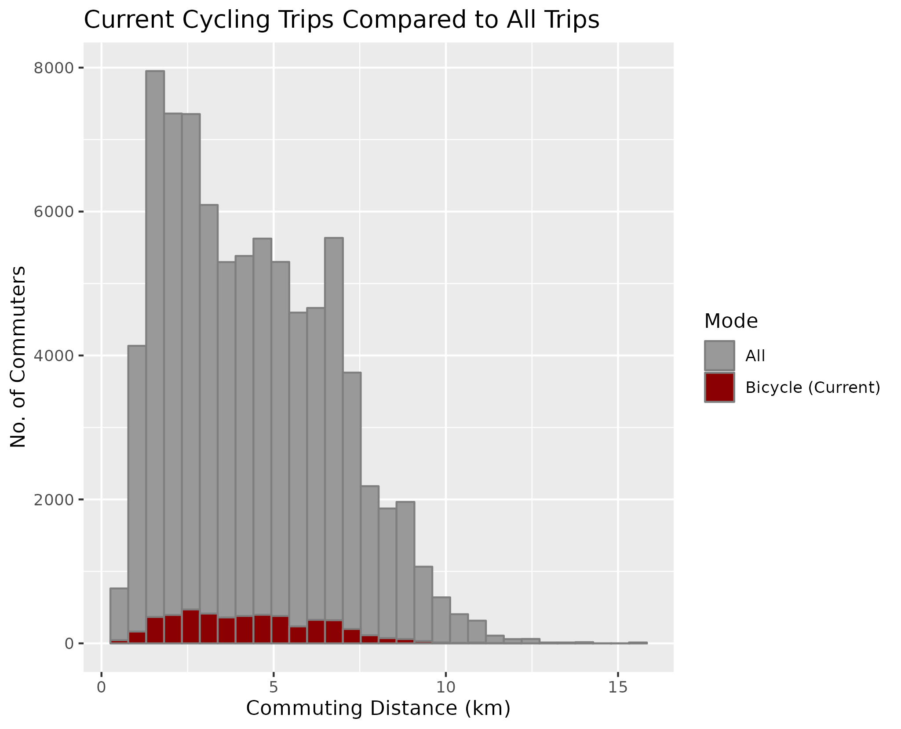
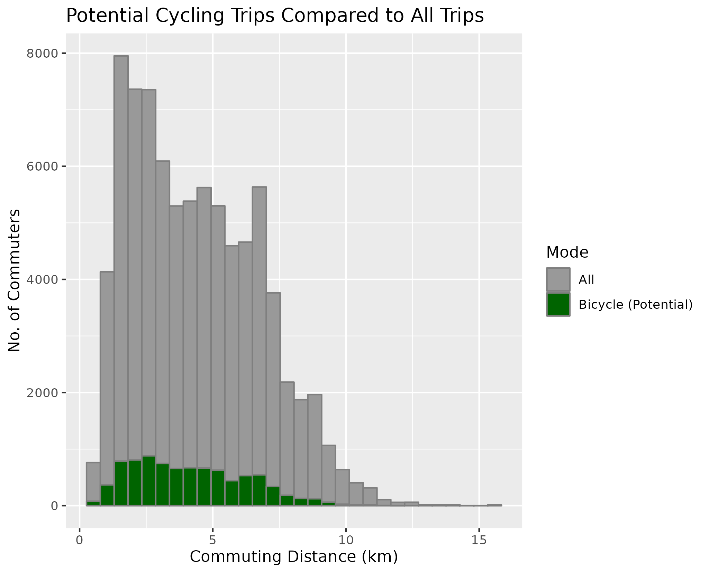
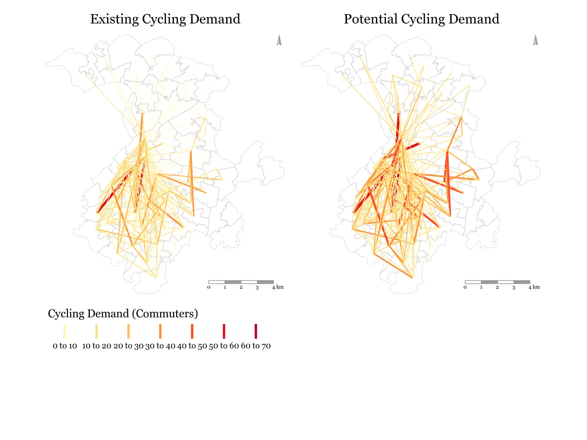
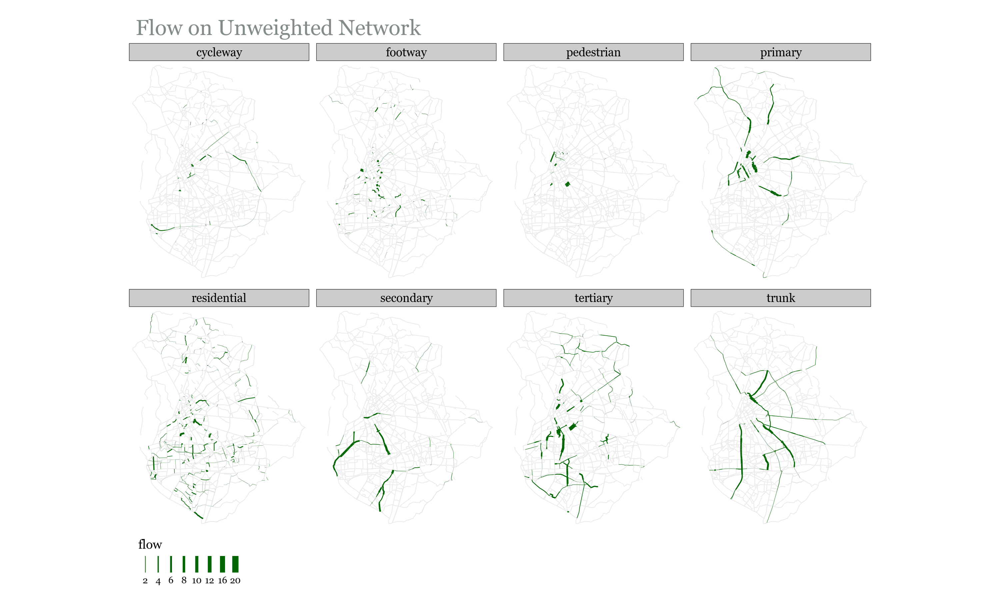
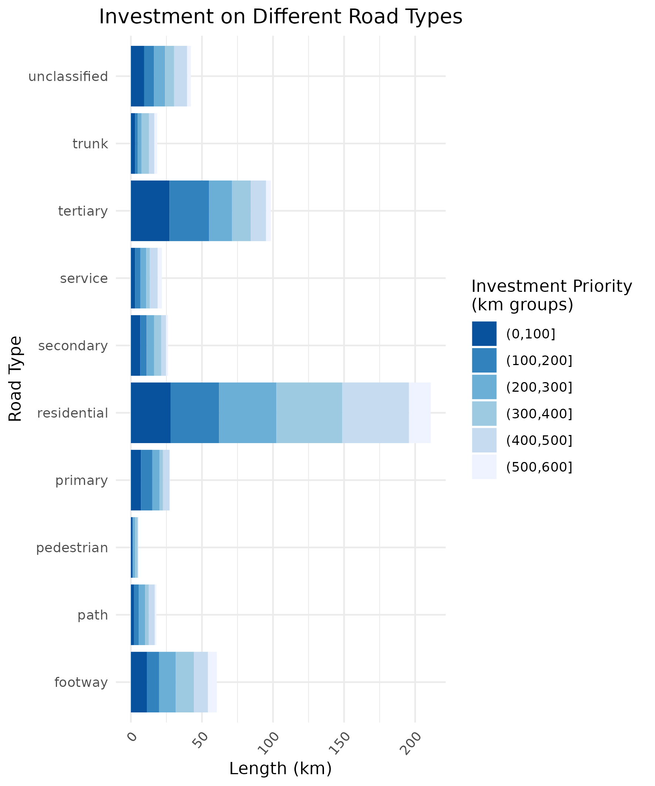

Road Segment Prioritization for Bicycle Infrastructure
================
2020-11-06

# Ideas and discussion

  - Lit Review: I can also organize this thematically and trim down
    **Planning Cycling Networks** substantially. I would then add some
    literature in:
      - Calculating Potential Demand
      - Routing
      - Road Segment Prioritization
  - Community Detection: Where in the document should this section be?
  - Other Cities

<!-- ## Missing Data -->

<!-- There are a couple of files that cannot be synced to github due to their -->

<!-- size. These files are neseccary for the scripts to run. Below are links -->

<!-- to where you can download them, and instructions on where to place them -->

<!-- in the repo file structure -->

<!-- Flow Data (2011 Census Origin-Destination Data): -->

<!--   - Source: <https://www.nomisweb.co.uk/census/2011/bulk/rOD1> —\> -->

<!--     Choose File **“WU03EW”** -->

<!--   - Location in Repo: data-raw/flow\_data.csv -->

<!-- Middle Layer Super Output Areas (December 2011) Boundaries: -->

<!--   - Source: -->

<!--     <http://geoportal.statistics.gov.uk/datasets/826dc85fb600440889480f4d9dbb1a24_0> -->

<!--   - Location in Repo: data-raw/MSOA\_2011\_Boundaries/\[Add files here\] -->

<!-- ----- -->

<!-- ## Scripts -->

<!-- The scripts should be run in the order they are numbered in (and listed -->

<!-- in here). The only exception is \_x\_dodgr\_weighting\_profiles.R. -->

<!-- Check the readme -->

<!-- [here](https://github.com/Hussein-Mahfouz/Bicycle-Network-Optimization) -->

<!-- for detailed info on each script -->

<!-- Keywords -->

<!-- ======== -->

<!-- Highlights -->

<!-- ======== -->

# Introduction

Intro ipsum dolor sit amet, consectetur adipiscing elit, sed do eiusmod
tempor incididunt ut labore et dolore magna aliqua. Ut enim ad minim
veniam, quis nostrud exercitation ullamco laboris nisi ut aliquip ex ea
commodo consequat. Duis aute irure dolor in reprehenderit in voluptate
velit esse cillum dolore eu fugiat nulla pariatur. Excepteur sint
occaecat cupidatat non proident, sunt in culpa qui officia deserunt
mollit anim id est laborum.Lorem ipsum dolor sit amet, consectetur
adipiscing elit, sed do eiusmod tempor incididunt ut labore et dolore
magna aliqua. Ut enim ad minim veniam, quis nostrud exercitation ullamco
laboris nisi ut aliquip ex ea commodo consequat. Duis aute irure dolor
in reprehenderit in voluptate velit esse cillum dolore eu fugiat nulla
pariatur. Excepteur sint occaecat cupidatat non proident, sunt in culpa
qui officia deserunt mollit anim id est laborum.Lorem ipsum dolor sit
amet, consectetur adipiscing elit, sed do eiusmod tempor incididunt ut
labore et dolore magna aliqua. Ut enim ad minim veniam, quis nostrud
exercitation ullamco laboris nisi ut aliquip ex ea commodo consequat.
Duis aute irure dolor in reprehenderit in voluptate velit esse cillum
dolore eu fugiat nulla pariatur. Excepteur sint occaecat cupidatat non
proident, sunt in culpa qui officia deserunt mollit anim id est laborum.

# Background

## What Affects the Decision To Cycle

Segregated cycling infrastructure\[1\] has been shown to increase
cycling uptake (Aldred, Croft, and Goodman 2019; Goodman et al. 2014;
Marqués et al. 2015), with the separation from motorized vehicles being
key (Winters et al. 2011). Revealed preference of cyclists shows that
they are willing to deviate from the most efficient routes in order to
commute on safer roads (Crane et al. 2017). However, such deviations are
only considered if they do not considerably increase route circuitry;
behaviour studies have found that the probability of choosing a route
decreases in proportion to its length relative to the shortest route
(Broach, Gliebe, and Dill 2011; Winters et al. 2010). Another defining
feature for cycling infrastructure is how well connected it is. Cyclists
prefer cohesive infrastructure, particularly when cycling on arterial
roads with high levels of motorized traffic (Stinson and Bhat 2003), and
the lack of well-connected cycling infrastructure is one of the main
obstacles to increasing cycling uptake (Caulfield, Brick, and McCarthy
2012). While direct and cohesive cycling networks have been shown to
positively impact cycling rates, density\[2\] of the cycling network is
also vital (Schoner and Levinson 2014)\].

## Planning Cycling Networks

*Optimization* techniques have been used to propose improvements to
cycling networks. Mesbah, Thompson, and Moridpour (2012) propose a
bi-level formulation to optimize allocation of cycling lanes to the
network without exceeding a set budget. The upper level is the proposed
interventions and the lower level is the route choices made by users in
reaction to changes in the network. The problem accounts for the effect
of cycling lanes on car traffic, and attempts to maximize utilization of
said lanes with minimal impact on car travel times. To improve cohesion
of the suggested network, a constraint is added so that each link with a
bike lane should be connected to at least one destination. Car usage is
not considered by Mauttone et al. (2017), who develop an optimization
framework that aims to minimize the total user cost of cycling on the
network. The aggregate flow on links is obtained by using shortest paths
to route existing cycling demand onto the road network, and the solution
is a proposed set of links where cycling infrastructure should be added
in order to minimize the overall travel cost of cyclists across the
network. The cost of traversing a link is given as a function of its
length and whether or not it has cycling infrastructure, and a
discontinuity penalty is also added to prioritize connected road
segments. The problem has also been solved by attempting to find the
minimum cost of improving roadway links to meet a desired level of
service (LOS) (Duthie and Unnikrishnan 2014). In this formulation, all
OD pairs need to be connected by roads that meet the desired LOS, and a
directness constraint is added so that paths between OD pairs do not
exceed a certain multiple of the shortest path.

These problem formulations do not explicitly solve for continuity, which
is dealt with using a either (a) a constraint specifying that each link
with a bike lane should be connected to at least one destination
(Mesbah, Thompson, and Moridpour 2012), (b) a constraint on deviation
from shortest paths (Duthie and Unnikrishnan 2014), or (c) a
discontinuity penalty (Mauttone et al. 2017). To solve for continuity,
the graph-theoretic concept of *connected components*, has been used.
Natera et al. (2019) study the existing cycling network in terms of its
disconnected components and introduce two different algorithms to
connect these components by their most critical links\[3\] and, in doing
so, measure the size of the growth of the largest connected component as
a function of the kilometers of network added. They observe that small
investments at strategic points have a large impact on connectivity in
most cases. The concept of connected components is also at the core of
the methodology proposed by Olmos et al. (2020). After routing the
cycling demand onto the network links, they use percolation theory to
filter out the links based on the aggregate flow\[4\] passing through
them. They vary the flow threshold for filtering to identify the minimum
flow at which the whole city is connected by a giant component. The
results show a cycling network that connects the entire city, and
subtracting links intersecting with current cycling infrastructure
identifies links proposed for intervention.

The problem formulations outlined above look at the network as a whole
when attempting to improve it. An alternative approach is to identify
the different sub-networks that exist within the larger network, and
work on improving each separately. Trip patterns in a city are not
uniformly distributed geographically, and *community finding* methods
have been used to partition study areas into localized areas that
experience a disproportionate number of trips within them. Akbarzadeh,
Mohri, and Yazdian (2018) use a modularity maximization approach
(Blondel et al. 2008) on taxi trip data to identify 7 different
communities in the city of Isfahan, Iran. An optimization problem is
then formulated to connect nodes within each community with cycling
infrastructure. The emphasis is on connectivity within the communities,
not between them. Bao et al. (2017) adopt a similar methodology, but use
hierarchical clustering to specify the desired number of clusters. They
use a greedy network expansion algorithm, where the link with the
highest benefit/cost ratio in each cluster is selected, and the network
is grown by adding neighboring links to the solution until a budget
limit is met. The benefit is the flow on the link, and each link is
assigned a cost based on current road conditions.

## Underlying Ethical Principles

The methodologies in Section
<a href="#planning-cycling-networks">3.2</a> are underpinned by
different ethical principles, even though these principles are not
explicitly acknowledged by the authors. This is important since
different ethical principles constitute different problem formulations
and targets. Broadly speaking, transport appraisal can be based on
either utilitarian or egalitarian principles. The former seeks to
maximize the overall benefit, while the latter is concerned with a fair
distribution of benefits (Jafino, Kwakkel, and Verbraeck 2020).
Nahmias-Biran, Martens, and Shiftan (2017) criticize the utilitarian
approach that has been historically popular in the evaluation of
transport investments, explaining how the maximization of overall
benefit fails to account for the distribution of that benefit among
communities or individuals. Lucas, Van Wee, and Maat (2016) explain how
transport studies have traditionally looked at the bigger picture
without studying the distribution of investments on the different parts
of the study area, and go on to propose an egalitarian approach that
ensures the dis-aggregation of transport policy benefits across the
study area. Pereira, Schwanen, and Banister (2017) also emphasize the
need for a more egalitarian approach to transport planning. They
highlight accessibility as a cornerstone of distributive justice, and
contend that policies should aim to distribute investments in a way that
minimizes spatial variations in accessibility. This research attempts to
provide a methodology that is grounded in egalitarian principles.
**Write some more here**

# Data and Geographical Scale of Analysis

The analysis is heavily dependant on Origin-Destination census data
(commuter data). Commuter data in the UK is publicly available at the
Middle layer Super Output Area (MSOA) level; the average MSOA has a
population of 8209 (ONS 2018). Iacono, Krizek, and El-Geneidy (2010)
note that such large travel zones are not ideal for understanding route
choice behaviour of cyclists and pedestrians. They also give rise to an
\`ecological fallacy’ whereby average characteristics are assumed to
apply to all residents of the aggregated geographical area. Given that
more granular data is not publicly available, the study uses MSOA-level
commuter data. The methodology is however applicable to more granular
commuter data should it become available.

# Calculating Potential Cycling Demand

The Propensity to Cycle Tool (PCT) (Lovelace et al. 2017) is used to
estimate the proportion of cyclists (\(\boldsymbol{C_{p}}\)) for each
MSOA pair should the government achieve its target of doubling cycling
by 2025. The PCT uses the following logistic regression model to
calculate \(\boldsymbol{C_{p}}\):

where \(\boldsymbol{d}\) and \(\boldsymbol{s}\) are the distance and
slope respectively for the OD pair. The authors use square and
square-root distance terms \`\`to capture the non-linear impact of
distance on the likelihood of cycling", and interaction terms to capture
the combined effect of slope and distance (Lovelace et al. 2017).

The potential demand calculations show that the current and potential
number of cyclists both follow a bell-shaped distribution, with the
number of trips peaking around the 3-5km commuting distance and then
going back down for longer distances (see Figure
<a href="#fig:potdemhistograms">1</a>.

Figure 1: Distribution of Potential Cycling Demand

Figure 2: Current and Potential Cycling Demand

It should be noted that the calculations assume a future that is
constrained by physical geography; i.e. we consider cycling in the
traditional sense. Recently there have been various micro-mobility
solutions, including e-bikes, that allow commuters to traverse longer
distances and hillier roads with less effort than traditional bicycles.
While these modes would probably be associated with less geographical
impedance, it is beyond the scope of this work to integrate that into
the analysis. Doing so is partially restricted by the lack of data on
the proliferation of these modes, which raises the point that perhaps
the census data category of \`Bicycle’ is too vague, and should be
further dis-aggregated to distinguish between traditional bicycles and
other forms of micro-mobility.

# Routing

The next step is to route the potential cycling demand
(\(\boldsymbol{C_{p}}\)) between all OD pairs onto the road network.

**ADD TABLE**

To conduct routing, the following is considered:

1.  **Cyclist Preference**: Work done by Dill and McNeil (2013) on
    examining cyclist typologies determined that around 60% of Portland
    residents fit under the *interested but concerned* category. These
    were people that enjoyed cycling but avoided it due safety concerns.
    The key to encouraging this group was to create a low-stress cycling
    network, not only though segregated infrastructure but also by
    planning routes that passed through residential streets.
2.  **Low-Traffic Neighborhoods**: The UK Department for Transport is
    allocating funding to local authorities to invest in Active
    Transport, partially through the creation of LTNs (DfT 2020b). This
    includes closing off residential streets to motorized traffic
3.  **Existing Cycling Infrastructure**: Utilizing existing cycling
    infrastructure makes economic sense, as small investments may lead
    to large connectivity gains as the disconnected cycling
    infrastructure gets joined together.

The weighting profiles are therefore adjusted to favor less-stressful
streets (based on information from Table **REFERENCE THE TABLE**), and
roads with existing cycling infrastructure. This is also in line with
the creation of LTNs, as residential streets are those where motorized
traffic is most likely to be banned in the creation of LTNs.

**ADD TABLE**

A weighted distance \(\boldsymbol{d_{w}}\) for each road segment is
calculated as following:\[5\]

$$

where \(\boldsymbol{d_{unw}}\) is the unweighted distance and
\(\boldsymbol{W}\) is the weight from Table .

All weights are between 0 and 1, and the values in the  profile are
chosen so as to be inversely proportional to the stress level
experienced by cyclists on them. The  weighting profile is used to
compare increases in route length resulting from two different
approaches:

1.  **Weighted**: Relatively high impedance on Primary and Trunk roads
    (to minimize cycling on them).
2.  **Weighted\_2**: Avoiding Primary and Trunk Roads completely.

Comparing the cycling demand routed on the weighted and unweighted road
network allows us to get a better understanding of the importance of
different road types. In the case of Manchester, trunk roads bisect the
city and are a major part of unweighted shortest paths (Figure
<a href="#fig:flowsfacetunweighted">3</a>). On the other hand, cycleways
are not part of unweighted shortest paths, and so very little of the
cycling demand is routed through them. In the weighted network,
cycleways are much better utilized, and the majority of the cycling
demand passes through tertiary roads, as expected.

Figure 3: Flow Results Based on **Unweighted** Shortest Paths
(Manchester)

Figure 4: Flow Results Based on **Weighted** Shortest Paths (Manchester)

<!-- The difference between aggregate flow on weighted and unweighted networks is dependant on the road network of the city. Comparing Manchester to Nottingham, we see that trunk roads are much more important in the former, as over 25\% of flow on the unweighted road network passes through them. For Nottingham, less than 10\% of the flow on the unweighted network passes through trunk roads, but almost 25\% of the flow passes through tertiary roads (Figure \ref{fig:perc_person-km}).  -->

The results of routing potential cycling demand on the weighted and
unweighted networks are understandably quite different. From Figure
<a href="#fig:flowsfacetunweighted">3</a> we can see that trunk and
primary roads are the most efficient means of traversing the road
network of Manchester. Both of these road types are classified as
Primary A roads according to the UK Department for Transport’s road
classification (**Reference the table**), and are therefore part of the
Primary Route Network (PRN) (DfT 2012). The PRN has the widest, most
direct roads on the network, and carries most of the through traffic.
This includes freight, with all roads in the PRN being required by law
to provide unrestricted access to trucks up to 40 tonnes (DfT 2012).

We choose to avoid routing the potential cycling demand on Primary A
Roads for the following 2 reasons:

1.  **Logistical Difficulty**: Changes on these roads need to be agreed
    upon by all affected authorities (DfT 2012), which may prove to be
    difficult.
2.  **Low Traffic Neighborhoods (LTNs)**: The UK government is aiming to
    restrict access to motorized vehicles on residential roads to create
    LTNs (DfT 2020b). This is part of a policy to prevent automobile
    rat-running and make streets more accessible to cyclists and
    pedestrians. Under such a policy, Primary A roads would become even
    more essential for motorized traffic and it would be more difficult
    to reallocate road space on these roads to cyclists.

Routing potential cycling demand on a weighted network is more in line
with government policy to create LTNs. Figure
<a href="#fig:flowsfacetweighted">4</a> shows that routing on the
weighted network significantly reduces flow on the trunk and primary
roads, but does not eliminate it completely. This is intentional, as the
impedance on these roads is only slightly higher than remaining road
types (See Table **Reference the table**). Potential cycling demand is
only routed on these roads if there are no routes through other roads
that offer comparable directness.

Banning cycling flow completely on trunk and primary roads may result in
excessively circuitous paths, as seen in Figure
<a href="#fig:boxplotcircuity">5</a>. When routing using the weighting
profile in Table **Reference Table**, we see that shortest paths
increase by less than 5% on average from unweighted shortest paths, with
the largest increases still below 30%. When routing on primary and trunk
roads is banned, the average increase relative to unweighted shortest
paths rises to 10%, with certain locations experiencing more significant
negative effects on accessibility.

Figure 5: Effect of Banning Cyclists from Trunk and Primary Roads for
all OD Pairs (Manchester)

Given that cyclists will only deviate from shortest paths by a certain
amount to access better cycling infrastructure (as explained in Section
<a href="#what-affects-the-decision-to-cycle">3.1</a>, allowing flow on
some stretches of trunk and primary roads is necessary to insure cycling
uptake and equitable access to cycling infrastructure. In its new vision
for walking and cycling, the Department for Transport acknowledges that
minimal segregated stretches of bicycle lanes on main roads will be
necessary to avoid circuitous cycling networks (DfT 2020b).

Weighting the road network also allows us to better utilize existing
cycling infrastructure, as can be seen by the higher flow on cycleways
in Figure <a href="#fig:flowsfacetweighted">4</a>. Again, the small
differences in impedance between cycleways and other road types mean
that cycleways that require significant deviation are not routed on.

It should be reiterated that the weighting profile used for routing has
been developed for the purposes of this study. It creates a hierarchy of
road preference that is grounded in cyclist preference and government
plans to create LTNs. Sensitivity analysis should be done to determine
an optimal weighting profile, but given the variation in city road
networks , <!-- (Figure \ref{fig:perc_person-km}) -->, these would
probably require calibration to the specific city. More accurate routing
could be carried out given the availability of road-level data. In such
cases we would add additional impedance to specific roads, giving more
useful routing results than the current methodology which considers all
roads of the same type to be equivalent.

One use-case of such granular data would be to identify roads that serve
schools. The Department of Transport notes that the number of school
children being driven to school has trebled over the past 40 years (DfT
2020b), and so having cycling infrastructure serving schools is key to
achieving the government target of getting more children to cycle. This
would not be difficult, as over 75% of children in the UK live within a
15 minute cycle from their school (DfT 2020a). Goodman et al. (2019)
show that if dutch levels of cycling were achieved in the UK, the % of
children cycling to school could increase from 1.8% to 41%.

In their typology of cyclists, Dill and McNeil (2013) found that a
majority of people who say they would never cycle had never cycled to
school, whereas confident cyclists were those most likely to have cycled
to school. Getting people to cycle from a young age is therefore key to
achieving societal change in commuting habits.

# Community Detection

One of the main aims of this research is to incorporate egalitarian
principles by fairly distributing investments in cycling infrastructure.
One way of quantifying this is to split up the city into smaller
geospatial areas and target equal investment in each of those areas.
Community detection offers us a way to delineate such a split; cyclists
are limited in their commuting distance (see Figure
<a href="#fig:cyclinghistmanc">6</a>), and so trip attractors are more
likely to have a local catchment area of cyclists.

Figure 6: Cycling Commuting Distance - Manchester (2011 Census Data)

In our case, the network is the city; the nodes are the
population-weighted MSOA centroids and the links connecting each MSOA
pair are weighted by the potential cycling demand between them. The
Louvian method (Blondel et al. 2008) is used to separate MSOAs into
communities. Potential cycling demand is used since we assume that this
is what the cycling demand will be once the cycling infrastructure is
added. To assign road links to communities, the following steps are
carried out:

1.  Create links between MSOA centroids and weigh these links by
    potential cycling demand between them.
2.  Use Louvian method to determine optimal number of communities and
    assign each MSOA centroid to a community.
3.  Assign each road link to the same community as the closest MSOA
    centroid to it.

The results show that Manchester can be split into four large
communities and one small one (Figure
<a href="#fig:communitiesmanchester">7</a>).

Figure 7: Communities Based on Potential Cycling Demand (Manchester)

# Road Segment Prioritization

After routing the potential cycling demand onto the road network using
weighted shortest paths, we have estimates for the cumulative potential
cycling demand passing through all road segments. This cumulative demand
(referred to as *flow* is then used as a basis for determining where
best to invest in segregated cycling infrastructure. In doing so, we
must account for the motivations and deterrents for cycling identified
in Section <a href="#what-affects-the-decision-to-cycle">3.1</a>, namely
direct and well connected routes.

For this purpose, two algorithms are proposed. Both utilize existing
infrastructure from the beginning and allow us to compare a solution
that focuses on utilitarianism to one that focuses on egalitarianism. In
both algorithms, links\[6\] are selected iteratively and the iteration
at which each link is added to the solution is recorded. Investments in
cycling infrastructure can be limited by budget constraints, so it can
be useful to see where best to allocate a defined length of segregated
infrastructure.

## Algorithm 1: Utilitarian Growth

1.  Identify all links that have segregated cycling infrastructure and
    add them to the initial solution
2.  Identify all links that neighbor links in the current solution
3.  Select neighboring link with highest flow and add it to the solution
4.  Repeat steps 2 & 3 until all flow is satisfied or investment
    threshold is met

This algorithm ensures that the resulting network is connected. It also
satisfies the directness criteria, since links on the weighted shortest
paths are those that have the highest flow passing through them (this is
a result of the routing in Section
<a href="#what-affects-the-decision-to-cycle">3.1</a>.

## Algorithm 2: Egalitarian Growth (Focus on Fair Distribution of Resources)

The first algorithm focuses on connectivity and directness, but not on
fairly distributing investment. The latter is not a requirement for
increasing cycling uptake, but it is fundamental for spatial equity, as
explained in Section <a href="#underlying-ethical-principles">3.3</a>.
This algorithm incorporates the ideal of fair distribution by using
community detection to partition the road network.

The algorithm uses the following logic to ensure fair distribution
between communities:

1.  Identify all links that have segregated cycling infrastructure and
    add them to the initial solution
2.  Identify all links that neighbor links in the current solution
3.  Select *from each community* one neighboring link with highest flow
    and add it to the solution
4.  If there are no more neighboring links in a community, select the
    link with the highest flow in that community, regardless of
    connectivity, and add it to the solution
5.  Repeat steps 2, 3 & 4 until all flow is satisfied or investment
    threshold is met

Even though we may end up with a more disconnected network, we will have
separate connected networks in each community. Given that communities
are defined by having more internal flow than external flow, this is a
satisfactory solution.

The results of the community detection are used to evaluate the
algorithms. This is done by looking at the *person-km satisfied* as
cycling infrastructure is added. Person-km is a measure of the total km
cycled on a road segment, so it is the product of the number of
potential commuters cycling on that road segment (\(flow\)) and the
length of the segment in km (\(l\)). For each road segment, the
person-km is equal to \(flow * l\). In the case of Manchester, Table
(**Reference the table**) shows that almost half of the person-km is in
community 1 , while only 0.5% of total person-km on the network is in
community 5.

| Community | Person-Km (Total) | Person-Km (%) |
| :-------- | ----------------: | ------------: |
| 1         |            284458 |          44.4 |
| 2         |            163877 |          25.6 |
| 3         |             79218 |          12.4 |
| 4         |            109635 |          17.1 |
| 5         |              3317 |           0.5 |

Table 1: Total Person-Km in Different Communities (Manchester)

Looking at the person-km satisfied (Figure
<a href="#fig:growthtotal">8</a>), we see that the incremental addition
of cycling infrastructure is better distributed between communities
using Algorithm 2; equal distribution of investment results in the gain
in % of person km satisfied in each community being inversely correlated
with the size of the community. In addition, we find that the
restrictions imposed by Algorithm 2 on the network growth do not seem to
have a noticeable effect on the city-wide % of person-km satisfied.
Comparing both algorithms, we can see that Algorithm 1 provides only
marginally quicker city-wide gains than Algorithm 2.

Figure 8: Comparing Overall (Dashed) and Community Level Person-Km
Satisfied (Manchester)

Figure <a href="#fig:growth3MapandBar">9</a> gives us a geographic
representation of the results from Algorithm 2; it shows when each link
was added to the solution (first 100km, second 100km, etc). We can see
that, generally, road segments around cycling infrastructure are
prioritized, except for those neighboring cycling infrastructure on the
very periphery. The first 100km is also spatially distributed across the
city, with no apparent bias towards a particular area.

It is also important to understand how the different highway types
contribute to the proposed network. Figure
<a href="#fig:growth3MapandBar">9</a> shows that most of the flow will
be on residential and tertiary roads, as expected from the weighting
profile defined in Table **reference the table**.

Figure 9: Results of Alg. 2 (Manchester)

## Connectivity

Existing cycling infrastructure is made up of many disconnected
components. Both Algorithm 1 and 2 start with all existing segregated
cycling infrastructure and aim to create an efficient, connected
network. Figure <a href="#fig:componentsandGCC">10</a> shows that both
algorithms gradually reduce the number of components as more
infrastructure is added, but Algorithm 2 is able to provide better
connectivity with less investment.

Consistent growth can also be seen for the size of the Largest Connected
Component in the proposed bicycle network (Figure
<a href="#fig:componentsandGCC">10</a>). Here however, we find that
there is little difference between both Algorithms.

Figure 10: Network Characteristics

# Overarching Policies

While segregated, connected, and direct cycling infrastructure is key to
achieving high levels of cycling, research has shown that it cannot
exist in a vacuum. Wardman, Tight, and Page (2007) developed a mode
choice model for the UK and their results showed that improved cycling
infrastructure on its own only had modest impacts on mode shift, and
even the unlikely scenario of all urban routes being serviced by
segregated bike lanes was forecast to increase cycling mode share by
only 3%. However, cities that invest in more comprehensive cycling
projects show a more significant increase in the number of cyclists as
well as the cycling mode share (Pucher, Dill, and Handy 2010). These
cities do not just focus on infrastructure, but on general policies as
well as restricting car use. Evaluation of policies in Denmark and
Germany and the Netherlands has shown that their high cycling mode share
is down to a broader set of policies that also include traffic calming,
cycling rights of way, bike parking, integration with the public
transport network, and making driving cars both expensive and
inconvenient (Pucher and Buehler 2008). While these policies are outside
the scope of this research, it is important to recognize their key role
in bringing about an increase in levels of cycling.

# Conclusions

# References

<!-- to fix indentation: https://github.com/crsh/papaja/issues/37#issuecomment-104185288 -->

Akbarzadeh, Meisam, Syed Sina Mohri, and Ehsan Yazdian. 2018. “Designing
Bike Networks Using the Concept of Network Clusters.” *Applied Network
Science* 3 (1): 12.

Aldred, Rachel, Joseph Croft, and Anna Goodman. 2019. “Impacts of an
Active Travel Intervention with a Cycling Focus in a Suburban Context:
One-Year Findings from an Evaluation of London’s in-Progress
Mini-Hollands Programme.” *Transportation Research Part A: Policy and
Practice* 123: 147–69.

Bao, Jie, Tianfu He, Sijie Ruan, Yanhua Li, and Yu Zheng. 2017.
“Planning Bike Lanes Based on Sharing-Bikes’ Trajectories.” In
*Proceedings of the 23rd Acm Sigkdd International Conference on
Knowledge Discovery and Data Mining*, 1377–86.

Blondel, Vincent D, Jean-Loup Guillaume, Renaud Lambiotte, and Etienne
Lefebvre. 2008. “Fast Unfolding of Communities in Large Networks.”
*Journal of Statistical Mechanics: Theory and Experiment* 2008 (10):
P10008.

Broach, Joseph, John Gliebe, and Jennifer Dill. 2011. “Bicycle Route
Choice Model Developed Using Revealed Preference Gps Data.” In *90th
Annual Meeting of the Transportation Research Board, Washington, Dc*.

Caulfield, Brian, Elaine Brick, and Orla Thérèse McCarthy. 2012.
“Determining Bicycle Infrastructure Preferences–a Case Study of
Dublin.” *Transportation Research Part D: Transport and Environment* 17
(5): 413–17.

Crane, Melanie, Chris Rissel, Chris Standen, Adrian Ellison, Richard
Ellison, Li Ming Wen, and Stephen Greaves. 2017. “Longitudinal
Evaluation of Travel and Health Outcomes in Relation to New Bicycle
Infrastructure, Sydney, Australia.” *Journal of Transport & Health* 6:
386–95.

DfT. 2012. “Guidance on Road Classification and the Primary Route
Network.” Department of Transport of Britain.

———. 2020a. “Cycling Infrastructure Design.”

———. 2020b. “Gear Change: A Bold Vision for Cycling and Walking.”

Dill, Jennifer, and Nathan McNeil. 2013. “Four Types of Cyclists?
Examination of Typology for Better Understanding of Bicycling Behavior
and Potential.” *Transportation Research Record* 2387 (1): 129–38.

Duthie, Jennifer, and Avinash Unnikrishnan. 2014. “Optimization
Framework for Bicycle Network Design.” *Journal of Transportation
Engineering* 140 (7): 04014028.

Goodman, Anna, Ilan Fridman Rojas, James Woodcock, Rachel Aldred,
Nikolai Berkoff, Malcolm Morgan, Ali Abbas, and Robin Lovelace. 2019.
“Scenarios of Cycling to School in England, and Associated Health and
Carbon Impacts: Application of the ‘Propensity to Cycle Tool’.” *Journal
of Transport & Health* 12: 263–78.

Goodman, Anna, Shannon Sahlqvist, David Ogilvie, and iConnect
Consortium. 2014. “New Walking and Cycling Routes and Increased Physical
Activity: One-and 2-Year Findings from the Uk iConnect Study.” *American
Journal of Public Health* 104 (9): e38–e46.

Iacono, Michael, Kevin J Krizek, and Ahmed El-Geneidy. 2010. “Measuring
Non-Motorized Accessibility: Issues, Alternatives, and Execution.”
*Journal of Transport Geography* 18 (1): 133–40.

Jafino, Bramka Arga, Jan Kwakkel, and Alexander Verbraeck. 2020.
“Transport Network Criticality Metrics: A Comparative Analysis and a
Guideline for Selection.” *Transport Reviews* 40 (2): 241–64.

Lovelace, Robin, Anna Goodman, Rachel Aldred, Nikolai Berkoff, Ali
Abbas, and James Woodcock. 2017. “The Propensity to Cycle Tool: An Open
Source Online System for Sustainable Transport Planning.” *Journal of
Transport and Land Use* 10 (1): 505–28.

Lucas, Karen, Bert Van Wee, and Kees Maat. 2016. “A Method to Evaluate
Equitable Accessibility: Combining Ethical Theories and
Accessibility-Based Approaches.” *Transportation* 43 (3): 473–90.

Marqués, R, V Hernández-Herrador, M Calvo-Salazar, and JA
García-Cebrián. 2015. “How Infrastructure Can Promote Cycling in
Cities: Lessons from Seville.” *Research in Transportation Economics*
53: 31–44.

Mauttone, Antonio, Gonzalo Mercadante, María Rabaza, and Fernanda
Toledo. 2017. “Bicycle Network Design: Model and Solution Algorithm.”
*Transportation Research Procedia* 27: 969–76.

Mesbah, Mahmoud, Russell Thompson, and Sara Moridpour. 2012. “Bilevel
Optimization Approach to Design of Network of Bike Lanes.”
*Transportation Research Record* 2284 (1): 21–28.

Nahmias-Biran, Bat-hen, Karel Martens, and Yoram Shiftan. 2017.
“Integrating Equity in Transportation Project Assessment: A
Philosophical Exploration and Its Practical Implications.” *Transport
Reviews* 37 (2): 192–210.

Natera, Luis, Federico Battiston, Gerardo Iñiguez, and Michael Szell.
2019. “Data-Driven Strategies for Optimal Bicycle Network Growth.”
*arXiv Preprint arXiv:1907.07080*.

Olmos, Luis E, Maria Sol Tadeo, Dimitris Vlachogiannis, Fahad Alhasoun,
Xavier Espinet Alegre, Catalina Ochoa, Felipe Targa, and Marta C
González. 2020. “A Data Science Framework for Planning the Growth of
Bicycle Infrastructures.” *Transportation Research Part C: Emerging
Technologies* 115: 102640.

ONS. 2018. “Population Estimates for the Uk, England and Wales, Scotland
and Northern Ireland: Mid-2017.” *Hampshire: Office for National
Statistics*.

Padgham, Mark. 2019. “Dodgr: An R Package for Network Flow Aggregation.”
*Transport Findings. Network Design Lab*.

Pereira, Rafael HM, Tim Schwanen, and David Banister. 2017.
“Distributive Justice and Equity in Transportation.” *Transport
Reviews* 37 (2): 170–91.

Pucher, John, and Ralph Buehler. 2008. “Making Cycling Irresistible:
Lessons from the Netherlands, Denmark and Germany.” *Transport Reviews*
28 (4): 495–528.

Pucher, John, Jennifer Dill, and Susan Handy. 2010. “Infrastructure,
Programs, and Policies to Increase Bicycling: An International Review.”
*Preventive Medicine* 50: S106–S125.

Schoner, Jessica E, and David M Levinson. 2014. “The Missing Link:
Bicycle Infrastructure Networks and Ridership in 74 Us Cities.”
*Transportation* 41 (6): 1187–1204.

Stinson, Monique A, and Chandra R Bhat. 2003. “Commuter Bicyclist Route
Choice: Analysis Using a Stated Preference Survey.” *Transportation
Research Record* 1828 (1): 107–15.

Wardman, Mark, Miles Tight, and Matthew Page. 2007. “Factors Influencing
the Propensity to Cycle to Work.” *Transportation Research Part A:
Policy and Practice* 41 (4): 339–50.
<https://doi.org/10.1016/j.tra.2006.09.011>.

Winters, Meghan, Gavin Davidson, Diana Kao, and Kay Teschke. 2011.
“Motivators and Deterrents of Bicycling: Comparing Influences on
Decisions to Ride.” *Transportation* 38 (1): 153–68.

Winters, Meghan, Kay Teschke, Michael Grant, Eleanor M Setton, and
Michael Brauer. 2010. “How Far Out of the Way Will We Travel? Built
Environment Influences on Route Selection for Bicycle and Car Travel.”
*Transportation Research Record* 2190 (1): 1–10.

1.  Segregated cycling infrastructure refers to road space that is
    allocated to cyclists only, with physical separation to protect
    cyclists from other modes of transport.

2.  making an area’s bicycle network denser means adding more cycling
    routes in the area and thereby giving cyclists more route options

3.  *link* refers to a road segment throughout this research

4.  *flow* is used throughout this research to refer to the cycling
    demand when it is routed onto the road network. The flow on any road
    segment is the cumulative demand on it, resulting from cyclists
    commuting between various OD pairs

5.  The **dodgr** r package (Padgham 2019) is used to route cycling
    demand onto the road network. The package uses the OpenStreetMaps
    (OSM) road network and allows the user to assign weights to roads
    based on their type. The routing is done based on weighted shortest
    paths, with the distance along each road segment being divided by a
    factor to obtain the weighted distance for routing. It is more
    intuitive to multiply when weighting a network, but the dodgr
    package divides by numbers between 0 and 1, which achieves the same
    result. For the sake of reproducibility, we stick to the convention
    used in the package.

6.  *link* refers to a road segment
