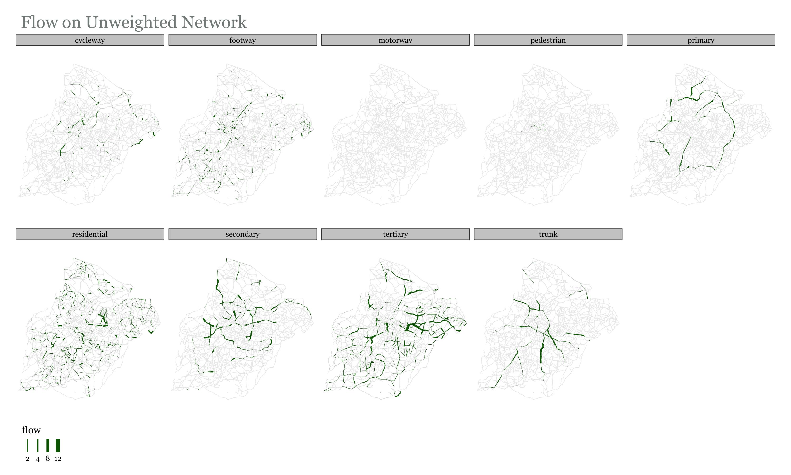
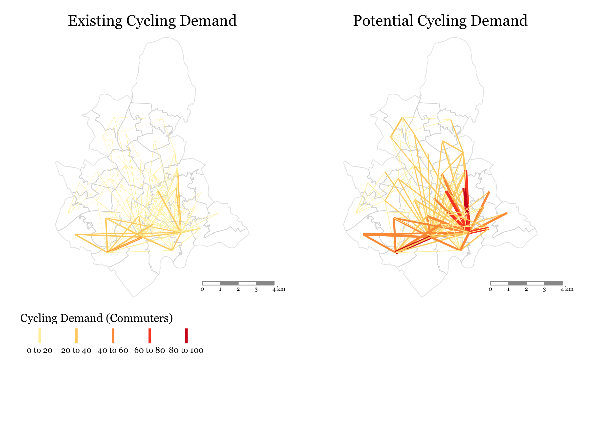
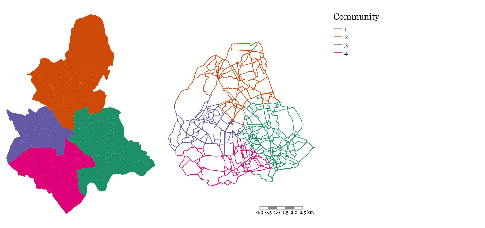

```{r setup, include=FALSE}
knitr::opts_chunk$set(echo = TRUE)
```

# Reproducing the results for other cities

To reproduce the results presented for other cities in the UK there are a few computing pre-requisites:

- A reasonably powerful computer, e.g. with 8 GB RAM
- The statistical programming language R installed (we recommend running it in the RStudio editor)
- The source code of the paper repository, which can be download from `url TBC`

```{r, eval=FALSE, echo=FALSE}
# run these lines to update the snapshot
required_packages = renv::dependencies()
renv::snapshot()
```

To ensure you have the necessary packages installed, open the `cycle-networks.Rproj` file in RStudio and run the following commands to ensure you have the necessary packages installed:

```{r, eval=FALSE}
install.packages("renv")
renv::restore()
```

The `build.R` script contains all of the necessary steps to reproduce the results for any city in the UK.
Open this file with the following command and run the code line-by-line.

```{r, eval=FALSE}
file.edit("R/build.R")
```

From there you will run the code script-by-script, e.g. with the following line:

```r
source("R/_1.0_get_flow_data.R")
```

You can of course edit that file also to run it line-by-line for debugging.

<!-- Todo: make the .zip download work for anyone, e.g. by uploading the data to the osf.io website alongside the preprint. -->

You can select a city to build by executing the following command:

```{r}
chosen_city <- "Manchester"
```

Replacing `Leeds` with any other city will make the script work for that city.
Note: this only works for Local Authority names in England and Wales listed below.

In this script, you choose which city you wish to run the analysis from
this list of available towns and cities:

    ##   [1] "Barnsley"             "Basildon"             "Basingstoke"         
    ##   [4] "Bath"                 "Bedford"              "Birkenhead"          
    ##   [7] "Birmingham"           "Blackburn"            "Blackpool"           
    ##  [10] "Bolton"               "Bournemouth"          "Bracknell"           
    ##  [13] "Bradford"             "Brighton and Hove"    "Bristol"             
    ##  [16] "Burnley"              "Burton upon Trent"    "Bury"                
    ##  [19] "Cambridge"            "Cardiff"              "Carlisle"            
    ##  [22] "Chatham"              "Chelmsford"           "Cheltenham"          
    ##  [25] "Chester"              "Chesterfield"         "Colchester"          
    ##  [28] "Coventry"             "Crawley"              "Darlington"          
    ##  [31] "Derby"                "Doncaster"            "Dudley"              
    ##  [34] "Eastbourne"           "Exeter"               "Gateshead"           
    ##  [37] "Gillingham"           "Gloucester"           "Grimsby"             
    ##  [40] "Guildford"            "Halifax"              "Harlow"              
    ##  [43] "Harrogate"            "Hartlepool"           "Hastings"            
    ##  [46] "Hemel Hempstead"      "High Wycombe"         "Huddersfield"        
    ##  [49] "Ipswich"              "Kingston upon Hull"   "Leeds"               
    ##  [52] "Leicester"            "Lincoln"              "Liverpool"           
    ##  [55] "London"               "Luton"                "Maidstone"           
    ##  [58] "Manchester"           "Mansfield"            "Middlesbrough"       
    ##  [61] "Milton Keynes"        "Newcastle upon Tyne"  "Newcastle-under-Lyme"
    ##  [64] "Newport"              "Northampton"          "Norwich"             
    ##  [67] "Nottingham"           "Nuneaton"             "Oldham"              
    ##  [70] "Oxford"               "Peterborough"         "Plymouth"            
    ##  [73] "Poole"                "Portsmouth"           "Preston"             
    ##  [76] "Reading"              "Redditch"             "Rochdale"            
    ##  [79] "Rotherham"            "Salford"              "Scunthorpe"          
    ##  [82] "Sheffield"            "Shrewsbury"           "Slough"              
    ##  [85] "Solihull"             "South Shields"        "Southampton"         
    ##  [88] "Southend-on-Sea"      "Southport"            "St Albans"           
    ##  [91] "St Helens"            "Stevenage"            "Stockport"           
    ##  [94] "Stockton-on-Tees"     "Stoke-on-Trent"       "Sunderland"          
    ##  [97] "Sutton Coldfield"     "Swansea"              "Swindon"             
    ## [100] "Telford"              "Wakefield"            "Walsall"             
    ## [103] "Warrington"           "Watford"              "West Bromwich"       
    ## [106] "Weston-Super-Mare"    "Wigan"                "Woking"              
    ## [109] "Wolverhampton"        "Worcester"            "Worthing"            
    ## [112] "York"

\newpage

# Birmingham

\subsubsection{Potential Demand}

```{r potdemhistogramsBirmingham, fig.cap="Distribution of Potential Cycling Demand", out.width="30%", fig.show='hold', echo=FALSE}
knitr::include_graphics(c(
  "data/Birmingham/Plots/histogram_distance_all_vs_cycling.png",
  "data/Birmingham/Plots/histogram_distance_all_vs_cycling_potential.png",
  "data/Birmingham/Plots/histogram_distance_cycling_potential_vs_current.png"
))
```

```{r desirefacetcyclingBirmingham, fig.cap="Current and Potential Cycling Demand", out.width="80%", fig.pos="H", fig.align="center", echo=FALSE}
knitr::include_graphics("data/Birmingham/Plots/desire_facet_cycling.png")
```

\clearpage

\subsubsection{Routing Cycling Flows}

```{r flowsfacetunweightedBirmingham, fig.cap="Flow Results Based on Unweighted Shortest Paths (Birmingham)", out.width="75%", fig.show='hold', fig.align = "center", echo=FALSE}

```

```{r flowsfacetweightedBirmingham, fig.cap="Flow Results Based on Weighted Shortest Paths (Birmingham)", out.width="75%", fig.show='hold', fig.align = "center", echo=FALSE}

```

\clearpage

\subsubsection{Community Detection}


```{r communitiesBirmingham, fig.cap="Communities Based on Potential Cycling Demand (Birmingham)", out.width="90%", fig.show='hold', fig.align = "center", echo=FALSE}

```

\subsubsection{Network Expansion Algorithms}


```{r growthtotal, fig.cap="Comparing Overall (Dashed) and Community Level Person-Km Satisfied (Birmingham)", out.width="45%", fig.show='hold', fig.pos="H", fig.align = "center", echo=FALSE}
knitr::include_graphics(c(
  "data/Birmingham/Plots/Growth_Results/growth_utilitarian_satisfied_km_both_flow_column.png",
  "data/Birmingham/Plots/Growth_Results/growth_egalitarian_satisfied_km_both_flow_column.png"
))
```

```{r componentsandGCCBirmingham, fig.cap="Network Characteristics", out.width="45%", fig.show='hold', fig.pos="H", fig.align = "center", echo=FALSE}
knitr::include_graphics(c(
  "data/Birmingham/Plots/Growth_Results/growth_util_egal_components_number_comparisonBirmingham.png",
  "data/Birmingham/Plots/Growth_Results/growth_util_egal_components_gcc_comparisonBirmingham.png"
))
```

```{r growth3MapandBarBirmingham, fig.cap="Road Segment Priority (left), disaggregated by road type (right) - Egalitarian Growth", out.width="45%", fig.show='hold', fig.align="center", echo=FALSE}
knitr::include_graphics(c(
  "data/Birmingham/Plots/Growth_Results/growth_egalitarian_priority_all_FLOW.png"#,
 # "data/Birmingham/Plots/Growth_Results/growth_egalitarian_investment_highways_flow.png"
))
```

\clearpage

# Leeds

\subsubsection{Potential Demand}

```{r potdemhistogramsLeeds, fig.cap="Distribution of Potential Cycling Demand", out.width="30%", fig.show='hold', echo=FALSE}
knitr::include_graphics(c(
  "data/Leeds/Plots/histogram_distance_all_vs_cycling.png",
  "data/Leeds/Plots/histogram_distance_all_vs_cycling_potential.png",
  "data/Leeds/Plots/histogram_distance_cycling_potential_vs_current.png"
))
```

```{r desirefacetcyclingLeeds, fig.cap="Current and Potential Cycling Demand", out.width="80%", fig.pos="H", fig.align="center", echo=FALSE}
knitr::include_graphics("data/Leeds/Plots/desire_facet_cycling.png")
```

\clearpage

\subsubsection{Routing Cycling Flows}

```{r flowsfacetunweightedLeeds, fig.cap="Flow Results Based on Unweighted Shortest Paths (Leeds)", out.width="75%", fig.show='hold', fig.align = "center", echo=FALSE}
knitr::include_graphics("data/Leeds/Plots/flows_facet_unweighted_Leeds.png")
```

```{r flowsfacetweightedLeeds, fig.cap="Flow Results Based on Weighted Shortest Paths (Leeds)", out.width="75%", fig.show='hold', fig.align = "center", echo=FALSE}
knitr::include_graphics("data/Leeds/Plots/flows_facet_weighted_Leeds.png")
```

\clearpage

\subsubsection{Community Detection}


```{r communitiesLeeds, fig.cap="Communities Based on Potential Cycling Demand (Leeds)", out.width="90%", fig.show='hold', fig.align = "center", echo=FALSE}
knitr::include_graphics("data/Leeds/Plots/communities_alternative_Leeds.png")
```

\subsubsection{Network Expansion Algorithms}


```{r growthtotalLeeds, fig.cap="Comparing Overall (Dashed) and Community Level Person-Km Satisfied (Leeds)", out.width="45%", fig.show='hold', fig.pos="H", fig.align = "center", echo=FALSE}
knitr::include_graphics(c(
  "data/Leeds/Plots/Growth_Results/growth_utilitarian_satisfied_km_both_flow_column.png",
  "data/Leeds/Plots/Growth_Results/growth_egalitarian_satisfied_km_both_flow_column.png"
))
```

```{r componentsandGCCLeeds, fig.cap="Network Characteristics", out.width="45%", fig.show='hold', fig.pos="H", fig.align = "center", echo=FALSE}
knitr::include_graphics(c(
  "data/Leeds/Plots/Growth_Results/growth_util_egal_components_number_comparisonLeeds.png",
  "data/Leeds/Plots/Growth_Results/growth_util_egal_components_gcc_comparisonLeeds.png"
))
```

```{r growth3MapandBarLeeds, fig.cap="Road Segment Priority (left), disaggregated by road type (right) - Egalitarian Growth", out.width="45%", fig.show='hold', fig.align="center", echo=FALSE}
knitr::include_graphics(c(
  "data/Leeds/Plots/Growth_Results/growth_egalitarian_priority_all_FLOW.png",
  "data/Leeds/Plots/Growth_Results/growth_egalitarian_investment_highways_flow.png"
))
```

\clearpage


# Nottingham

\subsubsection{Potential Demand}

```{r potdemhistogramsNottingham, fig.cap="Distribution of Potential Cycling Demand", out.width="30%", fig.show='hold', echo=FALSE}
knitr::include_graphics(c(
  "data/Nottingham/Plots/histogram_distance_all_vs_cycling.png",
  "data/Nottingham/Plots/histogram_distance_all_vs_cycling_potential.png",
  "data/Nottingham/Plots/histogram_distance_cycling_potential_vs_current.png"
))
```

```{r desirefacetcyclingNottingham, fig.cap="Current and Potential Cycling Demand", out.width="80%", fig.pos="H", fig.align="center", echo=FALSE}

```

\clearpage

\subsubsection{Routing Cycling Flows}

```{r flowsfacetunweightedNottingham, fig.cap="Flow Results Based on Unweighted Shortest Paths (Nottingham)", out.width="75%", fig.show='hold', fig.align = "center", echo=FALSE}

```

```{r flowsfacetweightedNottingham, fig.cap="Flow Results Based on Weighted Shortest Paths (Nottingham)", out.width="75%", fig.show='hold', fig.align = "center", echo=FALSE}
knitr::include_graphics("data/Nottingham/Plots/flows_facet_weighted_Nottingham.png")
```

\clearpage

\subsubsection{Community Detection}


```{r communitiesNottingham, fig.cap="Communities Based on Potential Cycling Demand (Nottingham)", out.width="90%", fig.show='hold', fig.align = "center", echo=FALSE}

```

\subsubsection{Network Expansion Algorithms}


```{r growthtotalNottingham, fig.cap="Comparing Overall (Dashed) and Community Level Person-Km Satisfied (Nottingham)", out.width="45%", fig.show='hold', fig.pos="H", bifig.align = "center", echo=FALSE}
knitr::include_graphics(c(
  "data/Nottingham/Plots/Growth_Results/growth_utilitarian_satisfied_km_both_flow_column.png",
  "data/Nottingham/Plots/Growth_Results/growth_egalitarian_satisfied_km_both_flow_column.png"
))
```

```{r componentsandGCCNottingham, fig.cap="Network Characteristics", out.width="45%", fig.show='hold', fig.pos="H", fig.align = "center", echo=FALSE}
knitr::include_graphics(c(
  "data/Nottingham/Plots/Growth_Results/growth_util_egal_components_number_comparisonNottingham.png",
  "data/Nottingham/Plots/Growth_Results/growth_util_egal_components_gcc_comparisonNottingham.png"
))
```

```{r growth3MapandBarNottingham, fig.cap="Road Segment Priority (left), disaggregated by road type (right) - Egalitarian Growth", out.width="45%", fig.show='hold', fig.align="center", echo=FALSE}
knitr::include_graphics(c(
  "data/Nottingham/Plots/Growth_Results/growth_egalitarian_priority_all_FLOW.png",
  "data/Nottingham/Plots/Growth_Results/growth_egalitarian_investment_highways_flow.png"
))
```

\clearpage

